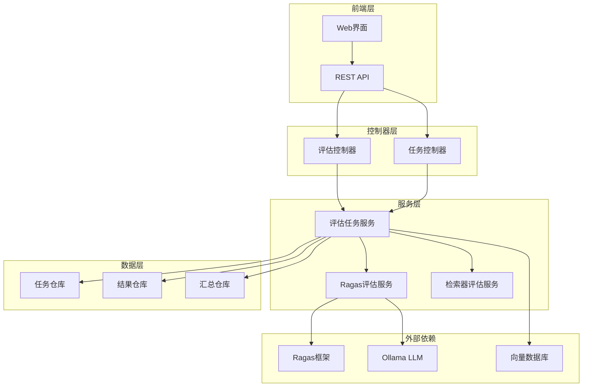
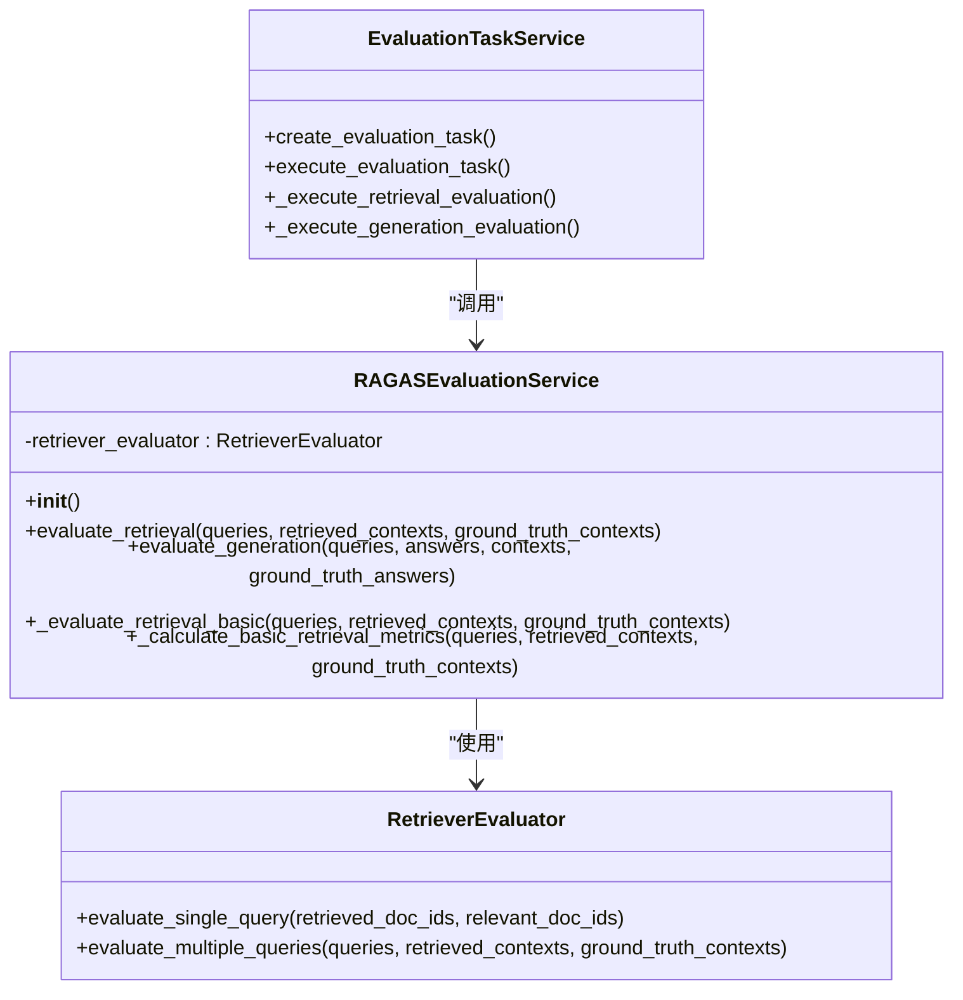
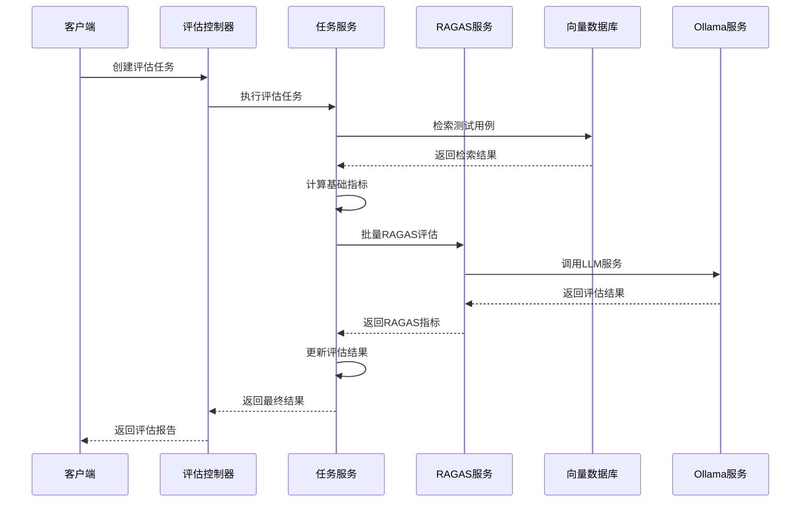
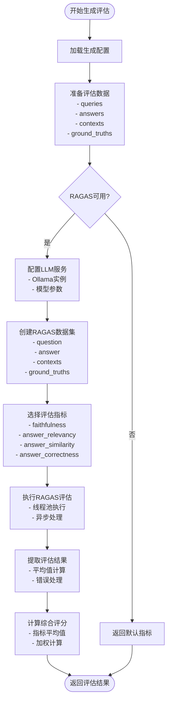
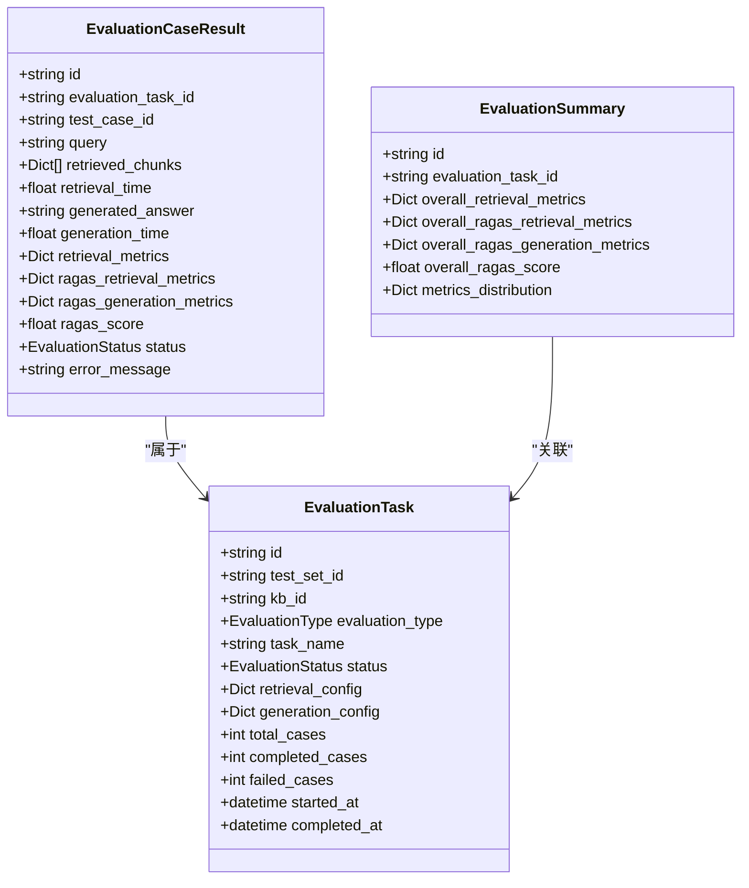
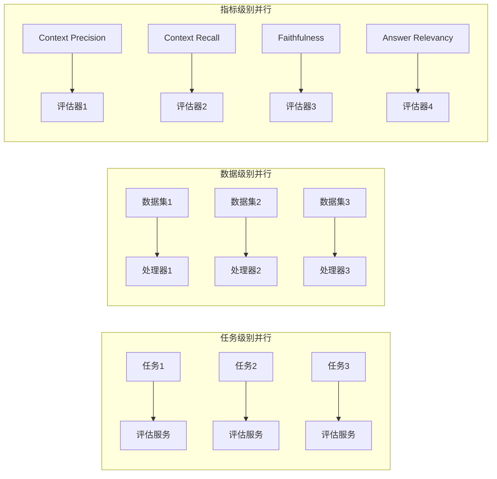

# 评估指标计算

<cite>
**本文档引用的文件**
- [ragas_evaluation.py](file://backend/app/services/ragas_evaluation.py)
- [evaluation.py](file://backend/app/models/evaluation.py)
- [evaluation.py](file://backend/app/controllers/evaluation.py)
- [evaluation_task.py](file://backend/app/services/evaluation_task.py)
- [config.py](file://backend/app/config.py)
- [retriever_evaluation.py](file://backend/app/services/retriever_evaluation.py)
</cite>

## 目录
1. [简介](#简介)
2. [系统架构概览](#系统架构概览)
3. [RagasEvaluationService核心组件](#ragasevaluationservice核心组件)
4. [核心评估指标详解](#核心评估指标详解)
5. [批量查询评估流水线](#批量查询评估流水线)
6. [EvaluationResult模型映射](#evaluationresult模型映射)
7. [性能优化策略](#性能优化策略)
8. [故障排除指南](#故障排除指南)
9. [总结](#总结)

## 简介

RAG Studio的评估系统基于Ragas框架实现了全面的多维度指标计算，专注于检索器和生成器的质量评估。该系统通过集成Ragas框架，提供了context_precision、context_recall、faithfulness和answer_relevancy等核心评估指标，为RAG系统的性能优化提供了科学依据。

## 系统架构概览

评估系统采用分层架构设计，包含控制器层、服务层和数据模型层，通过RAGASEvaluationService作为核心服务，实现了完整的评估流水线。



**图表来源**
- [evaluation.py](file://backend/app/controllers/evaluation.py#L1-L38)
- [evaluation_task.py](file://backend/app/services/evaluation_task.py#L26-L62)
- [ragas_evaluation.py](file://backend/app/services/ragas_evaluation.py#L191-L200)

## RAGASEvaluationService核心组件

### 服务初始化与依赖管理

RAGASEvaluationService采用延迟加载策略，确保在Ragas框架可用时才进行初始化，同时支持多种LLM配置方案。



**图表来源**
- [ragas_evaluation.py](file://backend/app/services/ragas_evaluation.py#L191-L200)
- [evaluation_task.py](file://backend/app/services/evaluation_task.py#L26-L62)

### RAGAS模块加载机制

系统实现了智能的RAGAS模块加载机制，支持多种配置场景：

1. **非LLM版本优先**：优先使用不需要OpenAI API Key的指标
2. **LLM版本回退**：当非LLM版本不可用时，自动切换到LLM版本
3. **Ollama配置**：支持本地LLM部署，避免外部API依赖
4. **兼容性处理**：针对Python 3.12/pydantic v1兼容性问题提供解决方案

**章节来源**
- [ragas_evaluation.py](file://backend/app/services/ragas_evaluation.py#L18-L186)

## 核心评估指标详解

### Context Precision（上下文精确度）

Context Precision衡量检索到的上下文中有多少是真正相关的，反映了检索系统的准确性。

**数学定义**：
```
Context Precision = (相关上下文数量) / (检索到的上下文总数)
```

**实现逻辑**：
- 使用NonLLMContextPrecisionWithReference指标
- 输入：retrieved_contexts（检索到的上下文）、reference_contexts（参考上下文）
- 输出：0.0-1.0范围内的浮点数值，值越高表示检索越准确

### Context Recall（上下文召回率）

Context Recall衡量检索系统能够找到多少真实相关的上下文，反映了检索系统的完整性。

**数学定义**：
```
Context Recall = (被检索到的真实相关上下文数量) / (真实的全部相关上下文数量)
```

**实现逻辑**：
- 使用NonLLMContextRecall指标
- 输入：retrieved_contexts（检索到的上下文）、reference_contexts（参考上下文）
- 输出：0.0-1.0范围内的浮点数值，值越高表示召回越完整

### Faithfulness（答案忠实度）

Faithfulness评估生成的答案与检索到的上下文之间的忠实程度，确保答案不产生幻觉。

**数学定义**：
```
Faithfulness = (答案事实一致性得分) / (答案事实总数)
```

**实现逻辑**：
- 使用faithfulness指标
- 输入：question（问题）、answer（答案）、contexts（上下文）
- 输出：0.0-1.0范围内的浮点数值，值越高表示答案越忠实

### Answer Relevancy（答案相关性）

Answer Relevancy衡量生成的答案与原始问题的相关程度，确保答案切题。

**数学定义**：
```
Answer Relevancy = (答案与问题的相关性得分) / (最大相关性得分)
```

**实现逻辑**：
- 使用answer_relevancy指标
- 输入：question（问题）、answer（答案）
- 输出：0.0-1.0范围内的浮点数值，值越高表示答案越相关

**章节来源**
- [ragas_evaluation.py](file://backend/app/services/ragas_evaluation.py#L29-L156)
- [ragas_evaluation.py](file://backend/app/services/ragas_evaluation.py#L388-L537)

## 批量查询评估流水线

### 检索评估流水线

检索评估采用两阶段处理模式：基础指标计算 + RAGAS指标计算。



**图表来源**
- [evaluation_task.py](file://backend/app/services/evaluation_task.py#L154-L338)
- [ragas_evaluation.py](file://backend/app/services/ragas_evaluation.py#L202-L380)

### 生成评估流水线

生成评估专注于答案质量和一致性评估，采用统一的数据处理流程。



**图表来源**
- [ragas_evaluation.py](file://backend/app/services/ragas_evaluation.py#L388-L537)

### Ground Truth匹配机制

系统实现了智能的Ground Truth匹配机制，确保评估的准确性：

1. **上下文匹配**：通过语义相似度匹配检索到的上下文与真实相关上下文
2. **内容标准化**：清理和标准化输入数据，确保格式一致性
3. **空值处理**：妥善处理空值和无效数据
4. **批量优化**：支持大规模数据的高效处理

**章节来源**
- [ragas_evaluation.py](file://backend/app/services/ragas_evaluation.py#L274-L300)

## EvaluationResult模型映射

### 模型结构设计

EvaluationCaseResult模型定义了完整的评估结果结构，支持多种评估指标的存储和查询。



**图表来源**
- [evaluation.py](file://backend/app/models/evaluation.py#L70-L179)

### 字段映射关系

| RAGAS指标 | EvaluationCaseResult字段 | 数据类型 | 描述 |
|-----------|-------------------------|----------|------|
| context_precision | ragas_retrieval_metrics["context_precision"] | float | 上下文精确度评分 |
| context_recall | ragas_retrieval_metrics["context_recall"] | float | 上下文召回率评分 |
| context_relevancy | ragas_retrieval_metrics["context_relevancy"] | float | 上下文相关性评分 |
| faithfulness | ragas_generation_metrics["faithfulness"] | float | 答案忠实度评分 |
| answer_relevancy | ragas_generation_metrics["answer_relevancy"] | float | 答案相关性评分 |
| answer_similarity | ragas_generation_metrics["answer_similarity"] | float | 答案相似度评分 |
| answer_correctness | ragas_generation_metrics["answer_correctness"] | float | 答案正确性评分 |
| ragas_score | ragas_score | float | 综合RAGAS评分 |

**章节来源**
- [evaluation.py](file://backend/app/models/evaluation.py#L89-L106)

## 性能优化策略

### 批处理大小调整

系统采用动态批处理策略，根据可用资源和数据规模自动调整批处理大小：

1. **内存优化**：监控可用内存，动态调整批次大小
2. **并发控制**：限制同时执行的评估任务数量
3. **进度反馈**：实时更新处理进度，避免长时间无响应
4. **错误恢复**：支持部分失败情况下的增量重试

### 缓存机制应用

虽然当前系统主要依赖实时计算，但可以扩展缓存机制：

1. **结果缓存**：缓存重复的评估结果
2. **中间结果缓存**：缓存检索和生成的中间结果
3. **配置缓存**：缓存LLM配置和模型参数
4. **元数据缓存**：缓存任务状态和统计数据

### 并行化策略

系统实现了多层次的并行化：



**图表来源**
- [evaluation_task.py](file://backend/app/services/evaluation_task.py#L190-L338)

### 性能监控指标

系统内置了多项性能监控指标：

1. **处理时间**：每个评估步骤的耗时统计
2. **吞吐量**：单位时间内处理的测试用例数量
3. **错误率**：评估失败的比例统计
4. **资源利用率**：CPU、内存、GPU的使用情况

**章节来源**
- [evaluation_task.py](file://backend/app/services/evaluation_task.py#L190-L338)

## 故障排除指南

### 常见问题及解决方案

#### RAGAS不可用问题

**症状**：评估功能受限，返回默认指标值
**原因**：RAGAS框架未正确安装或存在兼容性问题
**解决方案**：
1. 检查RAGAS安装状态：`pip show ragas`
2. 验证Python版本兼容性（推荐Python 3.11）
3. 检查pydantic版本：`pip show pydantic`
4. 安装依赖：`pip install ragas`

#### LLM配置问题

**症状**：生成评估失败，提示LLM配置错误
**原因**：Ollama服务未启动或模型不可用
**解决方案**：
1. 检查Ollama服务状态：`curl http://localhost:11434/api/tags`
2. 验证模型存在性：`ollama list`
3. 检查网络连接：确保端口11434可访问
4. 验证模型配置：确认`OLLAMA_CHAT_MODEL`设置正确

#### 内存不足问题

**症状**：大批量评估时出现内存溢出
**原因**：单次处理数据过多，超出系统内存限制
**解决方案**：
1. 减少批处理大小
2. 增加系统内存
3. 启用流式处理
4. 分阶段处理数据

### 日志分析

系统提供了详细的日志记录，便于问题诊断：

```python
# 关键日志级别
logger.info("RAGAS模块加载成功")
logger.warning("非 LLM 版本指标不可用，将使用 LLM 版本")
logger.error("RAGAS评估失败: {error_message}")
logger.debug("评估用例处理进度: {progress}%")
```

**章节来源**
- [ragas_evaluation.py](file://backend/app/services/ragas_evaluation.py#L160-L186)

## 总结

RAG Studio的评估指标计算系统通过RAGASEvaluationService深度集成了Ragas框架，实现了全面的多维度评估能力。系统具有以下特点：

1. **全面性**：覆盖检索和生成两个核心环节
2. **灵活性**：支持多种LLM配置和评估场景
3. **可靠性**：完善的错误处理和降级机制
4. **可扩展性**：模块化设计便于功能扩展

通过合理配置和优化，该系统能够为RAG系统的持续改进提供强有力的数据支撑，帮助开发者构建更高质量的问答系统。