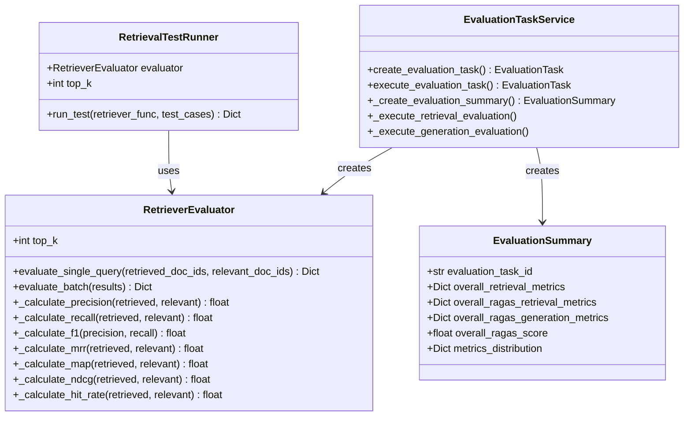
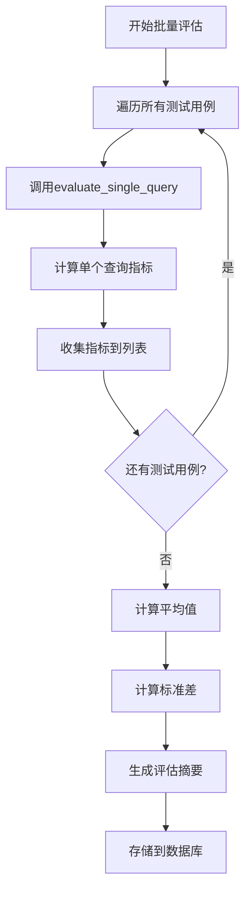
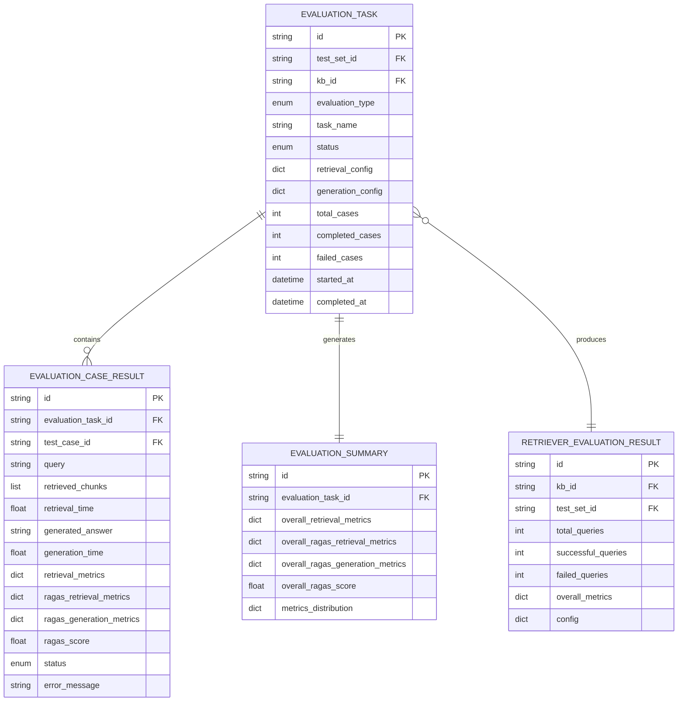
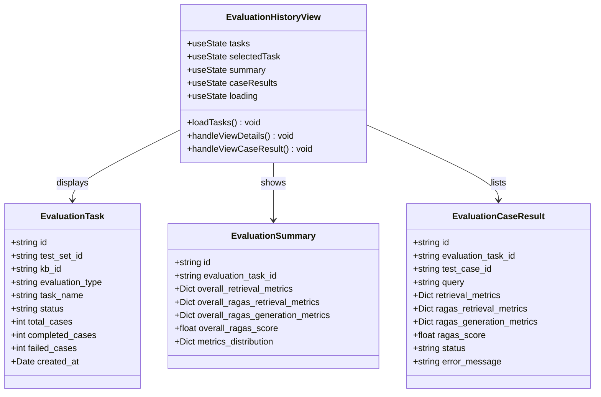
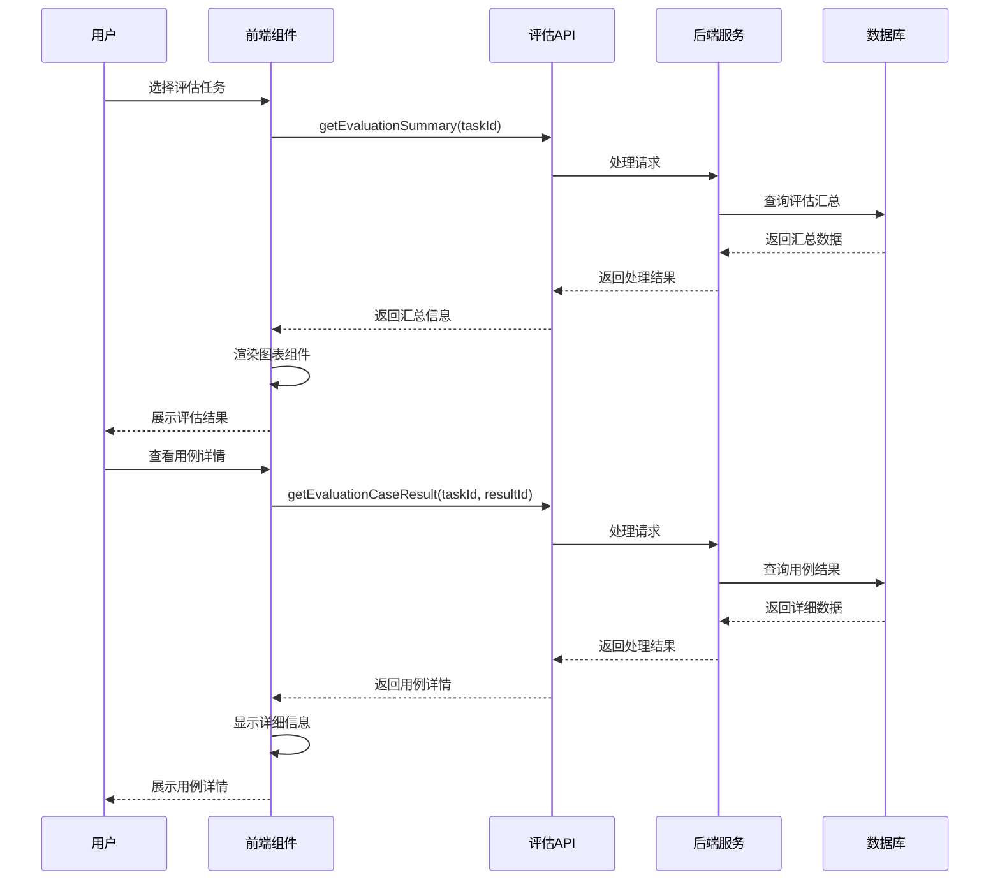

# 评估结果分析

<cite>
**本文档引用的文件**
- [retriever_evaluation.py](file://backend/app/services/retriever_evaluation.py)
- [evaluation_task.py](file://backend/app/services/evaluation_task.py)
- [evaluation.py](file://backend/app/controllers/evaluation.py)
- [retriever_evaluation.py](file://backend/app/models/retriever_evaluation.py)
- [evaluation.py](file://backend/app/models/evaluation.py)
- [retriever_evaluation_repository.py](file://backend/app/repositories/retriever_evaluation_repository.py)
- [evaluation-history.tsx](file://web/components/views/evaluation-history.tsx)
- [api.ts](file://web/lib/api.ts)
- [SUMMARY_检索器评估系统.md](file://backend/SUMMARY_检索器评估系统.md)
</cite>

## 目录
1. [系统概述](#系统概述)
2. [评估结果聚合机制](#评估结果聚合机制)
3. [存储架构设计](#存储架构设计)
4. [前端可视化分析](#前端可视化分析)
5. [评估报告结构](#评估报告结构)
6. [性能优化建议](#性能优化建议)
7. [总结](#总结)

## 系统概述

RAG Studio的检索器评估系统是一个完整的评估框架，专门用于评估向量数据库选择、检索算法配置和检索质量。系统基于RAGAS评估框架，支持T2Ranking标准数据集，实现了7个核心评估指标，涵盖检索系统的各个性能维度。

### 核心评估指标

系统实现了以下7个关键评估指标：

| 指标名称 | 英文名称 | 描述 | 计算公式 |
|---------|---------|------|---------|
| 精确率 | Precision@K | 检索到的相关文档占检索结果的比例 | Precision = | 相关文档数 / 检索结果总数 |
| 召回率 | Recall@K | 检索到的相关文档占所有相关文档的比例 | Recall = | 检索到的相关文档数 / 真实相关文档总数 |
| F1分数 | F1-Score | 精确率和召回率的调和平均值 | F1 = 2 × (Precision × Recall) / (Precision + Recall) |
| 平均倒数排名 | MRR | 第一个相关文档在检索结果中的位置的倒数平均值 | MRR = 1/rank |
| 平均精度均值 | MAP | 每个相关文档的精确度的平均值 | MAP = Σ(P@k × rel_k) / | 真实相关文档数 |
| 归一化折损累积增益 | NDCG | 考虑文档排序位置的精确度指标 | NDCG = DCG / IDCG |
| 命中率 | Hit Rate | 是否至少检索到一个相关文档 | Hit Rate = 1 (有相关文档) / 0 (无相关文档) |

## 评估结果聚合机制

### RetrieverEvaluationService核心功能

RetrieverEvaluationService是评估系统的核心组件，负责将单次查询的评估结果汇总为任务级的EvaluationSummary。



**图表来源**
- [retriever_evaluation.py](file://backend/app/services/retriever_evaluation.py#L26-L423)
- [evaluation_task.py](file://backend/app/services/evaluation_task.py#L26-L607)

### 均值计算机制

系统通过以下步骤实现评估结果的均值计算：

1. **单查询评估**：每个测试用例单独计算7个评估指标
2. **批量聚合**：将所有查询的指标值收集到列表中
3. **平均值计算**：对每个指标计算所有查询的平均值
4. **标准差统计**：计算指标的标准差以衡量稳定性



**图表来源**
- [retriever_evaluation.py](file://backend/app/services/retriever_evaluation.py#L75-L107)

### 性能瓶颈识别

系统通过以下方式识别性能瓶颈：

1. **指标分布分析**：计算每个指标的最大值、最小值和标准差
2. **异常值检测**：识别显著偏离平均值的查询
3. **趋势分析**：比较不同批次评估结果的变化趋势
4. **资源消耗监控**：跟踪检索时间和生成时间

**章节来源**
- [evaluation_task.py](file://backend/app/services/evaluation_task.py#L486-L552)

## 存储架构设计

### 数据模型结构

评估系统采用分层的数据模型设计，确保评估结果的有效存储和查询。



**图表来源**
- [evaluation.py](file://backend/app/models/evaluation.py#L27-L179)
- [retriever_evaluation.py](file://backend/app/models/retriever_evaluation.py#L11-L60)

### 查询接口设计

系统提供了多层次的查询接口，支持不同粒度的数据访问：

| 接口类型 | 功能描述 | 查询参数 | 返回数据 |
|---------|---------|---------|---------|
| 任务列表查询 | 获取评估任务列表 | test_set_id, kb_id, status, page, page_size | 任务基本信息列表 |
| 任务详情查询 | 获取单个任务详细信息 | task_id | 完整任务信息 |
| 汇总查询 | 获取评估汇总结果 | task_id | 总体指标和分布 |
| 用例结果查询 | 获取测试用例结果列表 | task_id, page, page_size | 用例结果列表 |
| 用例详情查询 | 获取单个用例详细结果 | task_id, result_id | 完整用例信息 |

**章节来源**
- [evaluation.py](file://backend/app/controllers/evaluation.py#L127-L335)

### 持久化结构

评估结果按照以下层次结构持久化：

1. **评估任务层**：存储任务基本信息和配置
2. **用例结果层**：存储每个测试用例的详细评估结果
3. **汇总层**：存储任务级别的总体指标和统计信息
4. **历史层**：存储历史评估记录用于趋势分析

**章节来源**
- [retriever_evaluation_repository.py](file://backend/app/repositories/retriever_evaluation_repository.py#L10-L54)

## 前端可视化分析

### evaluation-history.tsx组件架构

前端评估历史页面通过evaluation-history.tsx组件提供全面的可视化分析功能。



**图表来源**
- [evaluation-history.tsx](file://web/components/views/evaluation-history.tsx#L23-L464)

### 图表展示机制

前端通过多种图表形式展示评估指标趋势：

#### 1. 指标趋势图
- **柱状图**：展示不同评估指标的平均值
- **折线图**：展示指标随时间的变化趋势
- **箱线图**：展示指标的分布情况和异常值

#### 2. 多任务对比分析
- **雷达图**：多维指标对比
- **堆叠柱状图**：不同配置的性能对比
- **散点图**：指标间的相关性分析

#### 3. 绩效热力图
- **颜色深浅**：表示指标值的高低
- **时间轴**：展示历史变化趋势
- **配置矩阵**：展示不同配置组合的性能

**章节来源**
- [evaluation-history.tsx](file://web/components/views/evaluation-history.tsx#L285-L464)

### 数据交互流程



**图表来源**
- [evaluation-history.tsx](file://web/components/views/evaluation-history.tsx#L87-L112)
- [api.ts](file://web/lib/api.ts#L724-L800)

**章节来源**
- [evaluation-history.tsx](file://web/components/views/evaluation-history.tsx#L1-L464)

## 评估报告结构

### SUMMARY评估系统定义

根据SUMMARY_检索器评估系统.md的定义，评估报告包含以下核心结构：

#### 1. 基础评估指标
- **精确率**：衡量检索结果的相关性
- **召回率**：衡量检索结果的完整性
- **F1分数**：精确率和召回率的平衡指标
- **MRR**：排序质量的重要指标
- **MAP**：平均精度均值
- **NDCG**：归一化折扣累积增益
- **命中率**：检索是否成功的指标

#### 2. RAGAS评估指标
- **Context Precision**：检索上下文的精确度
- **Context Recall**：检索上下文的召回率
- **Faithfulness**：答案对上下文的忠实度
- **Answer Relevancy**：答案与问题的相关性

#### 3. 综合评分体系
- **Overall RAGAS Score**：综合评估得分
- **指标分布统计**：最大值、最小值、标准差
- **性能趋势分析**：历史对比和变化趋势

**章节来源**
- [SUMMARY_检索器评估系统.md](file://backend/SUMMARY_检索器评估系统.md#L34-L61)

### 报告解读指南

#### 评估结果等级划分
- **优秀**：F1 > 0.7，整体得分 > 80%
- **良好**：F1 0.5-0.7，整体得分 60-80%
- **需要优化**：F1 < 0.5，整体得分 < 60%

#### 性能优化建议模板

基于评估结果，系统可以提供以下优化建议：

1. **检索算法优化**
   - 调整`top_k`参数以平衡检索质量和性能
   - 优化`score_threshold`设置
   - 切换不同的融合算法（RRF vs 简单拼接）

2. **嵌入模型选择**
   - 比较不同embedding模型的效果
   - 考虑领域特定的预训练模型
   - 评估模型维度对性能的影响

3. **向量数据库配置**
   - 选择合适的向量数据库类型
   - 优化索引配置参数
   - 调整相似度计算方法

**章节来源**
- [SUMMARY_检索器评估系统.md](file://backend/SUMMARY_检索器评估系统.md#L283-L324)

## 性能优化建议

### 数据集规模优化

根据系统设计，推荐以下数据集规模配置：

| 规模级别 | 查询数量 | 文档数量 | 适用场景 |
|---------|---------|---------|---------|
| 初始测试 | 50-100 | 1000-5000 | 快速验证 |
| 中等规模 | 200-500 | 5000-20000 | 详细评估 |
| 完整评估 | 1000+ | 20000+ | 生产环境验证 |

### 采样策略优化

```python
# 推荐配置
max_queries = 100   # 根据需求调整
max_docs = None     # 自动确定（推荐）

# 或显式限制
max_docs = 10000    # 适合内存有限的环境
```

### 批处理优化

1. **批量评估API**：使用批量接口提高处理效率
2. **异步处理**：对于大规模测试使用异步执行
3. **增量保存**：结果增量保存避免数据丢失

### 内存管理策略

1. **智能采样**：根据查询采样相关文档
2. **内存监控**：大数据集使用采样功能
3. **分批处理**：避免一次性加载过多数据

**章节来源**
- [SUMMARY_检索器评估系统.md](file://backend/SUMMARY_检索器评估系统.md#L285-L304)

## 总结

RAG Studio的评估结果分析系统提供了完整的评估解决方案，从数据采集、指标计算、结果聚合到可视化展示，形成了一个闭环的评估体系。

### 系统优势

1. **全面的评估指标**：7个核心指标覆盖检索系统的关键性能维度
2. **灵活的架构设计**：支持多种向量数据库和embedding模型
3. **完善的存储机制**：多层次的数据模型确保结果的有效保存
4. **直观的可视化**：前端组件提供丰富的图表展示功能
5. **清晰的优化建议**：基于评估结果提供具体的优化指导

### 应用价值

该系统能够有效支持：
- 对比不同向量数据库性能
- 评估不同embedding模型效果  
- 测试不同检索算法配置
- 追踪检索质量变化趋势
- 为系统优化提供数据支撑

通过持续的评估和优化，系统能够不断提升检索质量，为用户提供更好的问答体验。