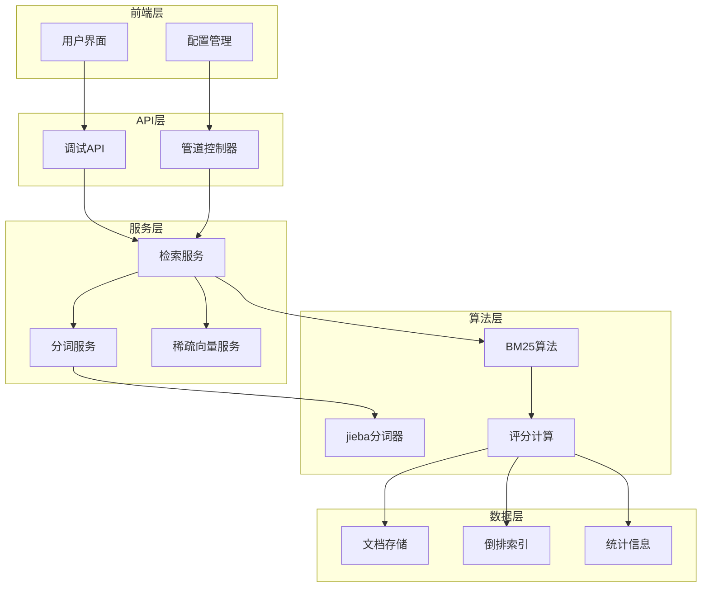
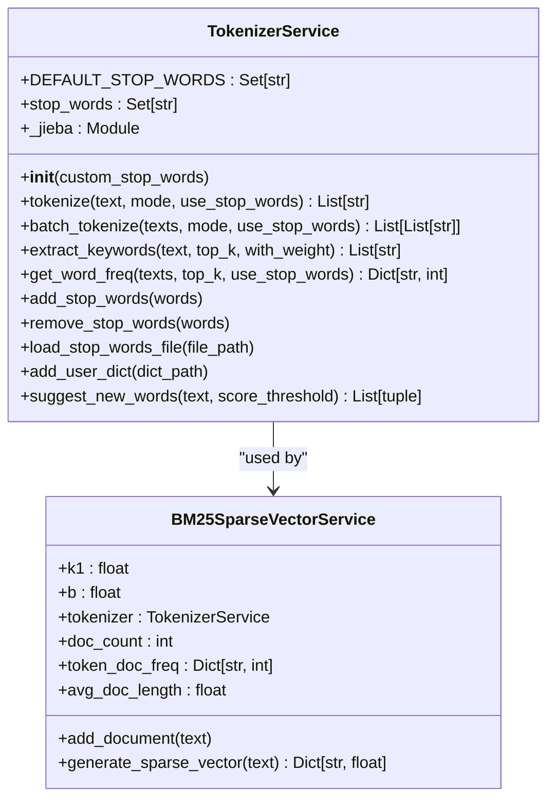
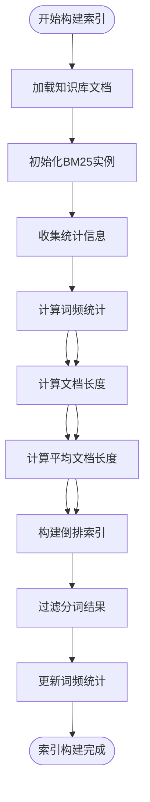
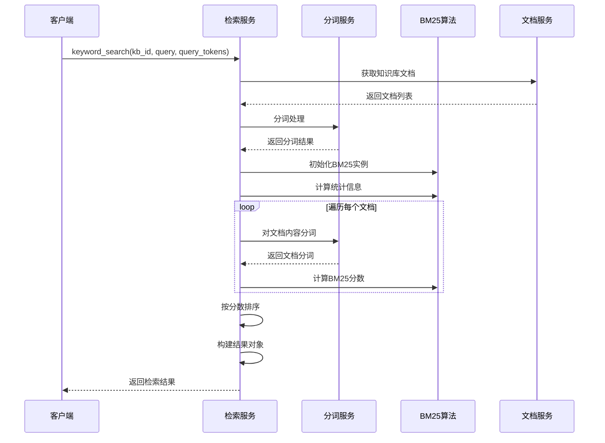
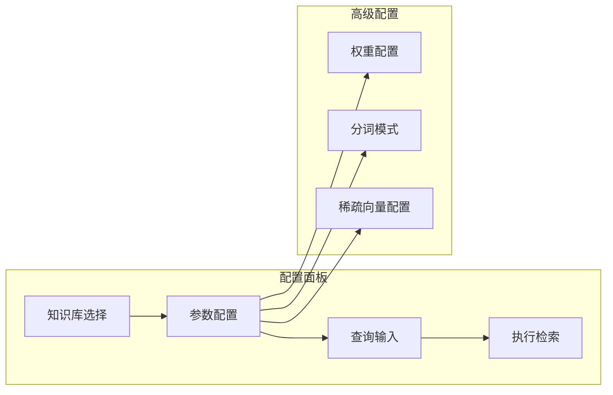

# 关键词检索系统深度解析

<cite>
**本文档引用的文件**
- [retrieval_service.py](file://backend/app/services/retrieval_service.py)
- [tokenizer_service.py](file://backend/app/services/tokenizer_service.py)
- [sparse_vector_service.py](file://backend/app/services/sparse_vector_service.py)
- [retrieval.tsx](file://web/components/views/retrieval.tsx)
- [debug_pipeline.py](file://backend/app/controllers/debug_pipeline.py)
</cite>

## 目录
1. [系统概述](#系统概述)
2. [核心架构](#核心架构)
3. [BM25算法实现](#bm25算法实现)
4. [分词器集成](#分词器集成)
5. [倒排索引构建](#倒排索引构建)
6. [关键词检索流程](#关键词检索流程)
7. [前端交互配置](#前端交互配置)
8. [性能优化策略](#性能优化策略)
9. [故障排除指南](#故障排除指南)
10. [最佳实践建议](#最佳实践建议)

## 系统概述

关键词检索系统是一个基于BM25算法的智能文档检索解决方案，通过jieba分词器进行中文文本处理，结合倒排索引技术实现高效的文档相关性计算。系统支持多种检索模式，包括精确模式、搜索引擎模式和全模式，并提供灵活的参数配置选项。

### 主要特性

- **BM25算法驱动**：采用经典的BM25算法进行文档相关性评分
- **jieba分词集成**：深度集成jieba分词器，支持多种分词模式
- **多层缓存机制**：优化检索性能，减少重复计算
- **灵活配置选项**：支持不同的分词模式和检索参数
- **混合检索能力**：可与向量检索结合，提供更全面的检索效果

## 核心架构



**架构图来源**
- [retrieval_service.py](file://backend/app/services/retrieval_service.py#L136-L854)
- [tokenizer_service.py](file://backend/app/services/tokenizer_service.py#L13-L277)
- [debug_pipeline.py](file://backend/app/controllers/debug_pipeline.py#L1142-L1198)

## BM25算法实现

### 算法原理

BM25（Best Matching 25）是一种广泛应用于信息检索领域的概率排序函数，特别适用于短文本的相似度计算。其核心思想是通过词频（TF）、逆文档频率（IDF）和文档长度归一化三个维度来评估查询与文档的相关性。

### 数学公式

BM25算法的核心公式为：

```
BM25(D, Q) = Σ IDF(qi) × (f(qi,D) × (k1 + 1)) / (f(qi,D) + k1 × (1 - b + b × |D| / avgdl))
```

其中：
- `D`：目标文档
- `Q`：查询
- `qi`：查询中的第i个词项
- `f(qi,D)`：词项qi在文档D中的词频
- `|D|`：文档D的长度（词数）
- `avgdl`：平均文档长度
- `k1`：词频饱和度参数（默认1.5）
- `b`：长度归一化参数（默认0.75）

### 参数配置

系统提供了灵活的参数配置选项：

| 参数 | 默认值 | 作用 | 调优建议 |
|------|--------|------|----------|
| k1 | 1.5 | 控制词频饱和度 | 较高值适合长文档，较低值适合短文档 |
| b | 0.75 | 控制长度归一化强度 | 0.5-1.0范围，平衡文档长度影响 |
| top_k | 10 | 返回结果数量 | 根据业务需求调整，避免过多结果 |
| score_threshold | 0.0 | 分数阈值 | 设置合理的阈值过滤低质量结果 |

**节来源**
- [retrieval_service.py](file://backend/app/services/retrieval_service.py#L718-L784)
- [sparse_vector_service.py](file://backend/app/services/sparse_vector_service.py#L51-L156)

## 分词器集成

### jieba分词器架构

系统采用jieba分词器作为主要的中文分词工具，通过`TokenizerService`类进行封装和管理。



**类图来源**
- [tokenizer_service.py](file://backend/app/services/tokenizer_service.py#L13-L277)
- [sparse_vector_service.py](file://backend/app/services/sparse_vector_service.py#L51-L156)

### 分词模式详解

系统支持三种分词模式，每种模式针对不同的应用场景：

#### 1. 默认模式（default）
- **特点**：精确分词，追求准确性
- **适用场景**：需要精确语义理解的任务
- **实现方式**：使用`jieba.cut()`进行精确分词

#### 2. 搜索引擎模式（search）
- **特点**：兼顾召回率和效率
- **适用场景**：信息检索、文档搜索
- **实现方式**：使用`jieba.cut_for_search()`进行搜索引擎优化分词

#### 3. 全模式（all）
- **特点**：最大召回率，覆盖所有可能的词汇
- **适用场景**：文本分析、特征提取
- **实现方式**：使用`jieba.cut(text, cut_all=True)`进行全模式分词

### 停用词处理

系统内置了中文常用停用词集合，并支持动态添加和移除停用词：

```python
# 默认停用词示例
DEFAULT_STOP_WORDS = {
    '的', '了', '是', '在', '有', '和', '就', '不', '人', '都', '一', '一个',
    '上', '也', '很', '到', '说', '要', '去', '你', '会', '着', '没有', '看',
    '好', '自己', '这', '那', '里', '为', '而', '及', '与', '或', '等'
}
```

**节来源**
- [tokenizer_service.py](file://backend/app/services/tokenizer_service.py#L17-L25)
- [tokenizer_service.py](file://backend/app/services/tokenizer_service.py#L54-L94)

## 倒排索引构建

### 构建流程

倒排索引的构建是关键词检索的基础，系统通过以下步骤实现：



**流程图来源**
- [retrieval_service.py](file://backend/app/services/retrieval_service.py#L273-L307)

### 统计信息维护

系统维护以下关键统计信息：

| 统计指标 | 描述 | 计算方式 |
|----------|------|----------|
| 文档频率（DF） | 包含特定词项的文档数量 | 统计每个词项在所有文档中出现的次数 |
| 文档总数（N） | 知识库中文档的总数量 | 计算知识库中所有文档的数量 |
| 平均文档长度（avgdl） | 所有文档的平均词数 | 总词数 ÷ 文档总数 |
| 词频（TF） | 特定词项在单个文档中的出现次数 | 统计词项在单个文档中的出现频率 |

### 内存优化策略

为了提高检索性能，系统采用了多种内存优化策略：

1. **延迟加载**：jieba分词器采用延迟加载机制，按需初始化
2. **词频缓存**：维护词项频率的全局缓存，避免重复计算
3. **增量更新**：支持增量式索引更新，减少重建成本
4. **内存池管理**：复用临时对象，减少垃圾回收压力

**节来源**
- [retrieval_service.py](file://backend/app/services/retrieval_service.py#L273-L307)
- [sparse_vector_service.py](file://backend/app/services/sparse_vector_service.py#L72-L88)

## 关键词检索流程

### 核心方法分析

`keyword_search`方法是关键词检索的核心实现，其处理流程如下：



**序列图来源**
- [retrieval_service.py](file://backend/app/services/retrieval_service.py#L217-L329)

### 评分计算过程

BM25评分计算的具体步骤：

1. **词频统计**：统计查询词项在目标文档中的出现次数
2. **IDF计算**：基于词项在整个文档集合中的出现频率计算逆文档频率
3. **TF归一化**：考虑文档长度对词频的影响进行归一化处理
4. **综合评分**：将IDF和归一化TF相乘得到最终的BM25分数

### 结果排序与过滤

系统按照以下优先级处理检索结果：

1. **分数排序**：按BM25分数降序排列
2. **数量限制**：根据`top_k`参数限制返回结果数量
3. **分数阈值**：过滤低于`score_threshold`的结果
4. **去重处理**：确保相同内容的文档不会重复出现

**节来源**
- [retrieval_service.py](file://backend/app/services/retrieval_service.py#L217-L329)

## 前端交互配置

### 分词模式配置

前端通过`retrieval.tsx`组件提供了灵活的分词模式配置选项：

```typescript
const [searchConfig, setSearchConfig] = useState({
    top_k: 5,
    vector_weight: 0.7,
    keyword_weight: 0.3,
    rrf_k: 60,
    embedding_model: "bge-m3:latest",
    tokenize_mode: "search"  // 分词模式配置
});
```

### 配置参数详解

| 参数 | 类型 | 默认值 | 说明 | 调优建议 |
|------|------|--------|------|----------|
| top_k | number | 5 | 返回结果数量 | 根据用户习惯调整，通常3-10 |
| vector_weight | number | 0.7 | 向量检索权重 | 平衡向量和关键词检索的重要性 |
| keyword_weight | number | 0.3 | 关键词检索权重 | 与向量权重之和为1 |
| rrf_k | number | 60 | RRF融合参数 | 影响结果融合的敏感度 |
| embedding_model | string | "bge-m3:latest" | 嵌入模型 | 根据硬件资源选择合适模型 |
| tokenize_mode | string | "search" | 分词模式 | 根据具体需求选择模式 |

### 用户界面设计

前端界面提供了直观的配置面板：



**图表来源**
- [retrieval.tsx](file://web/components/views/retrieval.tsx#L12-L390)

### 检索结果展示

系统提供了丰富的检索结果展示功能：

1. **分数显示**：显示每个结果的BM25分数
2. **来源标识**：标明结果来自向量检索还是关键词检索
3. **内容预览**：展示文档内容的前200字符
4. **元数据信息**：显示额外的文档元数据

**节来源**
- [retrieval.tsx](file://web/components/views/retrieval.tsx#L392-L532)

## 性能优化策略

### 缓存机制

系统实现了多层次的缓存机制来提升性能：

1. **分词结果缓存**：缓存常用的分词结果，避免重复分词
2. **统计信息缓存**：缓存BM25所需的统计信息
3. **结果缓存**：缓存频繁查询的检索结果

### 并行处理

对于大规模文档集合，系统支持并行处理：

```python
# 批量分词处理
async def batch_tokenize(self, texts: List[str], mode: str = "default"):
    tasks = [self.tokenize(text, mode) for text in texts]
    return await asyncio.gather(*tasks)
```

### 内存管理

系统采用以下策略优化内存使用：

1. **流式处理**：对于大文档集合，采用流式处理避免内存溢出
2. **对象池**：复用检索结果对象，减少内存分配开销
3. **及时清理**：定期清理不再使用的临时数据结构

### 算法优化

1. **早期终止**：在分数较低时提前终止计算
2. **索引优化**：使用高效的索引结构加速查找
3. **近似计算**：在精度允许的情况下使用近似算法

**节来源**
- [retrieval_service.py](file://backend/app/services/retrieval_service.py#L273-L307)

## 故障排除指南

### 常见问题及解决方案

#### 1. 分词异常
**问题描述**：分词过程中出现错误或结果不准确
**解决方案**：
- 检查jieba分词器是否正确安装
- 验证输入文本的编码格式
- 调整分词模式参数

#### 2. BM25分数异常
**问题描述**：BM25分数过高或过低
**解决方案**：
- 检查统计信息的准确性
- 调整k1和b参数
- 验证文档频率统计

#### 3. 性能问题
**问题描述**：检索速度过慢
**解决方案**：
- 启用缓存机制
- 优化文档索引结构
- 调整并发处理参数

### 调试工具

系统提供了多种调试工具：

1. **日志记录**：详细的执行日志帮助定位问题
2. **性能监控**：实时监控检索性能指标
3. **结果验证**：提供结果验证和对比功能

**节来源**
- [retrieval_service.py](file://backend/app/services/retrieval_service.py#L18-L20)

## 最佳实践建议

### 参数调优指南

#### 1. 分词模式选择
- **精确查询**：使用默认模式，获得最准确的分词结果
- **模糊搜索**：使用搜索引擎模式，提高召回率
- **特征提取**：使用全模式，获取尽可能多的词汇信息

#### 2. 权重配置
- **向量主导**：当语义相似度更重要时，增加向量权重
- **关键词主导**：当精确匹配更重要时，增加关键词权重
- **平衡配置**：两者同等重要时，设置为0.5:0.5

#### 3. 性能优化
- **缓存策略**：合理设置缓存大小和过期时间
- **并发控制**：根据系统资源调整并发处理数量
- **内存管理**：定期监控和清理内存使用

### 应用场景建议

#### 1. 文档检索
- 适合场景：学术论文、技术文档、法律条文等
- 推荐配置：搜索引擎模式，关键词权重较高

#### 2. 问答系统
- 适合场景：客服系统、FAQ、智能助手
- 推荐配置：默认模式，向量权重较高

#### 3. 内容推荐
- 适合场景：新闻推荐、商品推荐、视频推荐
- 推荐配置：全模式，平衡向量和关键词权重

### 监控和维护

1. **定期评估**：定期评估检索效果，调整参数配置
2. **性能监控**：监控系统性能指标，及时发现瓶颈
3. **数据更新**：定期更新知识库内容，保持索引时效性
4. **版本管理**：版本化管理配置参数，便于回滚和比较

通过遵循这些最佳实践，可以充分发挥关键词检索系统的潜力，为用户提供高质量的检索体验。