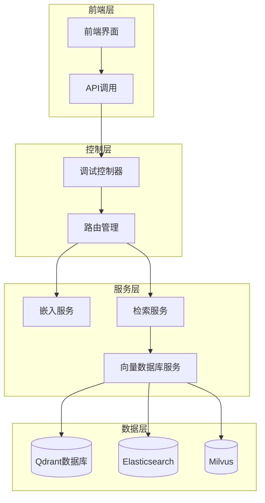
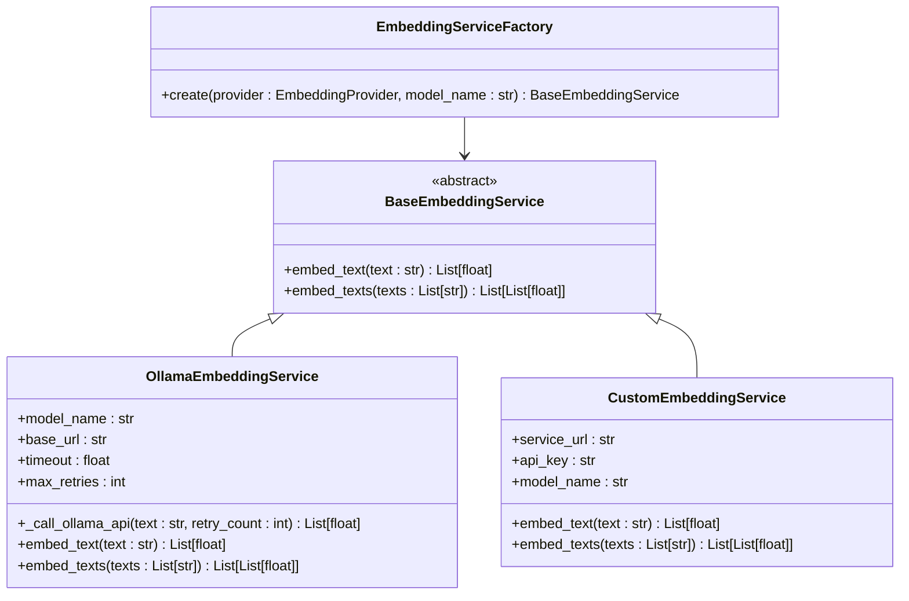
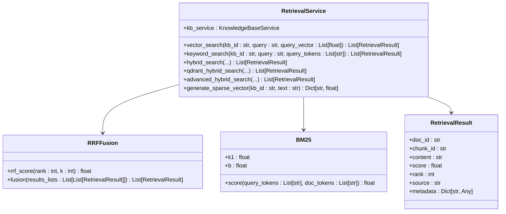
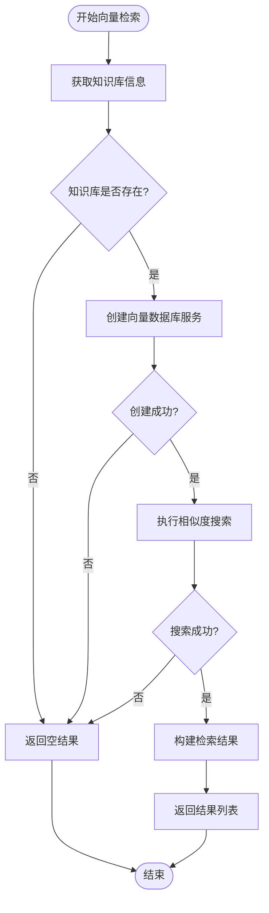
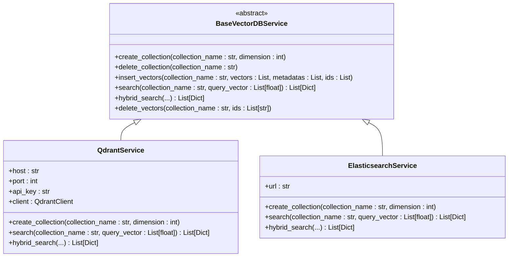
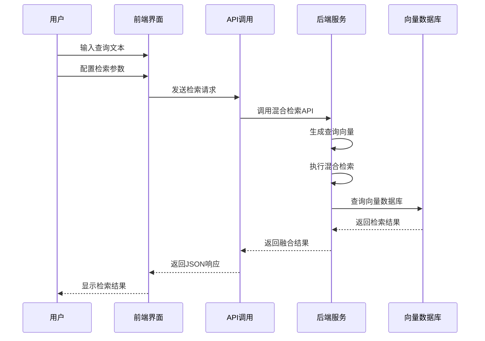

# 向量检索

<cite>
**本文档中引用的文件**
- [embedding_service.py](file://backend/app/services/embedding_service.py)
- [retrieval_service.py](file://backend/app/services/retrieval_service.py)
- [vector_db_service.py](file://backend/app/services/vector_db_service.py)
- [retrieval.tsx](file://web/components/views/retrieval.tsx)
- [debug_pipeline.py](file://backend/app/controllers/debug_pipeline.py)
- [main.py](file://backend/app/main.py)
</cite>

## 目录
1. [简介](#简介)
2. [系统架构概览](#系统架构概览)
3. [EmbeddingService嵌入服务](#embeddingservice嵌入服务)
4. [RetrievalService检索服务](#retrievalservice检索服务)
5. [向量数据库服务](#向量数据库服务)
6. [前端集成](#前端集成)
7. [性能优化](#性能优化)
8. [调试与测试](#调试与测试)
9. [总结](#总结)

## 简介

RAG Studio的向量检索系统是一个基于现代AI技术的智能检索解决方案，支持多种检索策略和向量数据库。该系统通过将查询文本转换为高维向量，在大规模文档集合中快速定位相关内容，为用户提供精准的知识检索服务。

核心特性包括：
- 多种嵌入模型支持（Ollama等）
- 多种向量数据库集成（Qdrant、Elasticsearch等）
- 混合检索策略（向量检索+关键词检索）
- 原生混合检索（稠密向量+稀疏向量）
- RRF融合算法优化检索结果
- 完整的调试和测试工具链

## 系统架构概览



**图表来源**
- [debug_pipeline.py](file://backend/app/controllers/debug_pipeline.py#L1-L50)
- [retrieval_service.py](file://backend/app/services/retrieval_service.py#L1-L50)
- [vector_db_service.py](file://backend/app/services/vector_db_service.py#L1-L50)

## EmbeddingService嵌入服务

### 嵌入服务架构

EmbeddingService负责将自然语言文本转换为高维向量表示，是整个检索系统的核心组件。



**图表来源**
- [embedding_service.py](file://backend/app/services/embedding_service.py#L18-L257)

### Ollama嵌入服务

Ollama嵌入服务是最主要的实现，支持通过HTTP API调用本地或远程的Ollama服务。

#### 核心功能特性

1. **并发处理**：使用信号量限制并发请求数量，避免Ollama服务过载
2. **重试机制**：对网络错误和服务器错误实现指数退避重试
3. **错误处理**：完善的异常处理和日志记录
4. **向量验证**：确保返回的向量格式正确

#### 性能优化策略

- **并发限制**：最多10个并发请求
- **超时控制**：60秒请求超时
- **重试策略**：最多3次重试
- **批量处理**：支持批量向量化提升效率

**章节来源**
- [embedding_service.py](file://backend/app/services/embedding_service.py#L48-L257)

## RetrievalService检索服务

### 检索服务架构

RetrievalService是检索系统的核心控制器，提供多种检索策略和融合算法。



**图表来源**
- [retrieval_service.py](file://backend/app/services/retrieval_service.py#L136-L854)

### vector_search方法详解

vector_search方法是向量检索的核心入口，接受查询文本和向量作为输入。

#### 参数说明

| 参数 | 类型 | 默认值 | 说明 |
|------|------|--------|------|
| kb_id | str | 必需 | 知识库ID |
| query | str | 必需 | 查询文本 |
| query_vector | List[float] | 必需 | 查询向量 |
| top_k | int | 10 | 返回结果数量 |
| score_threshold | float | 0.0 | 分数阈值 |

#### 执行流程



**图表来源**
- [retrieval_service.py](file://backend/app/services/retrieval_service.py#L143-L215)

### 混合检索策略

系统支持多种混合检索策略，根据不同的需求场景选择最优方案。

#### 1. 普通混合检索

结合向量检索和关键词检索，使用RRF算法进行结果融合。

#### 2. Qdrant原生混合检索

利用Qdrant的原生混合检索能力，同时使用稠密向量和稀疏向量进行检索。

#### 3. 高级混合检索

支持多种检索方式的组合，包括稠密向量、稀疏向量和关键词检索。

**章节来源**
- [retrieval_service.py](file://backend/app/services/retrieval_service.py#L324-L854)

## 向量数据库服务

### 向量数据库架构

系统支持多种向量数据库，通过统一的接口提供一致的服务。



**图表来源**
- [vector_db_service.py](file://backend/app/services/vector_db_service.py#L31-L200)

### Qdrant混合检索

Qdrant原生混合检索是系统最强大的功能之一，支持稠密向量和稀疏向量的联合检索。

#### 稠密向量检索

使用余弦相似度计算查询向量与文档向量之间的相似度。

#### 稀疏向量检索

使用BM25算法计算查询稀疏向量与文档稀疏向量之间的相似度。

#### 融合策略

- **RRF（Reciprocal Rank Fusion）**：基于倒数排名的融合算法
- **DBSF（Differentiable Bayesian Score Fusion）**：可微分的贝叶斯融合算法

**章节来源**
- [vector_db_service.py](file://backend/app/services/vector_db_service.py#L652-L800)

## 前端集成

### 前端架构

前端通过retrieval.tsx组件提供可视化的检索测试界面。



**图表来源**
- [retrieval.tsx](file://web/components/views/retrieval.tsx#L1-L100)

### 主要功能模块

1. **知识库选择**：支持动态加载和选择知识库
2. **参数配置**：灵活配置检索参数（top_k、权重、融合方法等）
3. **检索执行**：支持普通混合检索和Qdrant原生混合检索
4. **结果展示**：直观展示检索结果和评分信息
5. **结果管理**：保存、加载和导出检索结果

### API调用方式

前端通过以下两种主要API进行检索：

#### 混合检索API
```typescript
// 普通混合检索
const result = await debugAPI.hybridSearch({
    kb_id: kbId,
    query: searchQuery,
    top_k: searchConfig.top_k,
    vector_weight: searchConfig.vector_weight,
    keyword_weight: searchConfig.keyword_weight,
    rrf_k: searchConfig.rrf_k,
    embedding_model: searchConfig.embedding_model,
    tokenize_mode: searchConfig.tokenize_mode
});
```

#### Qdrant混合检索API
```typescript
// Qdrant原生混合检索
const result = await debugAPI.qdrantHybridSearch({
    kb_id: kbId,
    query: searchQuery,
    top_k: searchConfig.top_k,
    embedding_model: searchConfig.embedding_model,
    generate_sparse_vector: sparseVectorConfig.generate_sparse
});
```

**章节来源**
- [retrieval.tsx](file://web/components/views/retrieval.tsx#L61-L124)

## 性能优化

### 嵌入服务优化

1. **并发控制**：限制最大并发请求数量
2. **批量处理**：支持批量向量化减少网络开销
3. **缓存机制**：对常用查询结果进行缓存
4. **连接池**：复用HTTP连接减少建立连接的开销

### 检索服务优化

1. **结果预过滤**：使用分数阈值提前过滤低质量结果
2. **分页加载**：支持大数据集的分页检索
3. **索引优化**：合理配置向量数据库索引参数
4. **内存管理**：优化内存使用避免OOM

### 数据库优化

1. **向量量化**：使用量化技术减少存储空间
2. **索引策略**：根据数据特征选择合适的索引类型
3. **查询优化**：优化查询语句和参数
4. **硬件加速**：利用GPU加速向量计算

## 调试与测试

### 调试接口

系统提供了完整的调试接口，支持各种检索策略的测试和验证。

#### 混合检索测试

通过debug_pipeline.py提供的API，可以轻松测试混合检索效果：

```python
# 混合检索测试
@router.post("/retrieve/hybrid", summary="混合检索")
async def hybrid_search(request: HybridSearchRequest):
    # 执行混合检索逻辑
    results = await retrieval_service.hybrid_search(...)
    return JSONResponse(success_response(data={"results": results}))
```

#### Qdrant混合检索测试

```python
# Qdrant原生混合检索测试
@router.post("/retrieve/qdrant-hybrid", summary="Qdrant原生混合检索")
async def qdrant_hybrid_search(request: QdrantHybridSearchRequest):
    # 执行Qdrant混合检索
    results = await retrieval_service.qdrant_hybrid_search(...)
    return JSONResponse(success_response(data={"results": results}))
```

### 测试工具

1. **结果保存**：支持将检索结果保存到本地
2. **结果加载**：可以从本地加载历史检索结果
3. **结果导出**：支持导出为JSON格式
4. **结果导入**：支持从JSON文件导入结果

### 性能监控

系统内置了性能监控功能，可以跟踪：
- 检索耗时
- 向量生成时间
- 数据库查询时间
- 结果融合时间

**章节来源**
- [debug_pipeline.py](file://backend/app/controllers/debug_pipeline.py#L1142-L1296)

## 总结

RAG Studio的向量检索系统是一个功能完整、性能优异的智能检索解决方案。通过EmbeddingService将文本转换为向量，通过RetrievalService提供多种检索策略，通过VectorDBService支持多种向量数据库，最终通过前端界面为用户提供直观的检索体验。

### 核心优势

1. **灵活性**：支持多种嵌入模型和向量数据库
2. **性能**：通过各种优化策略确保高效检索
3. **可扩展性**：模块化设计便于扩展新功能
4. **易用性**：提供完整的调试和测试工具

### 技术特点

1. **混合检索**：结合向量和关键词检索的优势
2. **原生混合**：充分利用Qdrant等数据库的原生能力
3. **智能融合**：使用RRF等算法优化结果质量
4. **实时反馈**：提供详细的检索指标和性能信息

该系统为构建高质量的RAG应用提供了坚实的技术基础，能够满足各种复杂的检索需求。