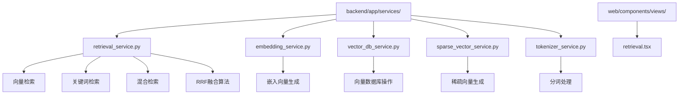
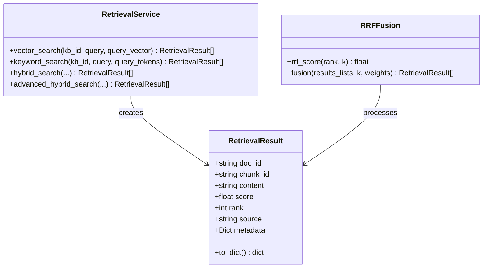
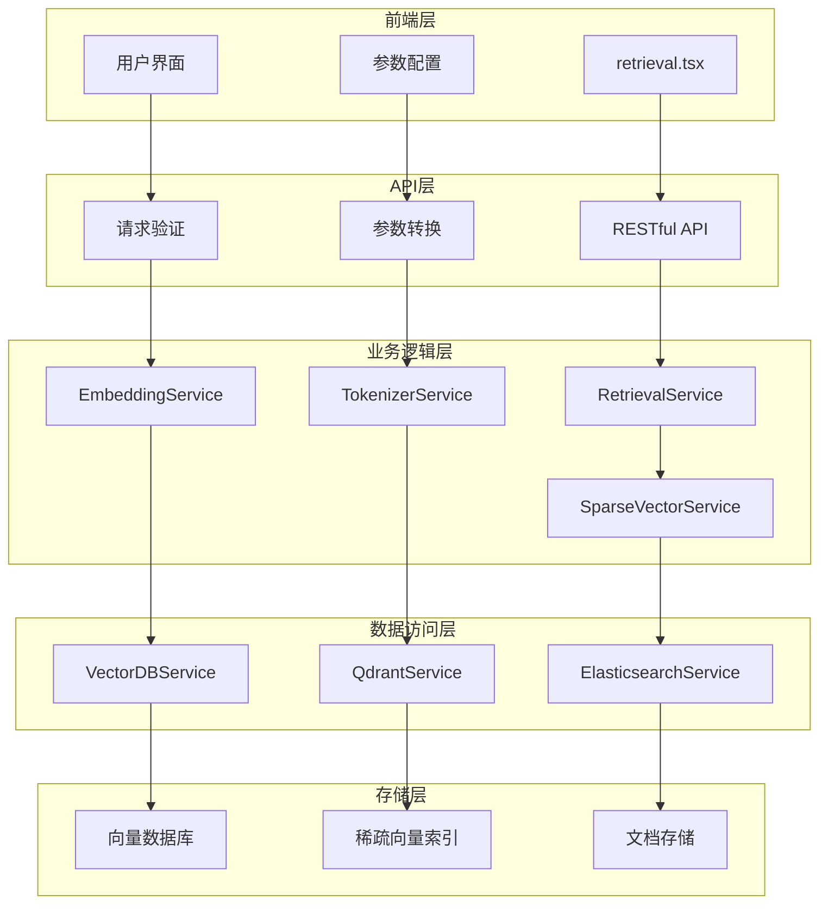
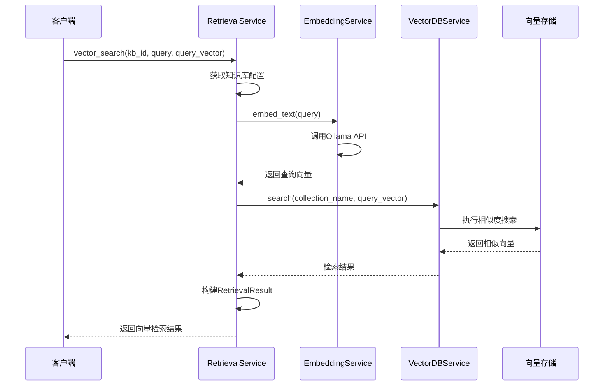
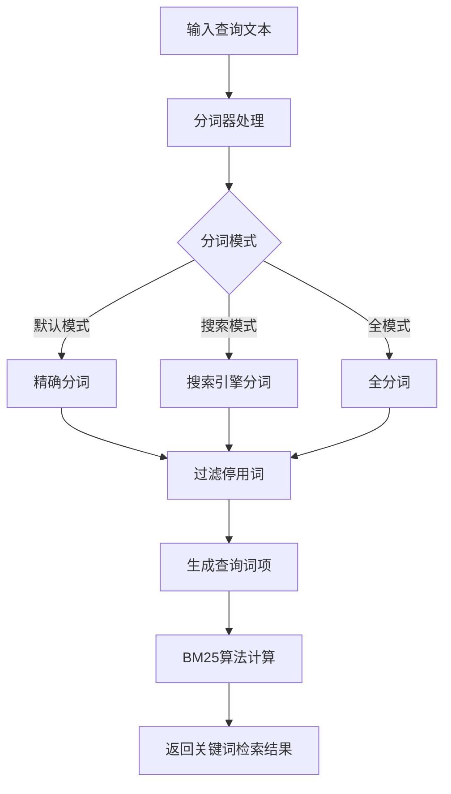
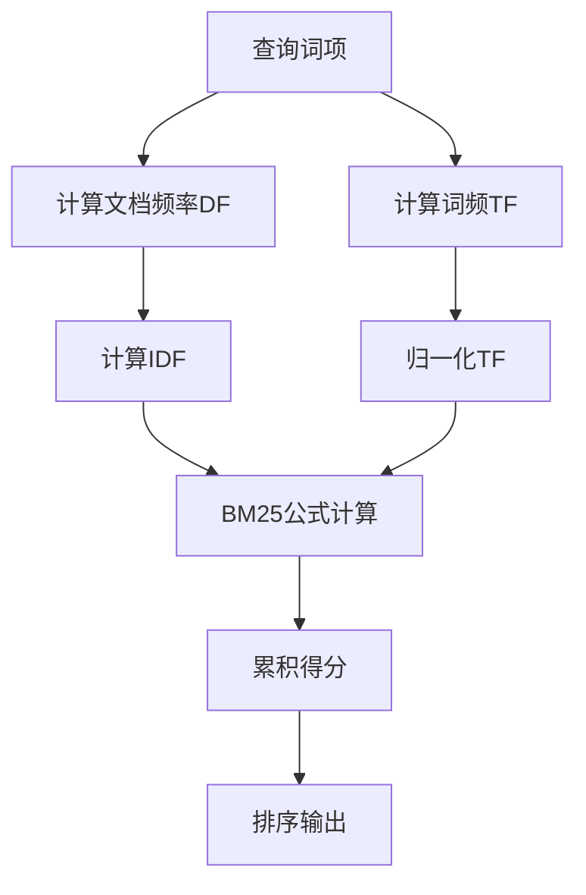
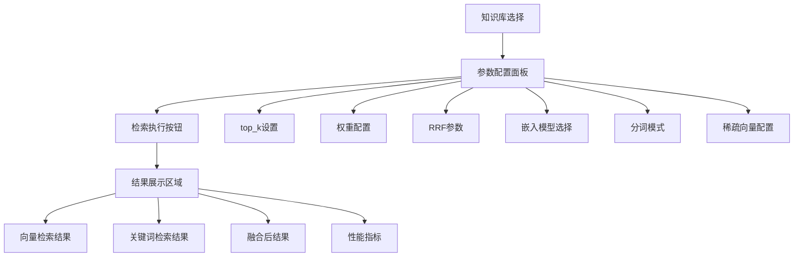
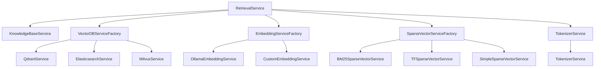

# 检索服务

<cite>
**本文档中引用的文件**
- [retrieval_service.py](file://backend/app/services/retrieval_service.py)
- [retrieval.tsx](file://web/components/views/retrieval.tsx)
- [embedding_service.py](file://backend/app/services/embedding_service.py)
- [vector_db_service.py](file://backend/app/services/vector_db_service.py)
- [sparse_vector_service.py](file://backend/app/services/sparse_vector_service.py)
- [tokenizer_service.py](file://backend/app/services/tokenizer_service.py)
</cite>

## 目录
1. [简介](#简介)
2. [项目结构](#项目结构)
3. [核心组件](#核心组件)
4. [架构概览](#架构概览)
5. [详细组件分析](#详细组件分析)
6. [依赖关系分析](#依赖关系分析)
7. [性能考虑](#性能考虑)
8. [故障排除指南](#故障排除指南)
9. [结论](#结论)

## 简介

RAG Studio的检索服务是一个综合性的信息检索系统，支持三种主要的检索模式：向量检索、关键词检索和混合检索。该系统采用先进的RRF（Reciprocal Rank Fusion）融合算法，能够有效整合不同检索方式的优势，为用户提供高质量的检索体验。

检索服务的核心目标是：
- 提供多样化的检索模式以满足不同场景需求
- 实现高效的向量相似度搜索
- 基于分词技术的关键词检索
- 通过RRF算法实现多源结果融合
- 支持多种向量数据库和稀疏向量技术

## 项目结构

检索服务的代码分布在以下目录结构中：



**图表来源**
- [retrieval_service.py](file://backend/app/services/retrieval_service.py#L1-L50)
- [retrieval.tsx](file://web/components/views/retrieval.tsx#L1-L30)

**章节来源**
- [retrieval_service.py](file://backend/app/services/retrieval_service.py#L1-L100)
- [retrieval.tsx](file://web/components/views/retrieval.tsx#L1-L50)

## 核心组件

### 检索服务架构

检索服务采用模块化设计，包含以下核心组件：

1. **向量检索模块**：基于EmbeddingService生成查询向量，在Qdrant或Elasticsearch中执行相似度搜索
2. **关键词检索模块**：基于jieba分词和BM25算法实现关键词匹配
3. **混合检索模块**：整合向量检索和关键词检索结果
4. **RRF融合算法**：实现多源结果的智能融合
5. **前端交互界面**：提供直观的检索配置和结果显示

### 数据结构设计



**图表来源**
- [retrieval_service.py](file://backend/app/services/retrieval_service.py#L21-L60)
- [retrieval_service.py](file://backend/app/services/retrieval_service.py#L44-L133)

**章节来源**
- [retrieval_service.py](file://backend/app/services/retrieval_service.py#L136-L200)

## 架构概览

检索服务的整体架构采用分层设计，从前端到后端形成完整的检索流水线：



**图表来源**
- [retrieval.tsx](file://web/components/views/retrieval.tsx#L1-L50)
- [retrieval_service.py](file://backend/app/services/retrieval_service.py#L136-L150)
- [vector_db_service.py](file://backend/app/services/vector_db_service.py#L31-L80)

## 详细组件分析

### 向量检索模式

向量检索是基于语义相似度的高级检索方式，通过将查询文本转换为高维向量，在向量空间中寻找最相似的文档片段。

#### 向量生成流程



**图表来源**
- [retrieval_service.py](file://backend/app/services/retrieval_service.py#L143-L215)
- [embedding_service.py](file://backend/app/services/embedding_service.py#L137-L150)

#### 向量数据库支持

系统支持多种向量数据库，包括Qdrant和Elasticsearch：

| 数据库类型 | 特点 | 优势 | 适用场景 |
|-----------|------|------|----------|
| Qdrant | 专门向量数据库 | 高性能向量搜索、原生混合检索 | 大规模向量检索 |
| Elasticsearch | 搜索引擎 | 结构化搜索、全文检索 | 混合搜索场景 |
| Milvus | 分布式向量数据库 | 可扩展性、多模态支持 | 企业级应用 |

**章节来源**
- [retrieval_service.py](file://backend/app/services/retrieval_service.py#L143-L215)
- [vector_db_service.py](file://backend/app/services/vector_db_service.py#L203-L300)

### 关键词检索模式

关键词检索基于jieba分词技术和BM25算法，实现基于词频和统计信息的文档匹配。

#### 分词处理流程



**图表来源**
- [tokenizer_service.py](file://backend/app/services/tokenizer_service.py#L54-L94)
- [retrieval_service.py](file://backend/app/services/retrieval_service.py#L217-L329)

#### BM25算法实现

BM25（Best Matching 25）是一种经典的信息检索算法，通过词频和文档频率计算相关性得分：



**图表来源**
- [retrieval_service.py](file://backend/app/services/retrieval_service.py#L718-L784)

**章节来源**
- [retrieval_service.py](file://backend/app/services/retrieval_service.py#L217-L329)
- [tokenizer_service.py](file://backend/app/services/tokenizer_service.py#L54-L94)

### 混合检索模式

混合检索整合向量检索和关键词检索的优势，通过RRF算法实现多源结果的智能融合。

#### RRF融合算法详解

RRF（Reciprocal Rank Fusion）是一种有效的多源结果融合算法：

```mermaid
flowchart TD
A[向量检索结果] --> D[RRF融合]
B[关键词检索结果] --> D
C[混合检索结果] --> D
D --> E[计算RRF分数]
E --> F[1/(k+rank)]
F --> G[加权求和]
G --> H[归一化权重]
H --> I[排序输出]
```

**图表来源**
- [retrieval_service.py](file://backend/app/services/retrieval_service.py#L44-L133)

#### RRF算法参数配置

| 参数 | 默认值 | 作用 | 调优建议 |
|------|--------|------|----------|
| k | 60 | 控制衰减速度 | 较小值（30-50）适合短查询，较大值（80-120）适合长查询 |
| vector_weight | 0.7 | 向量检索权重 | 语义重要场景设为0.7-0.8，关键词重要场景设为0.5-0.6 |
| keyword_weight | 0.3 | 关键词检索权重 | 与vector_weight互补，总和为1 |

**章节来源**
- [retrieval_service.py](file://backend/app/services/retrieval_service.py#L44-L133)
- [retrieval_service.py](file://backend/app/services/retrieval_service.py#L458-L536)

### 稀疏向量技术

稀疏向量技术为混合检索提供额外的语义表达能力，支持多种生成方法：

#### 稀疏向量生成方法对比

| 方法 | 原理 | 优势 | 适用场景 |
|------|------|------|----------|
| BM25 | 基于词频统计 | 语义丰富、计算高效 | 通用检索场景 |
| TF-IDF | 词频-逆文档频率 | 突出重要词汇 | 文档分类任务 |
| Simple | 直接词频 | 简单快速 | 快速原型开发 |
| SPLADE | 神经网络模型 | 表达能力强 | 高质量检索 |

**章节来源**
- [sparse_vector_service.py](file://backend/app/services/sparse_vector_service.py#L14-L100)
- [sparse_vector_service.py](file://backend/app/services/sparse_vector_service.py#L101-L243)

### 前端交互设计

前端retrieval.tsx组件提供了直观的检索配置界面和结果展示功能：

#### 用户界面架构



**图表来源**
- [retrieval.tsx](file://web/components/views/retrieval.tsx#L244-L456)

#### 性能对比功能

前端提供了详细的性能指标展示：

| 指标 | 含义 | 用途 |
|------|------|------|
| vector_count | 向量检索结果数 | 评估向量检索效果 |
| keyword_count | 关键词检索结果数 | 评估关键词检索效果 |
| fused_count | 融合后结果数 | 评估融合算法效果 |
| 执行时间 | 检索耗时 | 性能优化参考 |

**章节来源**
- [retrieval.tsx](file://web/components/views/retrieval.tsx#L244-L456)

## 依赖关系分析

检索服务的依赖关系体现了清晰的分层架构：



**图表来源**
- [retrieval_service.py](file://backend/app/services/retrieval_service.py#L13-L20)
- [vector_db_service.py](file://backend/app/services/vector_db_service.py#L31-L80)

**章节来源**
- [retrieval_service.py](file://backend/app/services/retrieval_service.py#L13-L20)
- [vector_db_service.py](file://backend/app/services/vector_db_service.py#L31-L80)

## 性能考虑

### 检索性能优化策略

1. **向量检索优化**
   - 使用向量数据库的索引机制
   - 合理设置top_k参数减少计算量
   - 启用向量量化压缩

2. **关键词检索优化**
   - 优化分词算法和停用词过滤
   - 使用倒排索引加速匹配
   - 批量处理提升吞吐量

3. **混合检索优化**
   - RRF参数调优平衡精度和效率
   - 权重分配根据具体场景调整
   - 结果缓存减少重复计算

### 内存和计算资源管理

- 向量嵌入的内存占用控制
- 分词结果的缓存策略
- 稀疏向量的压缩存储

## 故障排除指南

### 常见问题及解决方案

#### 向量检索问题

| 问题 | 可能原因 | 解决方案 |
|------|----------|----------|
| 向量生成失败 | 嵌入服务不可用 | 检查Ollama服务状态 |
| 检索结果为空 | 向量维度不匹配 | 验证模型配置 |
| 性能低下 | 向量数据库索引缺失 | 重建向量索引 |

#### 关键词检索问题

| 问题 | 可能原因 | 解决方案 |
|------|----------|----------|
| 分词效果差 | 词典配置不当 | 更新用户词典 |
| 检索准确率低 | 停用词过滤过度 | 调整停用词列表 |
| 性能瓶颈 | BM25计算复杂度高 | 优化算法实现 |

#### 混合检索问题

| 问题 | 可能原因 | 解决方案 |
|------|----------|----------|
| 融合效果不佳 | 权重分配不合理 | 调整vector_weight和keyword_weight |
| RRF参数失效 | k值设置不当 | 根据查询长度调整k值 |
| 结果排序异常 | 分数计算错误 | 检查RRF算法实现 |

**章节来源**
- [retrieval_service.py](file://backend/app/services/retrieval_service.py#L143-L215)
- [retrieval_service.py](file://backend/app/services/retrieval_service.py#L217-L329)

## 结论

RAG Studio的检索服务通过精心设计的架构和算法，实现了高效、灵活的信息检索能力。三种检索模式各有优势，通过RRF融合算法的智能整合，能够满足不同场景下的检索需求。

### 主要优势

1. **多样化检索模式**：向量检索、关键词检索和混合检索覆盖了主要的检索场景
2. **先进的融合算法**：RRF算法有效整合多源结果，提升检索质量
3. **灵活的配置选项**：丰富的参数配置满足不同应用场景的需求
4. **良好的扩展性**：模块化设计便于功能扩展和技术升级

### 应用前景

该检索服务为RAG系统提供了强大的信息检索基础，支持问答系统、文档检索、知识图谱等多种应用场景。随着技术的不断发展，可以进一步集成更先进的检索算法和向量数据库，持续提升系统的性能和用户体验。