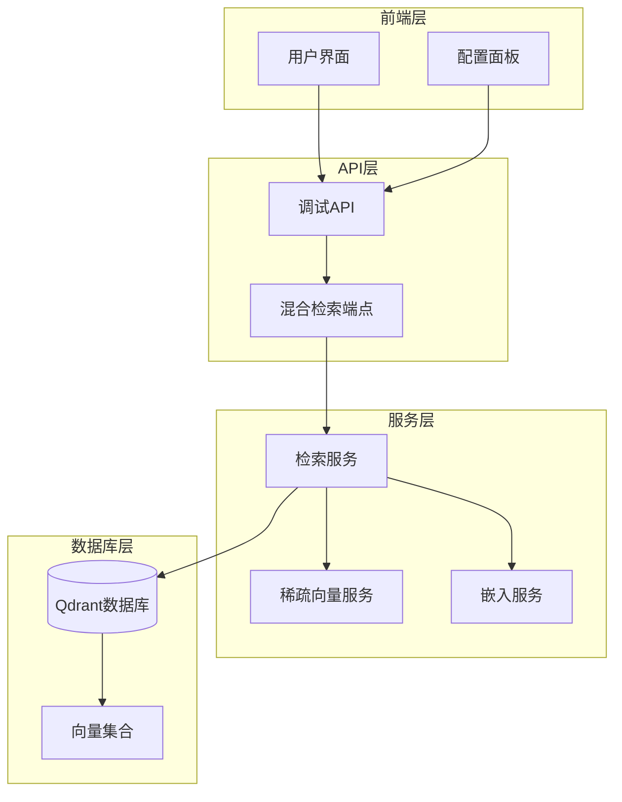
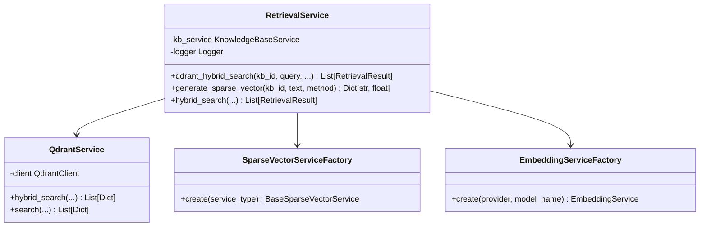
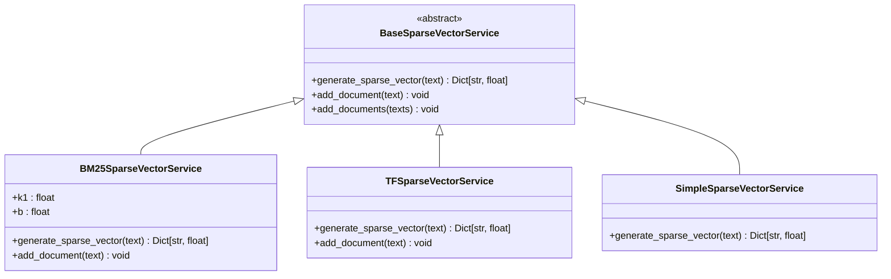
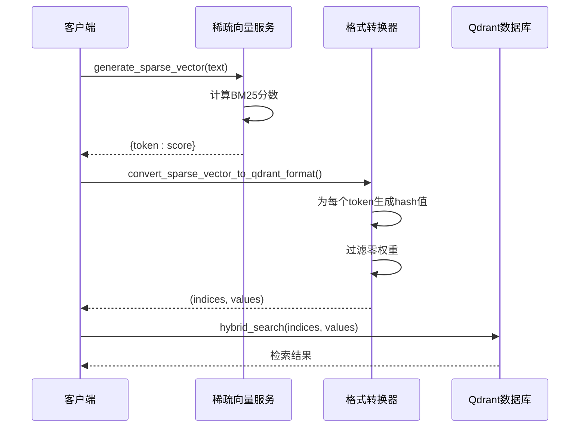
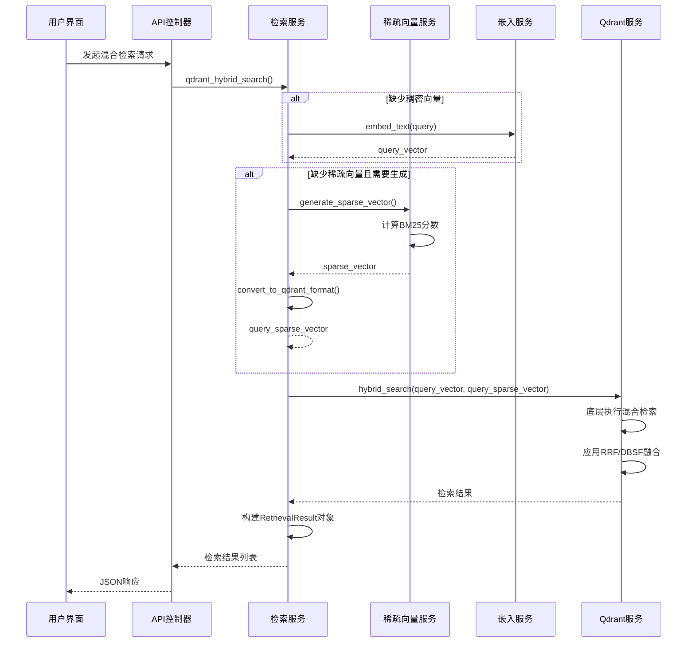
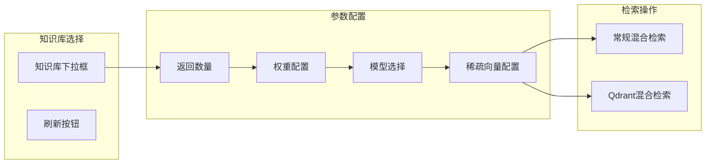

# Qdrant原生混合检索技术实现

<cite>
**本文档引用的文件**
- [retrieval.tsx](file://web/components/views/retrieval.tsx)
- [retrieval_service.py](file://backend/app/services/retrieval_service.py)
- [debug_pipeline.py](file://backend/app/controllers/debug_pipeline.py)
- [sparse_vector_service.py](file://backend/app/services/sparse_vector_service.py)
- [vector_db_service.py](file://backend/app/services/vector_db_service.py)
</cite>

## 目录
1. [简介](#简介)
2. [系统架构概览](#系统架构概览)
3. [核心组件分析](#核心组件分析)
4. [稀疏向量生成机制](#稀疏向量生成机制)
5. [Qdrant原生混合检索流程](#qdrant原生混合检索流程)
6. [与RRF融合的对比分析](#与rrf融合的对比分析)
7. [前端交互界面](#前端交互界面)
8. [性能优化考虑](#性能优化考虑)
9. [故障排除指南](#故障排除指南)
10. [总结](#总结)

## 简介

Qdrant原生混合检索是一种先进的检索技术，它充分利用了Qdrant向量数据库的内置功能，将稠密向量（dense vector）和稀疏向量（sparse vector）进行联合检索。这种技术通过同时利用语义相似性和关键词匹配，显著提升了检索的准确性和相关性。

### 技术优势

- **原生支持**：Qdrant数据库原生支持混合检索，无需应用层分别执行向量和关键词检索
- **高效融合**：底层自动执行融合策略，支持RRF（Reciprocal Rank Fusion）和DBSF（Differentiable Soft Beam Search Fusion）等多种融合方法
- **灵活配置**：支持多种稀疏向量生成算法（BM25、TF-IDF、简单词频等）
- **实时检索**：提供低延迟的混合检索能力

## 系统架构概览



**图表来源**
- [retrieval.tsx](file://web/components/views/retrieval.tsx#L1-L532)
- [debug_pipeline.py](file://backend/app/controllers/debug_pipeline.py#L1201-L1292)

## 核心组件分析

### 1. 检索服务（RetrievalService）

检索服务是混合检索的核心协调器，负责管理整个检索流程。



**图表来源**
- [retrieval_service.py](file://backend/app/services/retrieval_service.py#L330-L455)
- [vector_db_service.py](file://backend/app/services/vector_db_service.py#L652-L774)

**章节来源**
- [retrieval_service.py](file://backend/app/services/retrieval_service.py#L330-L455)

### 2. 稀疏向量服务工厂

系统支持多种稀疏向量生成算法，通过工厂模式统一管理。



**图表来源**
- [sparse_vector_service.py](file://backend/app/services/sparse_vector_service.py#L37-L330)

**章节来源**
- [sparse_vector_service.py](file://backend/app/services/sparse_vector_service.py#L37-L330)

## 稀疏向量生成机制

### BM25算法实现

BM25（Best Matching 25）是混合检索中最重要的稀疏向量生成算法之一。

```mermaid
flowchart TD
Start([输入查询文本]) --> Tokenize[分词处理]
Tokenize --> CalcFreq[计算词频]
CalcFreq --> CheckMode{是否有语料库统计?}
CheckMode --> |否| SimpleBM25[简化BM25计算]
CheckMode --> |是| StandardBM25[标准BM25计算]
SimpleBM25 --> SimpleCalc[使用单文档语料库<br/>idf=1.0<br/>tf计算简化]
StandardBM25 --> CalcIDF[计算IDF: log(N/df)]
CalcIDF --> CalcTF[计算TF: (tf*(k1+1))/(tf+k1*(1-b+b*dl/avgdl))]
CalcTF --> CalcScore[BM25分数: idf * tf_norm]
SimpleCalc --> Filter[过滤非零分数]
CalcScore --> Filter
Filter --> Output[输出稀疏向量]
```

**图表来源**
- [sparse_vector_service.py](file://backend/app/services/sparse_vector_service.py#L98-L155)

### 稀疏向量转换为Qdrant格式

生成的稀疏向量需要转换为Qdrant所需的indices和values格式。



**图表来源**
- [sparse_vector_service.py](file://backend/app/services/sparse_vector_service.py#L303-L330)
- [debug_pipeline.py](file://backend/app/controllers/debug_pipeline.py#L1601-L1623)

**章节来源**
- [sparse_vector_service.py](file://backend/app/services/sparse_vector_service.py#L98-L155)
- [debug_pipeline.py](file://backend/app/controllers/debug_pipeline.py#L1601-L1623)

## Qdrant原生混合检索流程

### 完整检索流程



**图表来源**
- [debug_pipeline.py](file://backend/app/controllers/debug_pipeline.py#L1201-L1292)
- [retrieval_service.py](file://backend/app/services/retrieval_service.py#L330-L455)

### Qdrant混合检索方法详解

Qdrant的混合检索方法支持两种融合策略：

| 融合方法 | 描述 | 适用场景 |
|---------|------|----------|
| RRF (Reciprocal Rank Fusion) | 基于倒数排名的融合算法 | 平衡向量检索和关键词检索结果 |
| DBSF (Differentiable Soft Beam Search Fusion) | 可微软Beam搜索融合 | 更复杂的融合策略，适合特定场景 |

**章节来源**
- [debug_pipeline.py](file://backend/app/controllers/debug_pipeline.py#L1201-L1292)
- [retrieval_service.py](file://backend/app/services/retrieval_service.py#L330-L455)
- [vector_db_service.py](file://backend/app/services/vector_db_service.py#L652-L774)

## 与RRF融合的对比分析

### 底层融合 vs 应用层融合

| 特性 | Qdrant原生混合检索 | RRF融合（应用层） |
|------|-------------------|------------------|
| **融合位置** | 数据库底层 | 应用层 |
| **性能** | 更高效，减少网络传输 | 需要传输中间结果 |
| **灵活性** | 受限于数据库支持 | 完全可定制 |
| **复杂度** | 简单配置即可使用 | 需要手动实现融合逻辑 |
| **准确性** | 底层优化，效果更好 | 取决于融合算法实现 |

### RRF融合算法实现

系统还提供了独立的RRF融合算法，用于调试和对比：

```mermaid
flowchart TD
Input[多个检索结果列表] --> Weight[分配权重]
Weight --> CalcScore[计算RRF分数<br/>score = 1/(k + rank)]
CalcScore --> Aggregate[聚合相同文档]
Aggregate --> Sort[按分数排序]
Sort --> Output[融合结果]
subgraph "权重计算"
Weight --> Normalize[权重归一化]
Normalize --> Apply[应用到各结果]
end
```

**图表来源**
- [retrieval_service.py](file://backend/app/services/retrieval_service.py#L43-L132)

**章节来源**
- [retrieval_service.py](file://backend/app/services/retrieval_service.py#L43-L132)

## 前端交互界面

### 检索界面组件

前端提供了直观的混合检索界面，支持Qdrant原生混合检索功能。



**图表来源**
- [retrieval.tsx](file://web/components/views/retrieval.tsx#L392-L422)

### Qdrant混合检索按钮

前端界面上的"Qdrant混合检索"按钮专门用于触发原生混合检索功能：

- **启用条件**：仅当知识库使用Qdrant作为向量数据库时可用
- **功能特点**：自动处理向量生成和格式转换
- **用户体验**：简化了检索配置，提供更好的性能

**章节来源**
- [retrieval.tsx](file://web/components/views/retrieval.tsx#L392-L422)

## 性能优化考虑

### 检索性能优化策略

1. **预取优化**：Qdrant自动执行预取查询，减少网络往返
2. **融合策略**：底层融合避免了中间结果传输
3. **缓存机制**：支持稀疏向量缓存，避免重复计算
4. **并发处理**：支持多线程并行检索

### 内存使用优化

- **稀疏向量压缩**：只存储非零权重
- **结果限制**：通过top_k参数控制返回数量
- **流式处理**：大结果集的分页处理

## 故障排除指南

### 常见问题及解决方案

| 问题 | 可能原因 | 解决方案 |
|------|----------|----------|
| 混合检索失败 | Qdrant客户端版本过旧 | 升级qdrant-client包 |
| 稀疏向量生成错误 | 语料库统计缺失 | 添加文档到语料库 |
| 性能下降 | 检索参数不当 | 调整top_k和score_threshold |
| 权重配置错误 | 权重总和不为1 | 自动归一化权重 |

### 调试工具

系统提供了丰富的调试接口：
- `/test/rrf`：测试RRF融合算法
- `/sparse-vector/generate`：单独生成稀疏向量
- 详细的日志记录和错误报告

**章节来源**
- [debug_pipeline.py](file://backend/app/controllers/debug_pipeline.py#L1297-L1351)
- [debug_pipeline.py](file://backend/app/controllers/debug_pipeline.py#L1549-L1597)

## 总结

Qdrant原生混合检索代表了现代检索系统的发展方向，它通过以下关键技术实现了卓越的检索性能：

### 核心技术亮点

1. **原生融合**：Qdrant数据库层面的向量和稀疏向量融合，避免了传统方法的多次检索开销
2. **智能稀疏向量生成**：支持BM25、TF-IDF等多种算法，适应不同的业务场景
3. **灵活的融合策略**：支持RRF和DBSF等先进融合算法
4. **完整的生态系统**：从前端界面到后端服务的完整解决方案

### 应用价值

- **提升检索质量**：结合语义和关键词信息，提高检索准确性
- **降低系统复杂度**：简化了应用层的检索逻辑
- **优化性能表现**：减少了网络传输和中间处理步骤
- **增强用户体验**：提供直观的配置界面和快速的响应速度

这种混合检索技术特别适用于需要高精度检索的应用场景，如智能问答系统、文档检索、推荐系统等。随着Qdrant数据库的不断发展和完善，这种原生混合检索能力将会成为构建高质量检索系统的重要基础。