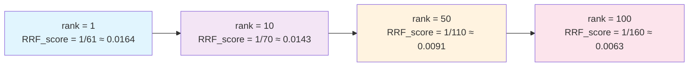
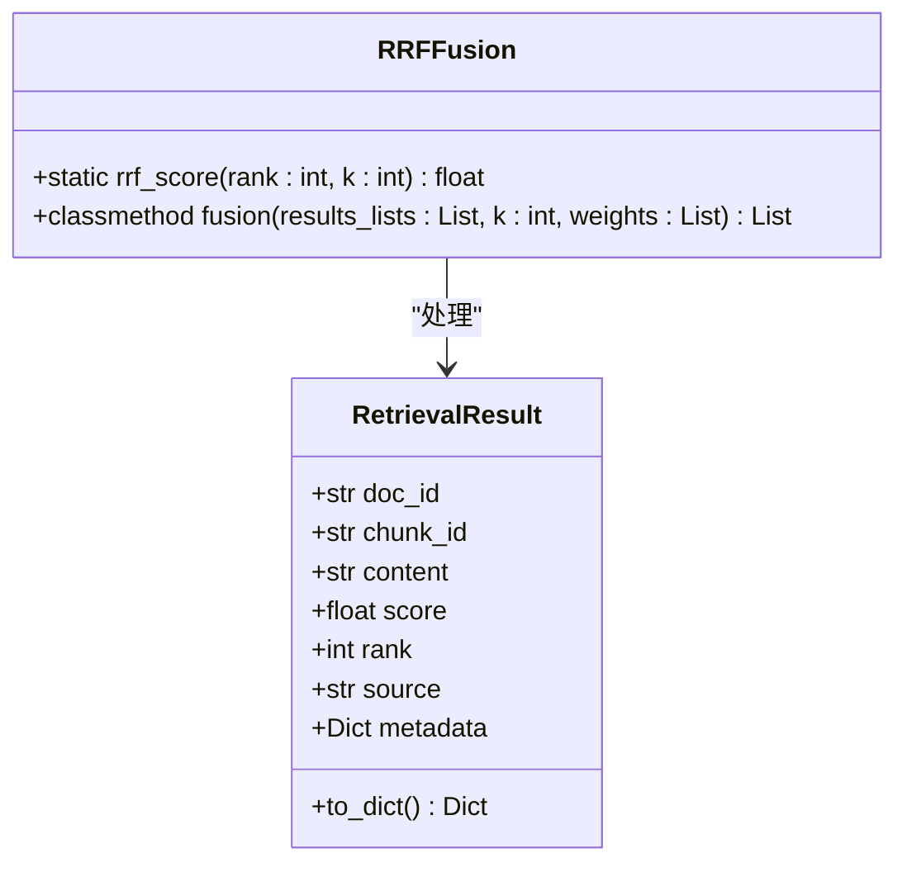
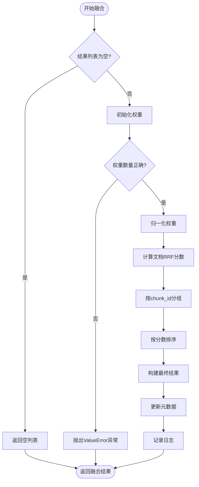
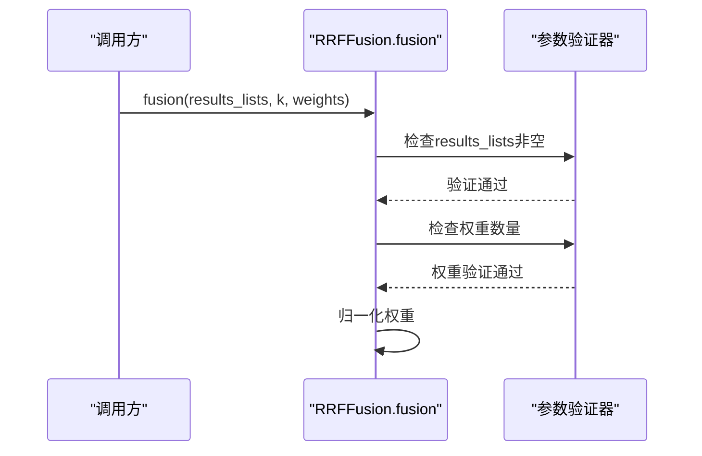
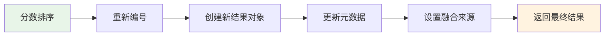
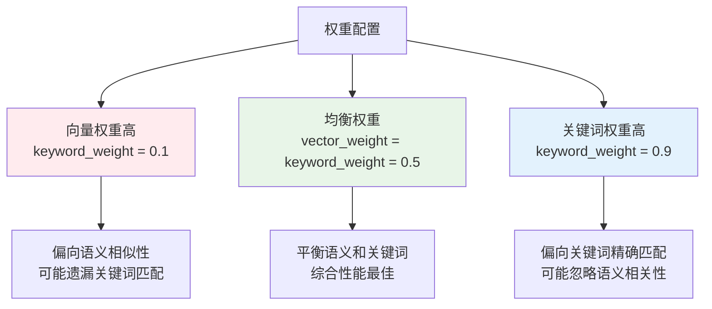
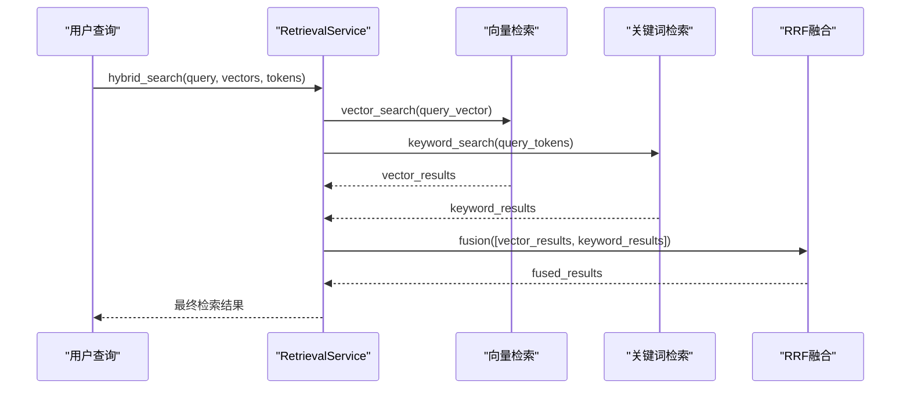
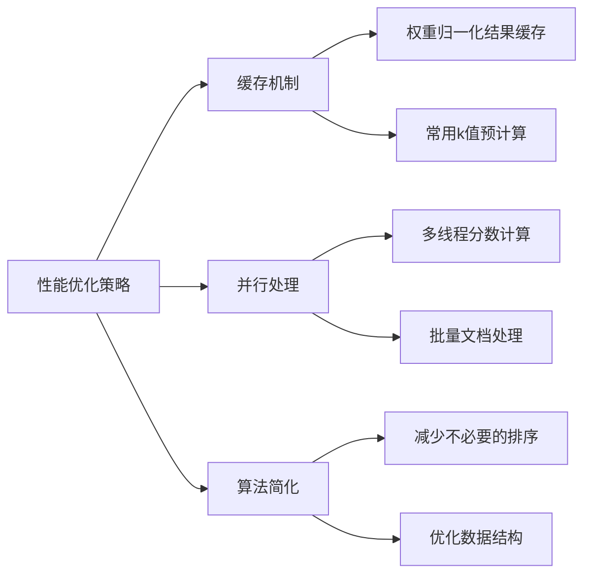

# RRF融合算法深度解析

<cite>
**本文档引用的文件**
- [retrieval_service.py](file://backend/app/services/retrieval_service.py)
- [retrieval.tsx](file://web/components/views/retrieval.tsx)
- [debug_pipeline.py](file://backend/app/controllers/debug_pipeline.py)
</cite>

## 目录
1. [简介](#简介)
2. [RRF算法数学原理](#rrf算法数学原理)
3. [RRFFusion类核心实现](#rrffusion类核心实现)
4. [融合算法执行流程](#融合算法执行流程)
5. [权重配置与参数调优](#权重配置与参数调优)
6. [实际应用场景](#实际应用场景)
7. [性能优化建议](#性能优化建议)
8. [故障排除指南](#故障排除指南)
9. [总结](#总结)

## 简介

Reciprocal Rank Fusion (RRF) 是一种强大的多检索结果融合算法，广泛应用于信息检索系统中。该算法通过计算每个文档在不同检索结果列表中的倒数排名分数，然后对这些分数进行加权求和，最终生成统一的排序结果。

在本项目中，RRF算法被用于融合向量检索和关键词检索两种不同的检索方式，通过合理的权重分配和参数调节，显著提升了检索系统的整体性能和准确性。

## RRF算法数学原理

### 基础公式

RRF算法的核心公式为：
```
RRF_score = 1 / (k + rank)
```

其中：
- `rank`：文档在某个检索结果列表中的排名位置（从1开始）
- `k`：常数参数，通常设置为60，控制分数衰减速度

### 数学特性分析

1. **分数范围**：RRF分数始终在(0, 1/k]范围内
2. **衰减特性**：随着rank增大，分数呈递减趋势，但衰减速度逐渐放缓
3. **相对性**：分数只反映相对排名，不依赖绝对分数值



**图表来源**
- [retrieval_service.py](file://backend/app/services/retrieval_service.py#L47-L58)

## RRFFusion类核心实现

### 类结构概览



**图表来源**
- [retrieval_service.py](file://backend/app/services/retrieval_service.py#L43-L132)

### rrf_score静态方法

该方法实现了RRF算法的核心计算逻辑：

**方法签名**：`rrf_score(rank: int, k: int = 60) -> float`

**功能描述**：
- 接收文档排名位置和RRF参数k
- 计算并返回对应的RRF分数
- 支持自定义k值调整分数衰减特性

**实现特点**：
- 使用静态方法设计，无需实例化即可调用
- 参数验证简洁高效
- 返回值类型明确，便于后续计算

**节来源**
- [retrieval_service.py](file://backend/app/services/retrieval_service.py#L47-L58)

### fusion类方法

这是RRF算法的主要入口点，负责处理多个检索结果列表的融合：

**方法签名**：`fusion(cls, results_lists: List[List[RetrievalResult]], k: int = 60, weights: Optional[List[float]] = None) -> List[RetrievalResult]`

**核心功能**：
1. **输入验证**：检查结果列表的有效性
2. **权重处理**：支持自定义权重或均等权重
3. **分数计算**：为每个文档计算RRF分数
4. **结果排序**：按最终分数降序排列
5. **结果构建**：创建新的融合结果对象

**节来源**
- [retrieval_service.py](file://backend/app/services/retrieval_service.py#L61-L132)

## 融合算法执行流程

### 完整执行流程图



**图表来源**
- [retrieval_service.py](file://backend/app/services/retrieval_service.py#L61-L132)

### 详细步骤解析

#### 1. 输入预处理阶段



**图表来源**
- [retrieval_service.py](file://backend/app/services/retrieval_service.py#L79-L92)

#### 2. 分数计算阶段

该阶段是RRF算法的核心，涉及复杂的分数累积和去重逻辑：

**关键数据结构**：
- `doc_scores`：defaultdict，存储每个chunk_id的累计RRF分数
- `doc_info`：字典，保存每个chunk_id的原始文档信息

**计算过程**：
1. 遍历每个结果列表
2. 对每个结果计算RRF分数
3. 按权重累加到对应chunk_id
4. 保存首次出现的文档信息

#### 3. 结果生成阶段



**图表来源**
- [retrieval_service.py](file://backend/app/services/retrieval_service.py#L110-L132)

**节来源**
- [retrieval_service.py](file://backend/app/services/retrieval_service.py#L94-L132)

## 权重配置与参数调优

### 前端权重配置界面

项目提供了直观的权重配置界面，允许用户动态调整RRF参数：

**主要配置项**：

| 参数名称 | 默认值 | 取值范围 | 作用描述 |
|---------|--------|----------|----------|
| `vector_weight` | 0.7 | 0.0-1.0 | 向量检索结果的权重比例 |
| `keyword_weight` | 0.3 | 0.0-1.0 | 关键词检索结果的权重比例 |
| `rrf_k` | 60 | 1-100 | 控制RRF分数衰减速度的参数 |
| `top_k` | 5 | 1-50 | 返回结果的数量限制 |

**节来源**
- [retrieval.tsx](file://web/components/views/retrieval.tsx#L17-L24)

### 权重配置对融合效果的影响



### rrf_k参数的影响机制

**参数值与衰减特性关系**：

| k值范围 | 衰减特性 | 适用场景 |
|---------|----------|----------|
| 1-20 | 快速衰减 | 对排名敏感的场景 |
| 21-60 | 中等衰减 | 通用场景，推荐值 |
| 61-100 | 缓慢衰减 | 需要保留更多候选结果 |

**图表来源**
- [retrieval.tsx](file://web/components/views/retrieval.tsx#L299-L307)

## 实际应用场景

### 混合检索系统中的应用

在本项目中，RRF算法被广泛应用于混合检索系统：



**图表来源**
- [retrieval_service.py](file://backend/app/services/retrieval_service.py#L458-L536)

### API调用示例

#### 基本混合检索调用

**节来源**
- [retrieval.tsx](file://web/components/views/retrieval.tsx#L75-L84)

#### Qdrant原生混合检索

**节来源**
- [retrieval.tsx](file://web/components/views/retrieval.tsx#L96-L115)

### 调试和测试接口

项目提供了专门的RRF测试接口，便于开发者验证算法效果：

**节来源**
- [debug_pipeline.py](file://backend/app/controllers/debug_pipeline.py#L1298-L1351)

## 性能优化建议

### 内存使用优化

1. **结果数量控制**：在混合检索中，通常将每个子检索返回结果数设为`top_k * 2`，避免过多中间结果占用内存
2. **权重归一化**：确保权重总和为1，避免浮点数精度问题
3. **去重机制**：利用`chunk_id`作为唯一标识符，自动处理重复文档

### 计算效率优化



### 参数调优策略

1. **权重调优**：
   - 根据具体业务场景调整向量权重和关键词权重
   - 可通过A/B测试确定最优权重组合

2. **k值调优**：
   - 较小的k值适合对排名敏感的应用
   - 较大的k值适合需要保留更多候选结果的场景

## 故障排除指南

### 常见问题及解决方案

#### 1. 权重配置错误

**问题现象**：`ValueError: 权重数量必须与结果列表数量一致`

**解决方案**：
- 确保权重列表长度与结果列表数量相等
- 使用默认权重时传入`None`
- 检查权重总和是否合理

#### 2. 融合结果为空

**可能原因**：
- 输入的检索结果列表为空
- 所有结果的分数过低
- 权重设置不合理导致某些结果被完全忽略

**排查步骤**：
1. 检查输入的检索结果是否有效
2. 验证权重配置是否合理
3. 调整k值观察效果变化

#### 3. 性能问题

**优化建议**：
- 减少`top_k`值降低中间结果数量
- 优化权重配置减少不必要的计算
- 使用更高效的向量检索算法

**节来源**
- [retrieval_service.py](file://backend/app/services/retrieval_service.py#L86-L88)

## 总结

RRF（Reciprocal Rank Fusion）融合算法作为一种经典的多结果融合方法，在本项目中展现了强大的实用价值。通过深入分析其数学原理、代码实现和实际应用场景，我们可以得出以下结论：

### 核心优势

1. **简单高效**：算法复杂度低，计算速度快
2. **鲁棒性强**：对不同质量的检索结果具有良好的适应性
3. **参数灵活**：通过权重和k值调节，可适应不同业务需求
4. **易于理解**：数学原理清晰，便于调试和优化

### 应用价值

在混合检索系统中，RRF算法有效整合了向量检索的语义能力和关键词检索的精确性，显著提升了整体检索效果。通过合理的参数配置和权重调优，可以在不同业务场景中获得最佳的检索性能。

### 发展方向

随着检索技术的不断发展，RRF算法可以进一步与其他先进的融合方法结合，如学习排序（Learning to Rank）等，以获得更好的融合效果。同时，针对特定领域的优化和自动化参数调优也是未来的重要发展方向。