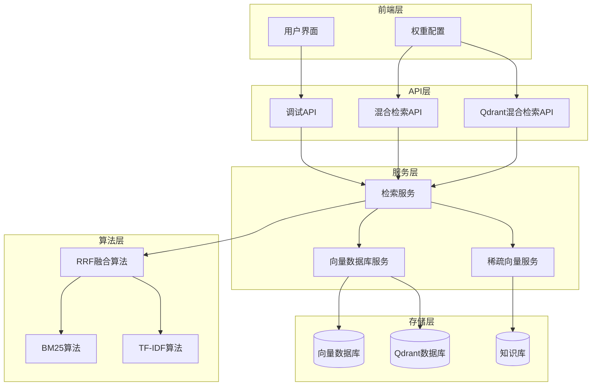
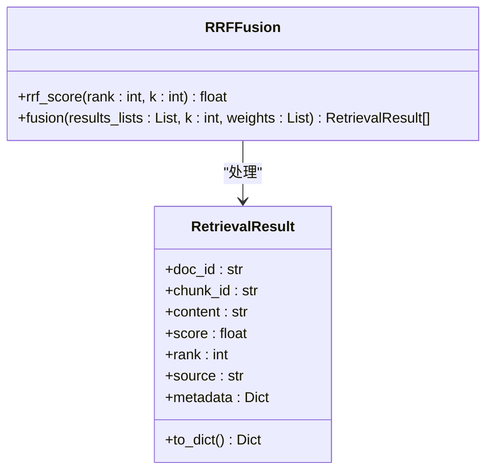
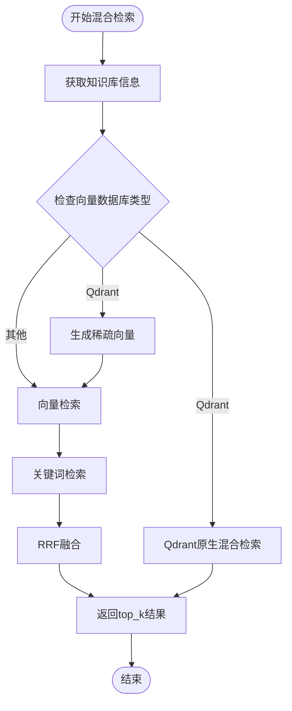
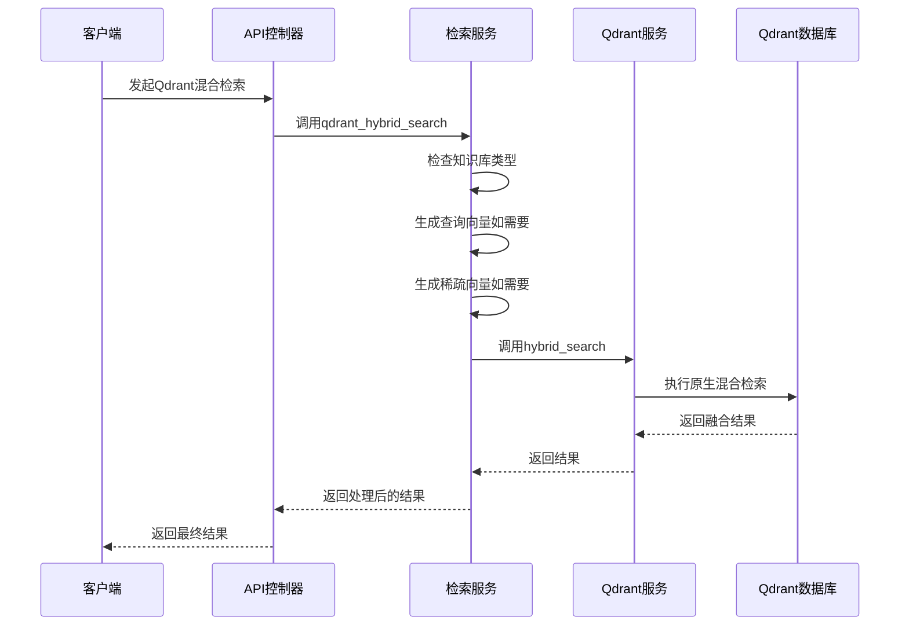
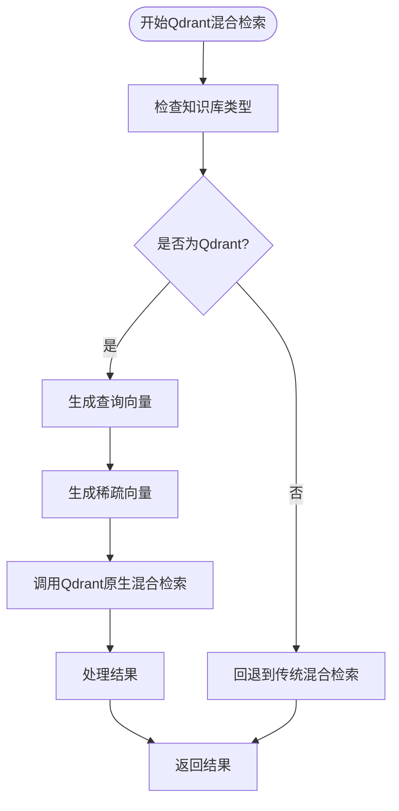
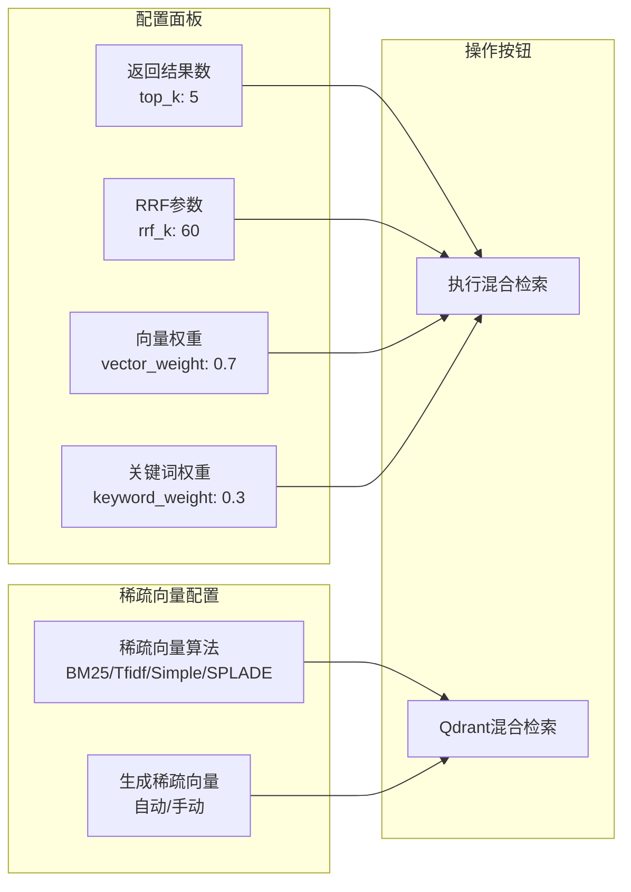
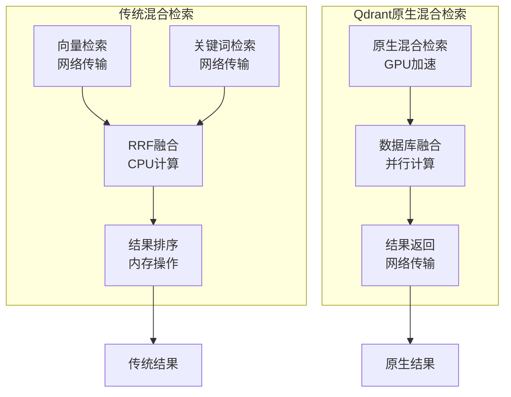
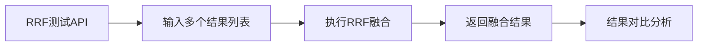

# 混合检索

<cite>
**本文档引用的文件**
- [retrieval_service.py](file://backend/app/services/retrieval_service.py)
- [retrieval.tsx](file://web/components/views/retrieval.tsx)
- [vector_db_service.py](file://backend/app/services/vector_db_service.py)
- [debug_pipeline.py](file://backend/app/controllers/debug_pipeline.py)
- [sparse_vector_service.py](file://backend/app/services/sparse_vector_service.py)
- [test_sparse_vector_simple.py](file://test_sparse_vector_simple.py)
</cite>

## 目录
1. [简介](#简介)
2. [系统架构概览](#系统架构概览)
3. [RRF融合算法详解](#rrf融合算法详解)
4. [传统混合检索实现](#传统混合检索实现)
5. [Qdrant原生混合检索](#qdrant原生混合检索)
6. [前端权重配置界面](#前端权重配置界面)
7. [技术差异与适用场景](#技术差异与适用场景)
8. [性能优化策略](#性能优化策略)
9. [故障排除指南](#故障排除指南)
10. [总结](#总结)

## 简介

混合检索系统是RAG（检索增强生成）应用中的核心组件，通过结合向量检索和关键词检索的优势，提供更准确、更全面的文档检索能力。本系统实现了两种主要的混合检索方式：基于RRF（Reciprocal Rank Fusion）融合的传统混合检索和Qdrant原生混合检索。

混合检索的核心思想是利用不同检索方式的优势互补：
- **向量检索**：基于语义相似度，能够理解查询的深层含义
- **关键词检索**：基于精确匹配，能够捕捉特定术语和概念
- **RRF融合**：通过数学公式将不同来源的检索结果进行智能融合

## 系统架构概览



**图表来源**
- [retrieval_service.py](file://backend/app/services/retrieval_service.py#L136-L854)
- [retrieval.tsx](file://web/components/views/retrieval.tsx#L1-L532)

## RRF融合算法详解

### 数学原理

RRF（Reciprocal Rank Fusion）是一种经典的检索结果融合算法，其核心公式为：

```
RRF_score = Σ(1 / (k + rank_i))
```

其中：
- `k` 是融合参数，通常设置为60
- `rank_i` 是某个文档在第i个检索结果列表中的排名
- `Σ` 表示对所有检索结果列表求和

### RRFFusion类实现



**图表来源**
- [retrieval_service.py](file://backend/app/services/retrieval_service.py#L44-L133)

#### rrf_score方法

`rrf_score`方法实现了RRF的核心数学公式：

- **输入参数**：
  - `rank`：文档在结果列表中的排名位置（从1开始）
  - `k`：RRF融合参数，控制衰减速度

- **输出**：RRF分数，值域范围为(0, 1/k]

- **特点**：
  - 排名越靠前，分数越高
  - 排名衰减呈递减曲线
  - 参数k越大，衰减越慢

#### fusion方法

`fusion`方法负责将多个检索结果列表融合成一个统一的排序结果：

- **权重分配机制**：
  - 支持为不同检索结果列表指定权重
  - 自动归一化权重总和为1
  - 权重决定了各检索方式在最终结果中的影响力

- **去重处理**：
  - 基于chunk_id识别重复文档
  - 保留首次出现的文档信息
  - 累加不同来源的RRF分数

- **排序策略**：
  - 按融合后的RRF分数降序排列
  - 重新分配排名位置
  - 保持原始文档的元数据信息

**章节来源**
- [retrieval_service.py](file://backend/app/services/retrieval_service.py#L44-L133)

## 传统混合检索实现

### hybrid_search方法

传统混合检索通过以下流程实现：



**图表来源**
- [retrieval_service.py](file://backend/app/services/retrieval_service.py#L458-L536)

### 关键参数配置

| 参数名称 | 类型 | 默认值 | 说明 |
|---------|------|--------|------|
| `vector_weight` | float | 0.7 | 向量检索结果的权重 |
| `keyword_weight` | float | 0.3 | 关键词检索结果的权重 |
| `rrf_k` | int | 60 | RRF融合参数，控制排名衰减速度 |
| `top_k` | int | 10 | 返回结果数量 |

### 实现细节

1. **向量检索**：
   - 使用稠密向量进行语义相似度搜索
   - 获取比top_k多2倍的结果用于融合
   - 支持多种向量数据库（Qdrant、Milvus等）

2. **关键词检索**：
   - 基于BM25算法的关键词匹配
   - 支持多种分词模式和检索策略
   - 计算每个文档的BM25分数

3. **融合过程**：
   - 计算每个文档的RRF分数
   - 应用权重分配
   - 按分数排序返回最终结果

**章节来源**
- [retrieval_service.py](file://backend/app/services/retrieval_service.py#L458-L536)

## Qdrant原生混合检索

### qdrant_hybrid_search方法

Qdrant原生混合检索利用Qdrant数据库的内置功能，提供更高效的混合检索能力：



**图表来源**
- [retrieval_service.py](file://backend/app/services/retrieval_service.py#L331-L456)
- [debug_pipeline.py](file://backend/app/controllers/debug_pipeline.py#L1202-L1293)

### 技术优势

1. **性能优化**：
   - 数据库层面的原生融合计算
   - 减少网络传输开销
   - 更快的响应时间

2. **算法支持**：
   - 支持RRF和DBSF两种融合算法
   - 内置稠密向量和稀疏向量检索
   - 自动权重平衡

3. **灵活性**：
   - 支持多种稀疏向量生成方法
   - 可配置融合参数
   - 灵活的查询向量和稀疏向量组合

### 实现流程



**图表来源**
- [retrieval_service.py](file://backend/app/services/retrieval_service.py#L331-L456)

**章节来源**
- [retrieval_service.py](file://backend/app/services/retrieval_service.py#L331-L456)

## 前端权重配置界面

### 界面设计

前端的retrieval.tsx组件提供了直观的权重配置界面，允许用户实时调整混合检索的各项参数：



**图表来源**
- [retrieval.tsx](file://web/components/views/retrieval.tsx#L287-L390)

### 参数说明

| 参数 | 范围 | 默认值 | 作用 |
|------|------|--------|------|
| `top_k` | 1-50 | 5 | 控制返回结果数量 |
| `rrf_k` | 1-100 | 60 | 影响RRF分数的衰减速度 |
| `vector_weight` | 0-1 | 0.7 | 向量检索结果的相对重要性 |
| `keyword_weight` | 0-1 | 0.3 | 关键词检索结果的相对重要性 |

### 用户交互流程

1. **参数调整**：
   - 用户通过滑块或输入框修改权重值
   - 实时观察权重总和的变化
   - 系统自动验证参数的有效性

2. **检索执行**：
   - 点击"执行混合检索"按钮
   - 系统发送带参数的API请求
   - 显示检索结果和性能指标

3. **结果展示**：
   - 展示每个结果的分数和排名
   - 显示检索指标（向量结果数、关键词结果数、融合后结果数）
   - 提供结果导出和保存功能

**章节来源**
- [retrieval.tsx](file://web/components/views/retrieval.tsx#L287-L456)

## 技术差异与适用场景

### 对比分析

| 特性 | 传统混合检索 | Qdrant原生混合检索 |
|------|-------------|-------------------|
| **实现方式** | 后端融合算法 | 数据库原生支持 |
| **性能** | 中等 | 高 |
| **灵活性** | 高 | 中等 |
| **部署复杂度** | 低 | 中等 |
| **适用场景** | 通用场景 | Qdrant数据库专用 |
| **算法支持** | RRF | RRF + DBSF |
| **稀疏向量** | 后端生成 | 数据库原生支持 |

### 适用场景建议

#### 传统混合检索适用场景：
- 使用非Qdrant向量数据库
- 需要高度定制化的融合算法
- 需要复杂的稀疏向量生成逻辑
- 对检索结果有特殊格式要求

#### Qdrant原生混合检索适用场景：
- 使用Qdrant作为向量数据库
- 追求最佳性能表现
- 需要数据库级别的融合计算
- 简单的检索需求

### 性能对比



**图表来源**
- [retrieval_service.py](file://backend/app/services/retrieval_service.py#L458-L536)
- [vector_db_service.py](file://backend/app/services/vector_db_service.py#L700-L761)

## 性能优化策略

### 检索优化

1. **结果预取优化**：
   - 向量检索获取top_k*2的结果
   - 关键词检索同样获取更多候选项
   - 为融合提供更多候选文档

2. **稀疏向量缓存**：
   - 缓存常用的稀疏向量
   - 避免重复计算相同的查询向量
   - 支持批量生成和更新

3. **数据库连接优化**：
   - 使用连接池管理数据库连接
   - 实现连接重试机制
   - 监控数据库性能指标

### 前端优化

1. **防抖处理**：
   - 检索按钮点击防抖
   - 参数变更延迟执行
   - 避免频繁的API调用

2. **结果缓存**：
   - 缓存最近的检索结果
   - 支持结果导出和导入
   - 提供结果比较功能

3. **用户体验优化**：
   - 加载状态指示
   - 实时进度反馈
   - 错误信息友好提示

**章节来源**
- [retrieval_service.py](file://backend/app/services/retrieval_service.py#L503-L504)
- [retrieval.tsx](file://web/components/views/retrieval.tsx#L62-L124)

## 故障排除指南

### 常见问题及解决方案

#### 检索结果质量不佳

**症状**：检索结果相关性低，重复率高

**可能原因**：
1. 权重分配不合理
2. RRF参数设置不当
3. 稀疏向量生成质量差

**解决方案**：
1. 调整`vector_weight`和`keyword_weight`比例
2. 优化`rrf_k`参数值
3. 检查稀疏向量生成方法的选择

#### 性能问题

**症状**：检索响应时间过长

**可能原因**：
1. 数据库连接问题
2. 检索参数过大
3. 稀疏向量计算复杂

**解决方案**：
1. 检查数据库连接状态
2. 减少`top_k`和`rrf_k`值
3. 使用更简单的稀疏向量算法

#### Qdrant混合检索失败

**症状**：Qdrant混合检索返回错误

**可能原因**：
1. 知识库配置错误
2. 稀疏向量格式不正确
3. Qdrant服务不可用

**解决方案**：
1. 检查知识库向量数据库类型
2. 验证稀疏向量格式
3. 确认Qdrant服务状态

### 调试工具

系统提供了专门的RRF融合测试接口，可用于调试和验证融合算法：



**图表来源**
- [debug_pipeline.py](file://backend/app/controllers/debug_pipeline.py#L1298-L1339)

**章节来源**
- [debug_pipeline.py](file://backend/app/controllers/debug_pipeline.py#L1298-L1339)

## 总结

混合检索系统通过结合向量检索和关键词检索的优势，为RAG应用提供了强大的文档检索能力。系统实现了两种主要的混合检索方式：

1. **基于RRF融合的传统混合检索**：
   - 灵活的算法实现
   - 支持多种向量数据库
   - 可定制的权重分配

2. **Qdrant原生混合检索**：
   - 数据库级别的高性能计算
   - 内置多种融合算法
   - 简化的部署架构

前端界面提供了直观的参数配置和实时效果预览，使用户能够轻松调整检索参数并观察效果变化。通过合理的参数配置和优化策略，混合检索系统能够在准确性和性能之间取得良好的平衡，为用户提供优质的检索体验。