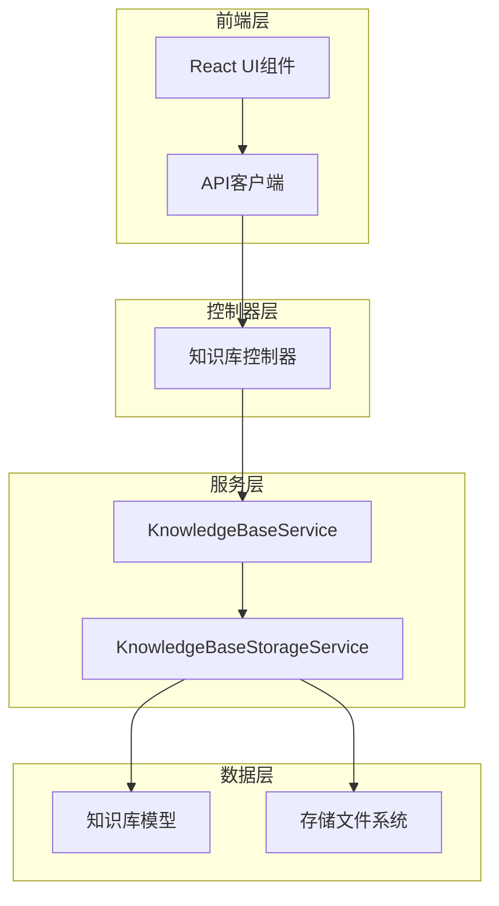
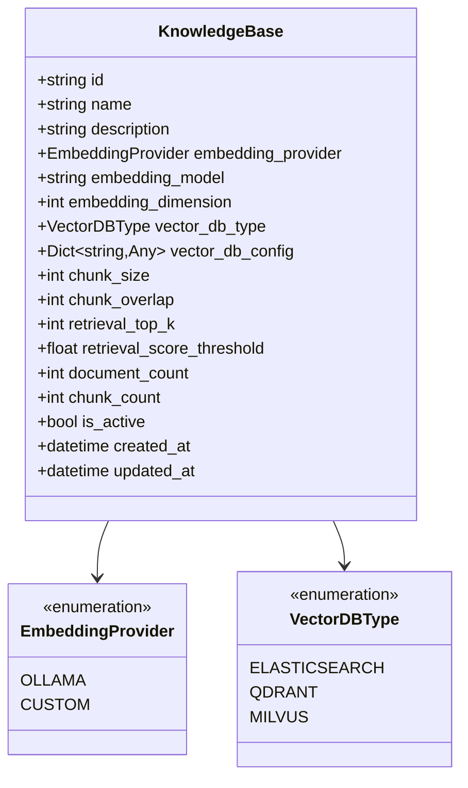
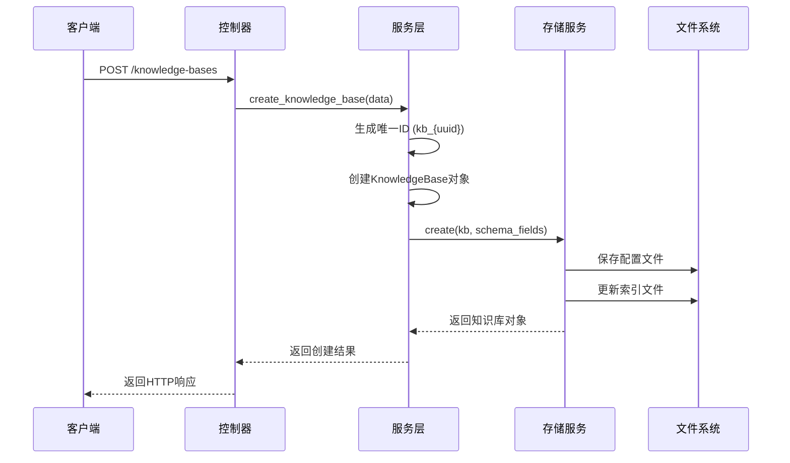
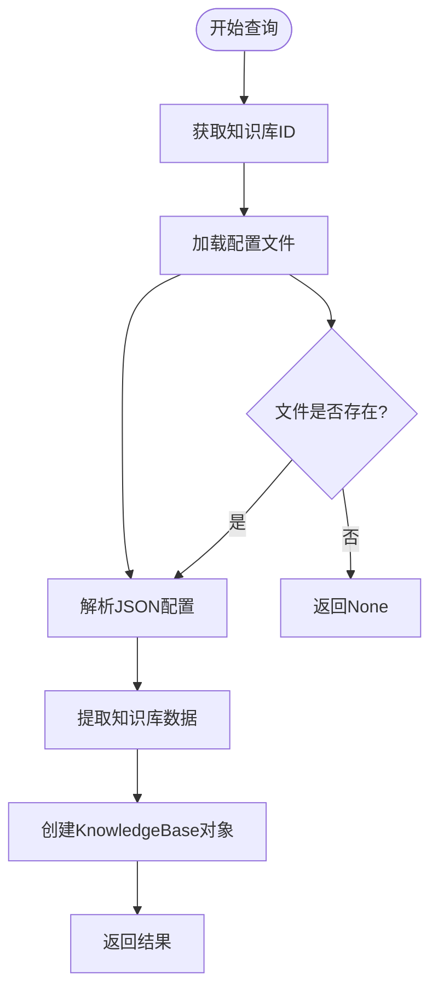
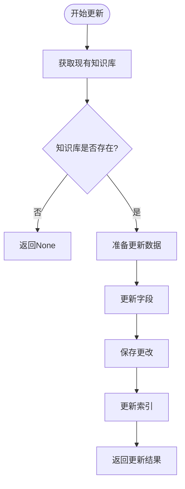
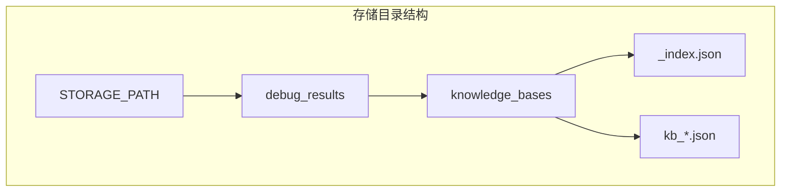
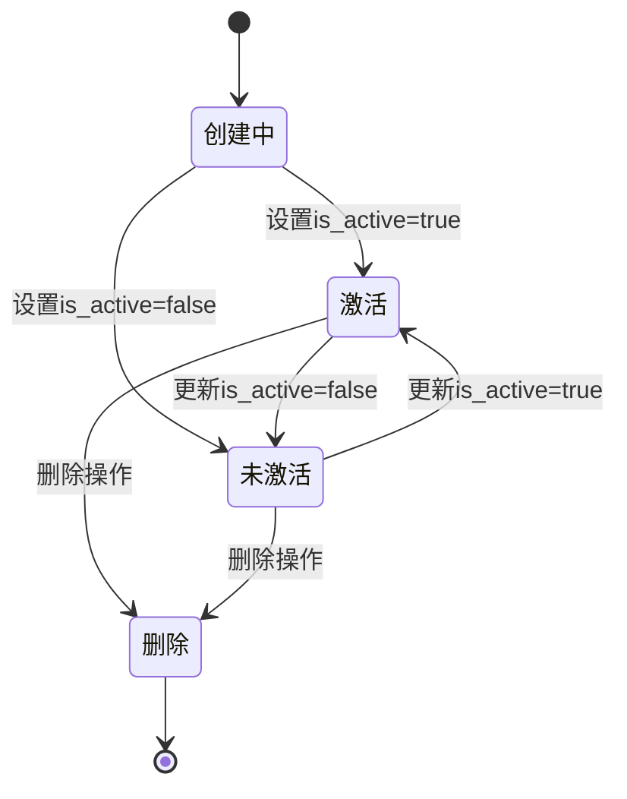

# 知识库管理

<cite>
**本文档引用的文件**
- [knowledge_base.py](file://backend/app/models/knowledge_base.py)
- [knowledge_base.py](file://backend/app/services/knowledge_base.py)
- [knowledge_base_storage.py](file://backend/app/services/knowledge_base_storage.py)
- [knowledge_base.py](file://backend/app/controllers/knowledge_base.py)
- [knowledge_base.py](file://backend/app/schemas/knowledge_base.py)
- [knowledge-base-list.tsx](file://web/components/views/knowledge-base-list.tsx)
- [knowledge-base-config.tsx](file://web/components/views/knowledge-base-config.tsx)
- [api.ts](file://web/lib/api.ts)
- [migrate_knowledge_bases.py](file://backend/app/utils/migrate_knowledge_bases.py)
</cite>

## 目录
1. [概述](#概述)
2. [系统架构](#系统架构)
3. [核心数据模型](#核心数据模型)
4. [CRUD操作详解](#crud操作详解)
5. [存储机制](#存储机制)
6. [前后端交互流程](#前后端交互流程)
7. [配置参数详解](#配置参数详解)
8. [状态管理](#状态管理)
9. [前端UI组件](#前端ui组件)
10. [实际调用示例](#实际调用示例)
11. [常见问题解决方案](#常见问题解决方案)
12. [最佳实践](#最佳实践)

## 概述

RAG Studio的知识库管理模块是一个完整的知识库生命周期管理系统，支持知识库的创建、查询、更新和删除（CRUD）操作。该模块采用分层架构设计，通过KnowledgeBaseService协调业务逻辑，使用KnowledgeBaseStorageService进行持久化存储，并提供了完整的前后端交互接口。

### 主要特性

- **完整的CRUD操作**：支持知识库的创建、查询、更新和删除
- **灵活的配置管理**：支持嵌入模型、向量数据库、分块策略等多种配置
- **状态控制**：通过is_active字段控制知识库的启用状态
- **Schema管理**：支持自定义字段定义和向量数据库配置
- **前后端分离**：提供RESTful API和React前端组件

## 系统架构



**图表来源**
- [knowledge_base.py](file://backend/app/controllers/knowledge_base.py#L1-L283)
- [knowledge_base.py](file://backend/app/services/knowledge_base.py#L1-L230)
- [knowledge_base_storage.py](file://backend/app/services/knowledge_base_storage.py#L1-L359)

## 核心数据模型

### 知识库模型结构

知识库模型定义了完整的知识库配置信息，包括嵌入配置、向量数据库配置、分块配置和检索配置。



**图表来源**
- [knowledge_base.py](file://backend/app/models/knowledge_base.py#L25-L80)

### 模型字段说明

| 字段名 | 类型 | 必填 | 默认值 | 说明 |
|--------|------|------|--------|------|
| id | string | 是 | 自动生成 | 知识库唯一标识符，格式为kb_{uuid} |
| name | string | 是 | - | 知识库名称，长度1-100字符 |
| description | string | 否 | - | 知识库描述，长度不超过500字符 |
| embedding_provider | EmbeddingProvider | 是 | OLLAMA | 嵌入模型提供商 |
| embedding_model | string | 是 | - | 嵌入模型名称 |
| embedding_dimension | int | 是 | 768 | 向量维度 |
| vector_db_type | VectorDBType | 是 | - | 向量数据库类型 |
| vector_db_config | Dict | 是 | {} | 向量数据库配置 |
| chunk_size | int | 是 | 512 | 分块大小，范围100-2000 |
| chunk_overlap | int | 是 | 50 | 分块重叠，范围0-500 |
| retrieval_top_k | int | 是 | 5 | 检索返回数量，范围1-50 |
| retrieval_score_threshold | float | 是 | 0.7 | 检索分数阈值，范围0.0-1.0 |
| document_count | int | 是 | 0 | 文档数量 |
| chunk_count | int | 是 | 0 | 分块数量 |
| is_active | bool | 是 | True | 是否激活 |

**章节来源**
- [knowledge_base.py](file://backend/app/models/knowledge_base.py#L28-L62)

## CRUD操作详解

### 创建知识库（Create）

创建知识库是系统启动的第一个操作，涉及ID生成、配置验证和存储持久化。



**图表来源**
- [knowledge_base.py](file://backend/app/services/knowledge_base.py#L21-L47)
- [knowledge_base_storage.py](file://backend/app/services/knowledge_base_storage.py#L92-L158)

#### ID生成机制

知识库ID采用`kb_{uuid}`格式，其中uuid取前12位字符，确保ID的唯一性和可读性。

**章节来源**
- [knowledge_base.py](file://backend/app/services/knowledge_base.py#L33)

### 查询知识库（Read）

系统提供多种查询方式，包括单个查询、列表查询和统计查询。

#### 单个查询



**图表来源**
- [knowledge_base_storage.py](file://backend/app/services/knowledge_base_storage.py#L160-L171)

#### 列表查询

列表查询支持分页和条件过滤，特别是对is_active状态的特殊处理。

**章节来源**
- [knowledge_base.py](file://backend/app/services/knowledge_base.py#L61-L86)
- [knowledge_base_storage.py](file://backend/app/services/knowledge_base_storage.py#L173-L218)

### 更新知识库（Update）

更新操作支持部分字段更新，通过Pydantic的exclude_unset机制实现。



**图表来源**
- [knowledge_base.py](file://backend/app/services/knowledge_base.py#L88-L117)

### 删除知识库（Delete）

删除操作相对简单，主要涉及文件删除和索引更新。

**章节来源**
- [knowledge_base.py](file://backend/app/services/knowledge_base.py#L119-L133)
- [knowledge_base_storage.py](file://backend/app/services/knowledge_base_storage.py#L292-L312)

## 存储机制

### debug_results机制

系统采用debug_results机制进行知识库配置的持久化存储，这种机制具有以下特点：

1. **文件组织结构**：`{STORAGE_PATH}/debug_results/knowledge_bases/`
2. **索引文件**：每个知识库都有一个独立的JSON配置文件
3. **索引管理**：主索引文件`_index.json`记录所有知识库的基本信息



**图表来源**
- [knowledge_base_storage.py](file://backend/app/services/knowledge_base_storage.py#L17-L23)

### 配置快照保存逻辑

每次更新知识库配置时，系统都会保存完整的配置快照，包括：

- 基础配置信息
- Schema字段定义
- 向量数据库配置
- 时间戳信息
- 元数据信息

**章节来源**
- [knowledge_base_storage.py](file://backend/app/services/knowledge_base_storage.py#L125-L142)

### 删除级联处理

删除知识库时，系统会：

1. 删除对应的配置文件
2. 从索引文件中移除记录
3. 更新索引文件排序

**章节来源**
- [knowledge_base_storage.py](file://backend/app/services/knowledge_base_storage.py#L292-L312)

## 前后端交互流程

### API接口设计

系统提供完整的RESTful API接口，遵循REST设计原则：

| 方法 | 端点 | 功能 | 参数 |
|------|------|------|------|
| GET | /knowledge-bases | 获取知识库列表 | page, page_size, is_active |
| GET | /knowledge-bases/{id} | 获取知识库详情 | id |
| POST | /knowledge-bases | 创建知识库 | KnowledgeBaseCreate |
| PUT | /knowledge-bases/{id} | 更新知识库 | id, KnowledgeBaseUpdate |
| DELETE | /knowledge-bases/{id} | 删除知识库 | id |
| GET | /knowledge-bases/{id}/config | 获取详细配置 | id |
| GET | /knowledge-bases/{id}/stats | 获取统计信息 | id |
| GET | /knowledge-bases/{id}/schema | 获取Schema配置 | id |
| PUT | /knowledge-bases/{id}/schema | 更新Schema配置 | id, schema_fields |

**章节来源**
- [knowledge_base.py](file://backend/app/controllers/knowledge_base.py#L22-L283)

### 前端API封装

前端通过统一的API客户端进行后端调用，提供类型安全的接口。

**章节来源**
- [api.ts](file://web/lib/api.ts#L108-L221)

## 配置参数详解

### 嵌入配置

嵌入配置决定了知识库使用的向量表示方法：

- **embedding_provider**：嵌入模型提供商，支持OLLAMA和CUSTOM
- **embedding_model**：具体的嵌入模型名称
- **embedding_dimension**：向量维度，影响向量空间的表达能力

### 向量数据库配置

系统支持三种主流向量数据库：

- **Qdrant**：高性能向量搜索引擎，支持稠密向量和稀疏向量
- **Elasticsearch**：分布式搜索引擎，支持向量搜索插件
- **Milvus**：专门的向量数据库，支持大规模向量存储

### 分块配置

分块配置影响文档处理的质量和检索效果：

- **chunk_size**：每个文本块的大小，影响语义完整性
- **chunk_overlap**：相邻文本块之间的重叠部分，保证上下文连续性

### 检索配置

检索配置控制知识库的检索行为：

- **retrieval_top_k**：返回的最相似文档数量
- **retrieval_score_threshold**：检索结果的最低分数阈值

**章节来源**
- [knowledge_base.py](file://backend/app/models/knowledge_base.py#L31-L54)

## 状态管理

### is_active字段的作用

`is_active`字段是知识库状态管理的核心，具有以下影响：

1. **查询过滤**：在列表查询中可以通过is_active参数筛选
2. **检索限制**：未激活的知识库不会参与检索过程
3. **统计计算**：统计信息仅包含激活状态的知识库

### 状态变更流程



**章节来源**
- [knowledge_base.py](file://backend/app/services/knowledge_base.py#L110-L112)

## 前端UI组件

### 知识库列表组件

知识库列表组件提供了完整的知识库管理界面，包括：

- **列表展示**：显示知识库的基本信息和状态
- **搜索功能**：支持按名称和描述搜索
- **分页控制**：支持分页浏览
- **状态筛选**：支持按激活状态筛选
- **操作按钮**：支持查看详情、编辑和删除

**章节来源**
- [knowledge-base-list.tsx](file://web/components/views/knowledge-base-list.tsx#L1-L149)

### 知识库配置组件

配置组件提供了详细的配置管理界面：

- **Schema管理**：支持自定义字段定义和向量配置
- **向量数据库配置**：支持Qdrant、Elasticsearch、Milvus的配置
- **配置导入导出**：支持Schema的保存和加载
- **实时预览**：配置修改后实时预览效果

**章节来源**
- [knowledge-base-config.tsx](file://web/components/views/knowledge-base-config.tsx#L75-L1599)

## 实际调用示例

### 创建知识库示例

```typescript
// 前端调用示例
const createKnowledgeBase = async () => {
  try {
    const response = await knowledgeBaseAPI.create({
      name: "技术文档库",
      description: "存储公司技术文档",
      embedding_model: "bge-m3:latest",
      vector_db_type: "qdrant",
      embedding_dimension: 1024,
      chunk_size: 512,
      chunk_overlap: 50,
      retrieval_top_k: 5,
      retrieval_score_threshold: 0.7
    });
    
    if (response.success) {
      showToast("知识库创建成功", "success");
      // 刷新列表
      loadKnowledgeBases();
    }
  } catch (error) {
    showToast(`创建失败: ${error.message}`, "error");
  }
};
```

### 更新知识库配置示例

```typescript
// Schema配置更新示例
const updateSchema = async () => {
  try {
    const schemaFields = [
      {
        name: "content",
        type: "text",
        isIndexed: true,
        isVectorIndex: false
      },
      {
        name: "embedding",
        type: "dense_vector",
        isIndexed: true,
        isVectorIndex: true,
        dimension: 1024,
        distance: "Cosine",
        hnsw: {
          m: 16,
          ef_construct: 100,
          full_scan_threshold: 10000,
          on_disk: false
        }
      }
    ];
    
    await knowledgeBaseAPI.updateSchema(
      selectedKb.id,
      schemaFields,
      "qdrant",
      { host: "localhost", port: 6333 }
    );
    
    showToast("Schema配置更新成功", "success");
  } catch (error) {
    showToast(`更新失败: ${error.message}`, "error");
  }
};
```

### 分页查询示例

```typescript
// 分页查询示例
const loadKnowledgeBases = async (page = 1, pageSize = 20, isActive?: boolean) => {
  try {
    const response = await knowledgeBaseAPI.list(page, pageSize, isActive);
    
    setKnowledgeBases(response.data);
    setTotal(response.total);
    setCurrentPage(page);
    setPageSize(pageSize);
  } catch (error) {
    setError(error.message);
  }
};
```

**章节来源**
- [api.ts](file://web/lib/api.ts#L112-L221)

## 常见问题解决方案

### ID生成冲突

**问题**：UUID生成的ID可能重复

**解决方案**：
1. 系统使用uuid.uuid4()生成全局唯一ID
2. 截取前12位确保ID的唯一性
3. 在创建时检查ID是否已存在

### 配置文件损坏

**问题**：JSON配置文件格式错误或内容损坏

**解决方案**：
1. 使用try-catch捕获JSON解析异常
2. 提供默认配置作为回退方案
3. 记录详细的错误日志

### 向量数据库连接失败

**问题**：向量数据库配置错误导致连接失败

**解决方案**：
1. 提供配置验证机制
2. 支持配置测试功能
3. 记录连接状态和错误信息

### Schema配置复杂性

**问题**：Schema配置过于复杂，难以理解

**解决方案**：
1. 提供可视化配置界面
2. 支持配置模板和导入导出
3. 提供配置向导和最佳实践建议

**章节来源**
- [knowledge_base_storage.py](file://backend/app/services/knowledge_base_storage.py#L26-L47)
- [knowledge-base-config.tsx](file://web/components/views/knowledge-base-config.tsx#L1-L50)

## 最佳实践

### 知识库命名规范

1. 使用有意义的名称，便于识别
2. 避免使用特殊字符
3. 保持名称简洁明了

### 配置优化建议

1. **嵌入模型选择**：根据应用场景选择合适的模型
2. **向量数据库选择**：根据数据规模和性能要求选择
3. **分块策略**：平衡语义完整性和处理效率
4. **检索参数调优**：根据具体需求调整Top-K和阈值

### 性能优化

1. **索引优化**：合理配置向量索引参数
2. **缓存策略**：缓存频繁访问的配置信息
3. **批量操作**：支持批量创建和更新操作

### 安全考虑

1. **敏感信息保护**：向量数据库密码等敏感信息加密存储
2. **权限控制**：实现细粒度的访问控制
3. **审计日志**：记录重要的配置变更操作

### 迁移和备份

1. **配置备份**：定期备份知识库配置
2. **版本管理**：支持配置版本控制
3. **平滑迁移**：提供配置导入导出功能

**章节来源**
- [migrate_knowledge_bases.py](file://backend/app/utils/migrate_knowledge_bases.py#L53-L89)