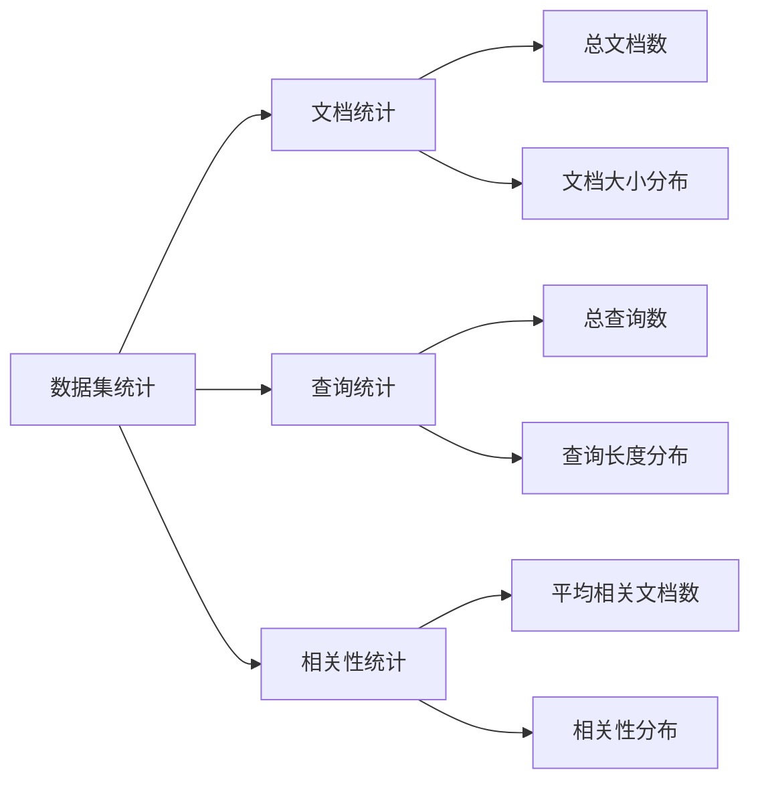
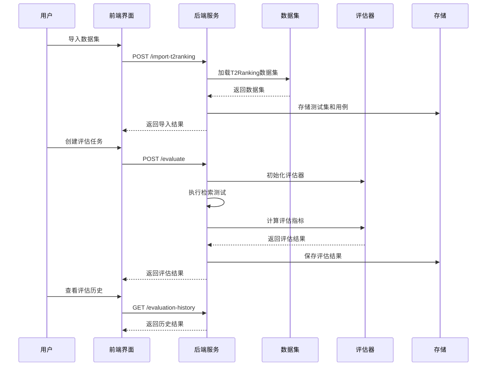
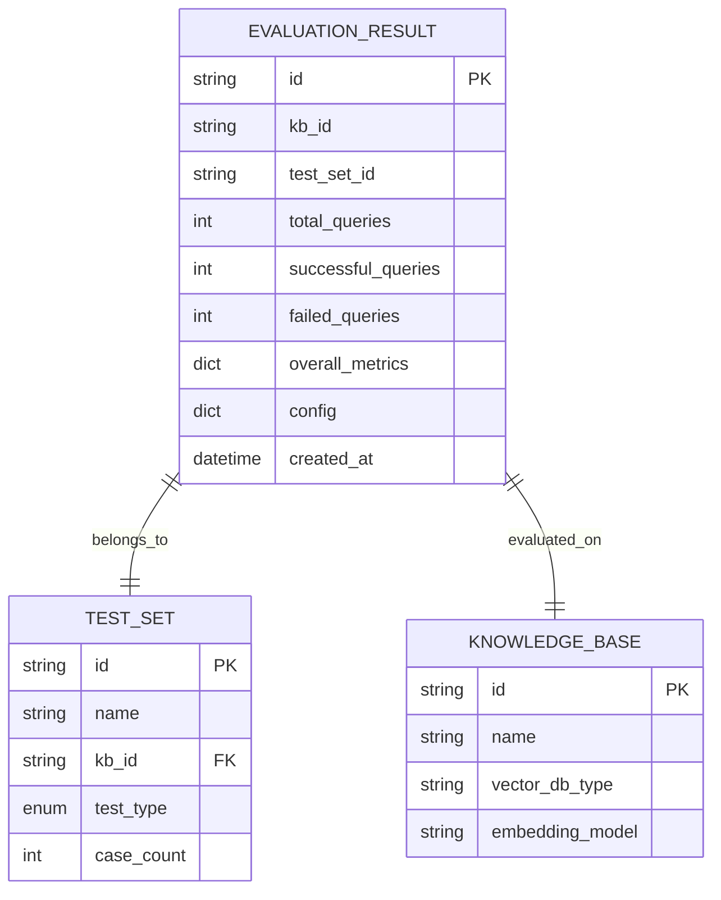
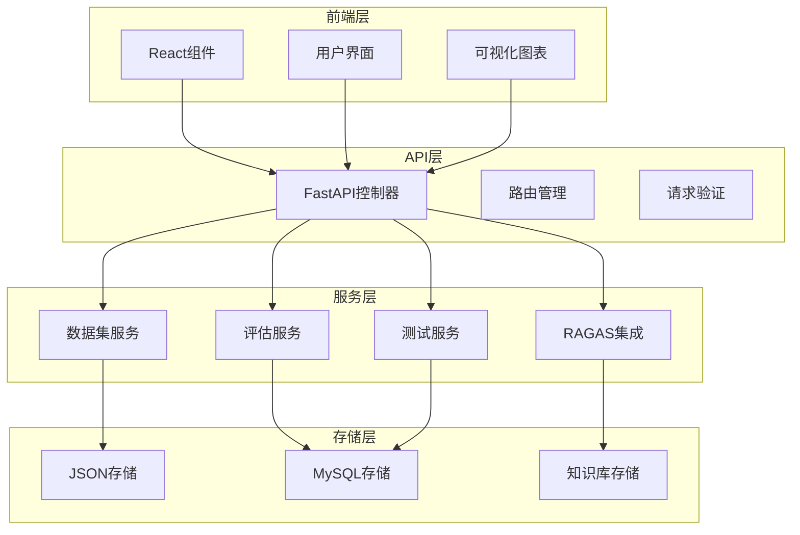
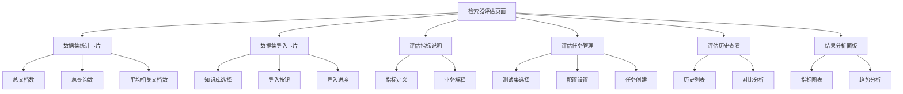
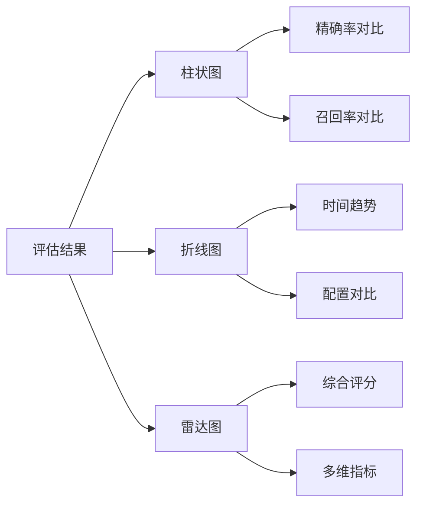

# 检索器评估系统

<cite>
**本文档引用的文件**
- [retriever_evaluation.py](file://backend/app/controllers/retriever_evaluation.py)
- [retriever_evaluation.py](file://backend/app/services/retriever_evaluation.py)
- [example_t2ranking_usage.py](file://backend/example_t2ranking_usage.py)
- [retriever-evaluation.tsx](file://web/components/views/retriever-evaluation.tsx)
- [README_RETRIEVER_EVAL.md](file://backend/README_RETRIEVER_EVAL.md)
- [dataset_loader.py](file://backend/app/services/dataset_loader.py)
- [retriever_evaluation.py](file://backend/app/models/retriever_evaluation.py)
- [test.py](file://backend/app/schemas/test.py)
- [test_retriever_eval.py](file://backend/test_retriever_eval.py)
- [test_t2ranking_pipeline.py](file://backend/test_t2ranking_pipeline.py)
</cite>

## 目录
1. [系统概述](#系统概述)
2. [设计目标](#设计目标)
3. [核心功能](#核心功能)
4. [评估指标详解](#评估指标详解)
5. [数据集支持](#数据集支持)
6. [评估流程](#评估流程)
7. [系统架构](#系统架构)
8. [API接口](#api接口)
9. [前端界面](#前端界面)
10. [使用示例](#使用示例)
11. [结果分析](#结果分析)
12. [最佳实践](#最佳实践)
13. [故障排除](#故障排除)

## 系统概述

检索器评估系统是一个基于RAGAS框架的完整检索质量评估解决方案，专门用于量化评估RAG系统中检索组件的性能。该系统支持多种评估指标，提供标准化的评估流程，并具备可视化结果分析能力。

### 核心特性

- **标准化评估**：基于T2Ranking等标准数据集
- **多维度指标**：支持Precision@K、Recall@K、F1-Score、MRR、MAP、NDCG等多种评估指标
- **自动化流程**：从数据集导入到结果分析的完整自动化
- **可视化界面**：提供直观的评估结果展示和分析工具
- **灵活配置**：支持多种检索算法和配置的对比测试

## 设计目标

### 量化评估RAG系统检索性能

系统的核心目标是建立一套科学、客观的评估体系，用于量化评估RAG系统中检索组件的各项性能指标。通过标准化的评估流程，帮助开发者：

- **性能基准测试**：建立检索系统的性能基准
- **算法对比**：对比不同检索算法的优劣
- **配置优化**：优化检索参数和配置
- **质量监控**：持续监控检索质量的变化趋势

### 支持多种评估场景

系统设计支持以下评估场景：

- **向量数据库对比**：对比Elasticsearch、Qdrant、Milvus等不同向量数据库的检索性能
- **Embedding模型评估**：评估不同embedding模型的效果
- **检索算法测试**：测试不同的检索算法配置
- **性能趋势追踪**：追踪检索质量的变化趋势

## 核心功能

### 数据集管理

系统提供完整的数据集管理功能，支持：

- **T2Ranking数据集导入**：自动加载和处理T2Ranking标准数据集
- **数据集采样**：支持大数据集的智能采样以优化性能
- **统计分析**：提供详细的数据集统计信息

### 检索评估指标

系统实现了完整的检索评估指标体系：

```mermaid
graph TD
A[检索评估指标] --> B[精确度指标]
A --> C[召回率指标]
A --> D[排序指标]
A --> E[综合指标]
B --> B1[Precision@K]
B --> B2[F1-Score]
C --> C1[Recall@K]
C --> C2[Hit Rate]
D --> D1[MRR]
D --> D2[MAP]
D --> D3[NDCG]
E --> E1[综合评分]
```

**图表来源**
- [retriever_evaluation.py](file://backend/app/services/retriever_evaluation.py#L14-L24)

### 评估流程

完整的评估流程包括：

1. **数据准备**：加载和预处理测试数据
2. **检索执行**：执行检索操作获取结果
3. **指标计算**：计算各项评估指标
4. **结果存储**：保存评估结果
5. **结果分析**：提供可视化分析工具

## 评估指标详解

### Precision@K（精确率）

**计算公式**：
```
Precision@K = |检索到的相关文档| / |检索到的文档|
```

**业务意义**：
- 衡量检索结果中相关文档的比例
- 值越高表示检索结果越准确
- 适合关注检索准确性场景

### Recall@K（召回率）

**计算公式**：
```
Recall@K = |检索到的相关文档| / |所有相关文档|
```

**业务意义**：
- 衡量相关文档被检索到的比例
- 值越高表示检索覆盖范围越广
- 适合关注检索完整性场景

### F1-Score（F1分数）

**计算公式**：
```
F1 = 2 * (Precision * Recall) / (Precision + Recall)
```

**业务意义**：
- 精确率和召回率的调和平均
- 平衡考虑精确率和召回率
- 综合评估检索质量的重要指标

### MRR（平均倒数排名）

**计算公式**：
```
MRR = 1 / rank of first relevant doc
```

**业务意义**：
- 关注第一个相关结果的位置
- 适合单答案场景的评估
- 值越接近1.0表示检索质量越好

### MAP（平均精度均值）

**计算公式**：
```
MAP = (sum of P@k for each relevant doc) / |relevant docs|
```

**业务意义**：
- 考虑所有相关结果的位置
- 适合多答案场景的评估
- 综合反映检索质量

### NDCG（归一化折损累积增益）

**计算公式**：
```
NDCG = DCG / IDCG
```

其中：
- DCG = Σ(rel_i / log2(i+1)) （实际DCG）
- IDCG = Σ(rel_i / log2(i+1)) （理想DCG）

**业务意义**：
- 综合考虑相关性和排序位置
- 值越接近1.0表示检索质量越好
- 适合对比不同检索算法

### Hit Rate（命中率）

**计算公式**：
```
Hit Rate = 1 if 至少有一个相关文档被检索到, 0 otherwise
```

**业务意义**：
- 衡量至少检索到一个相关文档的比例
- 适合关注检索可用性的场景

**章节来源**
- [retriever_evaluation.py](file://backend/app/services/retriever_evaluation.py#L109-L248)

## 数据集支持

### T2Ranking数据集

系统主要支持T2Ranking标准数据集，这是信息检索领域的重要基准数据集。

#### 数据集结构

T2Ranking数据集包含三个核心文件：

| 文件 | 描述 | 格式 |
|------|------|------|
| collection.tsv | 文档集合 | doc_id \t doc_text |
| queries.dev.tsv | 查询集合 | query_id \t query_text |
| qrels.dev.tsv | 相关性标注 | query_id \t 0 \t doc_id \t relevance |

#### 数据集统计信息

系统提供详细的统计数据：



**图表来源**
- [dataset_loader.py](file://backend/app/services/dataset_loader.py#L168-L190)

#### 数据集优化

系统支持数据集采样以优化性能：

- **查询采样**：控制测试查询的数量
- **文档采样**：只加载与查询相关的文档
- **自动优化**：根据查询数量自动确定相关文档

**章节来源**
- [dataset_loader.py](file://backend/app/services/dataset_loader.py#L14-L140)

## 评估流程

### 完整评估流程



**图表来源**
- [retriever_evaluation.py](file://backend/app/controllers/retriever_evaluation.py#L26-L152)
- [retriever_evaluation.py](file://backend/app/services/retriever_evaluation.py#L334-L422)

### 批量检索执行

系统支持批量检索执行，提高评估效率：

1. **测试用例准备**：准备完整的测试用例列表
2. **批量检索**：一次性执行多个查询的检索
3. **结果收集**：收集所有检索结果
4. **指标计算**：批量计算评估指标

### 结果存储和管理

评估结果采用结构化存储：



**图表来源**
- [retriever_evaluation.py](file://backend/app/models/retriever_evaluation.py#L11-L59)

**章节来源**
- [retriever_evaluation.py](file://backend/app/services/retriever_evaluation.py#L334-L422)

## 系统架构

### 整体架构设计



**图表来源**
- [retriever_evaluation.py](file://backend/app/controllers/retriever_evaluation.py#L1-L375)
- [retriever_evaluation.py](file://backend/app/services/retriever_evaluation.py#L1-L423)

### 核心模块

#### 控制器层（Controllers）

负责API接口的处理和请求验证：

- **数据集导入**：`/import-t2ranking`
- **评估执行**：`/evaluate`
- **历史查询**：`/evaluation-history`
- **结果对比**：`/compare-evaluations`

#### 服务层（Services）

提供核心业务逻辑：

- **数据集加载**：`DatasetService` - 加载和处理T2Ranking数据集
- **检索评估**：`RetrieverEvaluator` - 实现各种评估指标计算
- **RAGAS集成**：`RAGASEvaluator` - 集成RAGAS框架
- **测试运行**：`RetrievalTestRunner` - 执行检索测试

#### 模型层（Models）

定义数据结构和验证规则：

- **评估结果模型**：存储评估结果
- **测试集模型**：管理测试集信息
- **测试用例模型**：定义测试用例结构

**章节来源**
- [retriever_evaluation.py](file://backend/app/controllers/retriever_evaluation.py#L1-L375)
- [retriever_evaluation.py](file://backend/app/services/retriever_evaluation.py#L1-L423)

## API接口

### 主要API接口

| 接口 | 方法 | 说明 | 参数 |
|------|------|------|------|
| `/retriever-evaluation/dataset-statistics` | GET | 获取数据集统计信息 | collection_path, queries_path, qrels_path, max_docs, max_queries |
| `/retriever-evaluation/import-t2ranking` | POST | 导入T2Ranking数据集 | kb_id, test_set_name, collection_path, queries_path, qrels_path, max_docs, max_queries |
| `/retriever-evaluation/evaluate` | POST | 执行检索器评估 | kb_id, test_set_id, top_k, vector_db_type, embedding_provider, embedding_model |
| `/retriever-evaluation/evaluation-history` | GET | 查看评估历史 | kb_id, test_set_id, page, page_size |
| `/retriever-evaluation/compare-evaluations` | GET | 对比多个评估结果 | evaluation_ids |

### 请求和响应格式

#### 导入数据集请求

```json
{
  "kb_id": "kb_t2ranking",
  "test_set_name": "T2Ranking检索测试集",
  "collection_path": "/path/to/collection.tsv",
  "queries_path": "/path/to/queries.dev.tsv",
  "qrels_path": "/path/to/qrels.dev.tsv",
  "max_docs": 10000,
  "max_queries": 100
}
```

#### 评估请求

```json
{
  "kb_id": "kb_001",
  "test_set_id": "ts_001",
  "top_k": 10,
  "vector_db_type": "elasticsearch",
  "embedding_provider": "ollama",
  "embedding_model": "nomic-embed-text"
}
```

#### 评估结果响应

```json
{
  "evaluation_id": "eval_001",
  "kb_id": "kb_001",
  "test_set_id": "ts_001",
  "total_queries": 100,
  "successful_queries": 98,
  "failed_queries": 2,
  "overall_metrics": {
    "precision": 0.85,
    "recall": 0.78,
    "f1_score": 0.81,
    "mrr": 0.89,
    "map": 0.82,
    "ndcg": 0.87,
    "hit_rate": 0.95
  },
  "config": {
    "top_k": 10,
    "vector_db_type": "elasticsearch",
    "embedding_model": "nomic-embed-text"
  }
}
```

**章节来源**
- [test.py](file://backend/app/schemas/test.py#L182-L273)

## 前端界面

### 界面布局

前端界面采用现代化的React组件设计，提供直观的用户体验：



**图表来源**
- [retriever-evaluation.tsx](file://web/components/views/retriever-evaluation.tsx#L1-L645)

### 主要功能组件

#### 数据集统计展示

- **实时统计**：显示数据集的基本统计信息
- **可视化图表**：以图表形式展示数据分布
- **采样控制**：支持数据集采样配置

#### 评估任务管理

- **任务创建**：配置评估参数和选项
- **进度跟踪**：实时显示评估进度
- **结果查看**：展示评估结果和指标

#### 结果分析工具

- **指标对比**：支持多个评估结果的对比分析
- **趋势图表**：展示评估指标的变化趋势
- **配置优化**：提供配置优化建议

**章节来源**
- [retriever-evaluation.tsx](file://web/components/views/retriever-evaluation.tsx#L1-L645)

## 使用示例

### 基本使用流程

以下是使用检索器评估系统的基本流程示例：

#### 1. 加载数据集

```python
# 示例：加载T2Ranking数据集
dataset = DatasetService.load_t2ranking(
    collection_path=COLLECTION_PATH,
    queries_path=QUERIES_PATH,
    qrels_path=QRELS_PATH,
    max_queries=100,  # 采样100个查询
    max_docs=None     # 自动根据查询确定相关文档
)
```

#### 2. 评估检索器性能

```python
# 创建评估器
evaluator = RetrieverEvaluator(top_k=10)

# 模拟检索结果
retrieved_docs = ["doc_1", "doc_2", "doc_5", "doc_10", "doc_15"]
relevant_docs = ["doc_2", "doc_5", "doc_7", "doc_20"]

# 计算评估指标
metrics = evaluator.evaluate_single_query(retrieved_docs, relevant_docs)
```

#### 3. 批量评估

```python
# 批量评估多个查询
batch_results = [
    {
        'retrieved_doc_ids': ["doc_1", "doc_2", "doc_3", "doc_4"],
        'relevant_doc_ids': ["doc_2", "doc_3", "doc_5"]
    },
    # ... 其他查询结果
]

avg_metrics = evaluator.evaluate_batch(batch_results)
```

#### 4. 对比不同配置

```python
# 配置A的检索结果（如 BM25）
config_a_results = ["doc_1", "doc_2", "doc_5", "doc_8", "doc_9"]
metrics_a = evaluator.evaluate_single_query(config_a_results, relevant_docs)

# 配置B的检索结果（如 Dense Retrieval）
config_b_results = ["doc_2", "doc_5", "doc_7", "doc_10", "doc_12"]
metrics_b = evaluator.evaluate_single_query(config_b_results, relevant_docs)
```

**章节来源**
- [example_t2ranking_usage.py](file://backend/example_t2ranking_usage.py#L1-L171)

## 结果分析

### 评估结果可视化

系统提供多种结果可视化方式：

#### 指标图表展示



#### 结果对比分析

- **配置对比**：对比不同配置的性能差异
- **时间趋势**：分析性能随时间的变化
- **统计分析**：提供统计学意义上的显著性检验

### 优化建议

基于评估结果，系统可以提供以下优化建议：

#### 检索策略优化

- **Top-K调整**：根据Recall@K曲线选择合适的Top-K值
- **阈值优化**：根据Precision-Recall曲线优化相似度阈值
- **融合策略**：对比不同检索策略的性能

#### 配置参数调优

- **Embedding模型选择**：基于评估指标选择最优模型
- **向量数据库对比**：评估不同向量数据库的性能
- **索引配置优化**：优化索引参数提升检索效率

**章节来源**
- [retriever-evaluation.tsx](file://web/components/views/retriever-evaluation.tsx#L496-L541)

## 最佳实践

### 数据集优化策略

#### 采样策略

```python
# 推荐配置
max_queries = 100  # 采样100个查询
max_docs = None    # 自动根据采样查询确定相关文档
```

#### 性能优化

- **渐进式测试**：从少量查询开始，逐步增加测试规模
- **分布式评估**：对于大规模数据集，考虑分布式评估
- **缓存机制**：利用缓存减少重复计算

### 评估配置建议

#### 指标选择

- **F1-Score**：平衡精确率和召回率的首选指标
- **NDCG**：考虑排序位置的综合指标
- **MRR**：关注第一个相关结果的指标

#### 参数调优

- **Top-K范围**：通常使用10-50之间的值
- **阈值设置**：根据具体应用场景调整
- **评估粒度**：平衡评估精度和性能

### 性能监控

#### 长期监控

- **定期评估**：建立定期评估机制
- **趋势分析**：监控性能变化趋势
- **回归检测**：及时发现性能退化

#### A/B测试

- **固定测试集**：保持测试集一致性
- **单变量对比**：每次只改变一个参数
- **统计显著性**：确保结果的统计显著性

**章节来源**
- [README_RETRIEVER_EVAL.md](file://backend/README_RETRIEVER_EVAL.md#L185-L239)

## 故障排除

### 常见问题及解决方案

#### 数据集相关问题

**问题**：数据集文件未找到
**解决方案**：
- 检查文件路径是否正确
- 确认文件权限设置
- 验证文件格式是否符合要求

**问题**：数据集过大导致内存不足
**解决方案**：
- 使用max_queries参数进行采样
- 使用max_docs参数限制文档数量
- 考虑分布式处理方案

#### 评估执行问题

**问题**：评估过程中断
**解决方案**：
- 检查网络连接稳定性
- 验证评估配置参数
- 查看错误日志定位问题

**问题**：评估结果异常
**解决方案**：
- 验证输入数据的质量
- 检查评估指标的计算逻辑
- 确认评估环境的一致性

#### 性能问题

**问题**：评估执行速度慢
**解决方案**：
- 减少测试用例数量
- 优化评估参数配置
- 考虑并行化处理

**问题**：内存占用过高
**解决方案**：
- 增加max_docs限制
- 使用流式处理
- 优化数据结构

### 调试技巧

#### 日志分析

- **启用详细日志**：设置适当的日志级别
- **关键节点标记**：在关键步骤添加日志输出
- **错误信息提取**：重点分析错误堆栈信息

#### 性能分析

- **时间测量**：测量各阶段的执行时间
- **资源监控**：监控CPU和内存使用情况
- **瓶颈识别**：定位性能瓶颈所在

**章节来源**
- [test_retriever_eval.py](file://backend/test_retriever_eval.py#L1-L150)
- [test_t2ranking_pipeline.py](file://backend/test_t2ranking_pipeline.py#L1-L245)

## 总结

检索器评估系统是一个功能完整、设计精良的检索质量评估解决方案。通过标准化的评估流程、丰富的评估指标和直观的可视化界面，该系统能够有效帮助开发者量化评估RAG系统中检索组件的性能。

### 系统优势

- **标准化**：基于T2Ranking等标准数据集
- **全面性**：支持多种评估指标和场景
- **易用性**：提供直观的前端界面和清晰的API
- **可扩展性**：支持自定义评估指标和扩展功能

### 应用价值

该系统在以下方面具有重要应用价值：

- **研发阶段**：辅助算法研发和参数优化
- **生产环境**：监控检索质量的稳定性
- **产品对比**：为产品选型提供决策依据
- **质量保证**：建立质量保证体系

通过持续的使用和优化，检索器评估系统将成为RAG系统开发和部署过程中的重要工具，为提升检索质量提供有力支撑。