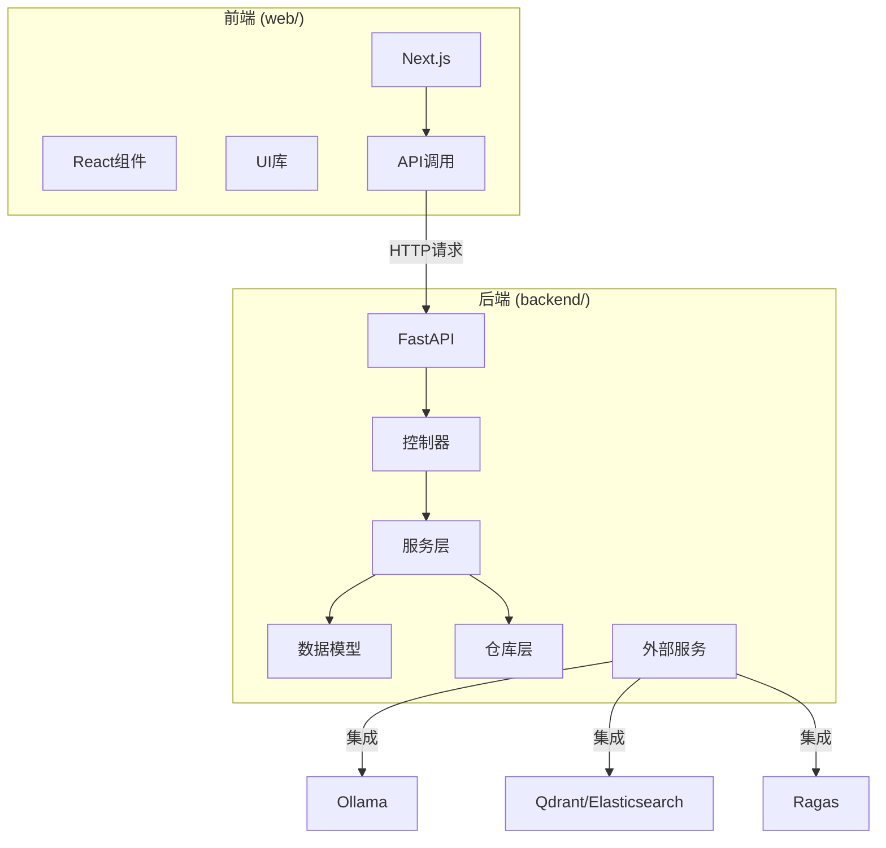
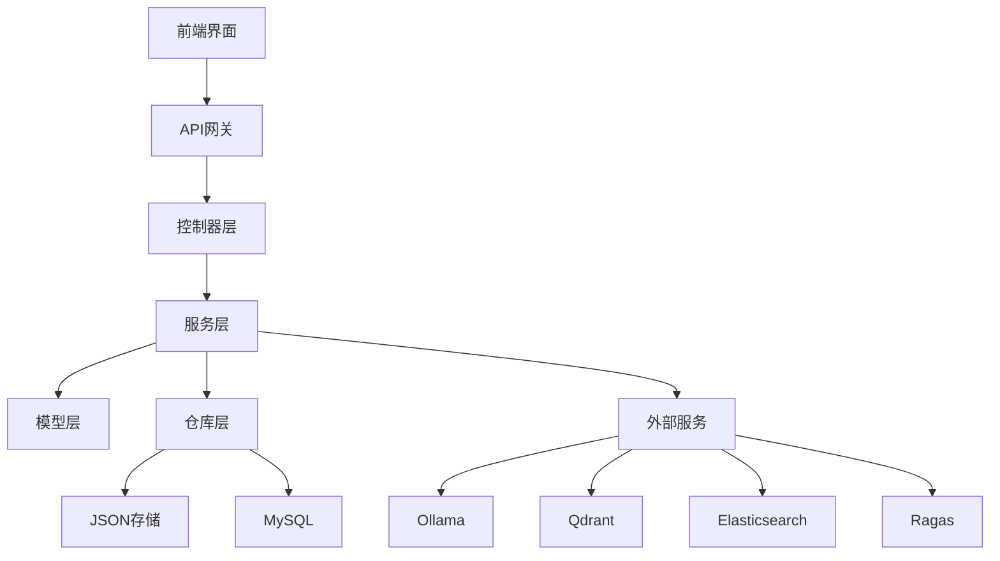
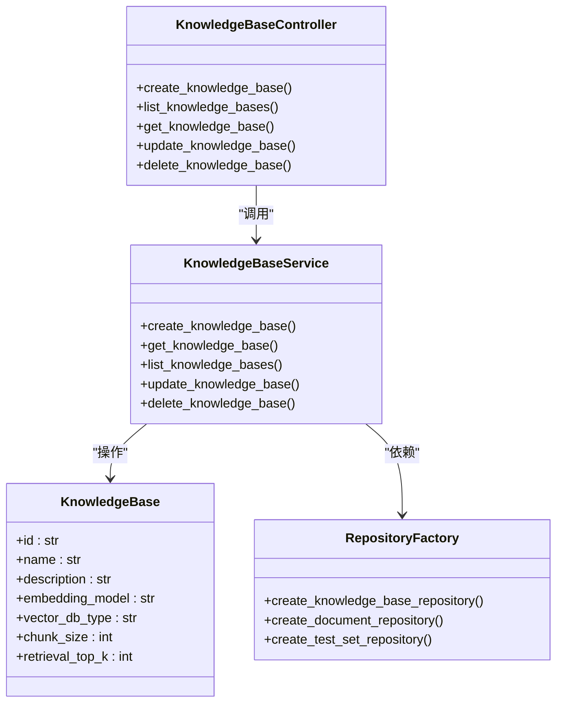
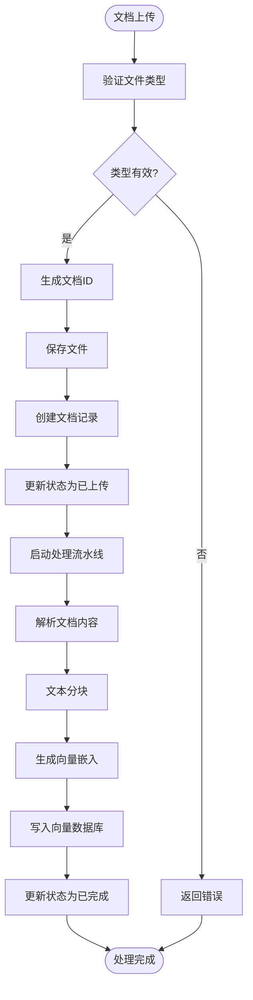
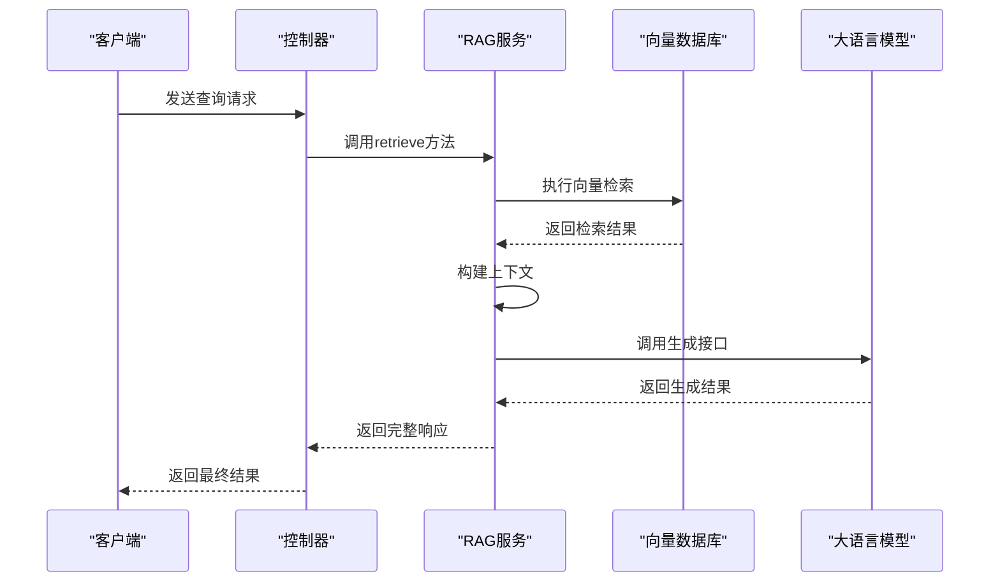
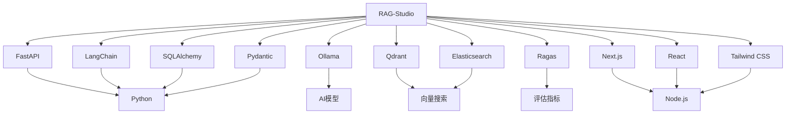

# 系统概述

<cite>
**本文档引用的文件**  
- [main.py](file://backend/app/main.py)
- [config.py](file://backend/app/config.py)
- [knowledge_base.py](file://backend/app/controllers/knowledge_base.py)
- [document.py](file://backend/app/services/document.py)
- [rag_service.py](file://backend/app/services/rag_service.py)
- [factory.py](file://backend/app/repositories/factory.py)
- [README.md](file://backend/README.md)
- [README.md](file://web/README.md)
- [layout.tsx](file://web/app/layout.tsx)
- [package.json](file://web/package.json)
- [requirements.txt](file://backend/requirements.txt)
- [knowledge_base.py](file://backend/app/models/knowledge_base.py)
- [knowledge_base.py](file://backend/app/schemas/knowledge_base.py)
</cite>

## 目录
1. [简介](#简介)
2. [项目结构](#项目结构)
3. [核心组件](#核心组件)
4. [架构概述](#架构概述)
5. [详细组件分析](#详细组件分析)
6. [依赖分析](#依赖分析)
7. [性能考虑](#性能考虑)
8. [故障排除指南](#故障排除指南)
9. [结论](#结论)

## 简介
RAG-Studio 是一个为检索增强生成（RAG）系统设计的可视化平台，集成了知识库管理、链路调试和检索器评估三大核心功能。该系统采用前后端分离架构，前端使用 Next.js 构建现代化用户界面，后端使用 FastAPI 提供高性能 API 服务。平台支持多种外部服务集成，包括 Ollama、Ragas、Qdrant 和 Elasticsearch，为用户提供灵活的部署选项。系统旨在帮助开发者和研究人员高效地构建、调试和评估 RAG 系统，通过可视化界面简化复杂的 AI 工作流程。

## 项目结构
RAG-Studio 项目采用清晰的目录结构，分为前端和后端两大主要部分。后端服务位于 `backend/` 目录，采用 FastAPI 框架，遵循 MVC 架构模式，包含控制器、服务、模型、仓库等标准组件。前端应用位于 `web/` 目录，基于 Next.js 框架构建，使用 React 组件化开发模式。这种分离的架构设计使得前后端可以独立开发、测试和部署，提高了开发效率和系统的可维护性。

**图源**  
- [README.md](file://backend/README.md#L1-L164)
- [README.md](file://web/README.md#L1-L37)

## 核心组件
RAG-Studio 的核心组件包括知识库管理、文档处理流水线、混合检索引擎、测试集管理和评估指标计算。知识库管理模块允许用户创建、配置和管理多个知识库实例，每个知识库可以独立设置嵌入模型、向量数据库和分块策略。文档处理流水线负责将原始文档解析、分块并生成向量嵌入，存储到向量数据库中。混合检索能力支持多种检索策略，提高查询的准确性和召回率。测试集管理模块提供了一套完整的评估框架，支持使用 Ragas 等工具计算 Precision、Recall、MRR 等关键指标。

**组件来源**  
- [knowledge_base.py](file://backend/app/controllers/knowledge_base.py#L1-L283)
- [document.py](file://backend/app/services/document.py#L1-L272)
- [rag_service.py](file://backend/app/services/rag_service.py#L1-L165)

## 架构概述
RAG-Studio 采用典型的前后端分离架构，前端使用 Next.js 框架构建用户界面，后端使用 FastAPI 框架提供 RESTful API 服务。系统遵循 MVC（模型-视图-控制器）分层架构，通过依赖注入和服务工厂模式实现组件间的松耦合。后端架构分为四层：控制器层处理 HTTP 请求和响应，服务层实现核心业务逻辑，模型层定义数据结构，仓库层负责数据持久化。这种分层设计提高了代码的可读性和可维护性，便于团队协作开发。

**图源**  
- [main.py](file://backend/app/main.py#L1-L112)
- [config.py](file://backend/app/config.py#L1-L99)
- [factory.py](file://backend/app/repositories/factory.py#L1-L116)

## 详细组件分析

### 知识库管理分析
知识库管理是 RAG-Studio 的核心功能之一，负责创建、配置和管理知识库实例。该模块采用 MVC 架构模式，控制器处理 API 请求，服务层实现业务逻辑，模型定义数据结构。系统支持多种存储类型切换，通过仓库工厂模式实现 JSON 文件存储和 MySQL 数据库存储的无缝切换。知识库配置包括嵌入模型、向量数据库、分块策略和检索参数等关键设置，为 RAG 系统的性能优化提供了基础。

**图源**  
- [knowledge_base.py](file://backend/app/controllers/knowledge_base.py#L1-L283)
- [knowledge_base.py](file://backend/app/services/knowledge_base.py#L1-L230)
- [knowledge_base.py](file://backend/app/models/knowledge_base.py#L1-L80)
- [factory.py](file://backend/app/repositories/factory.py#L1-L116)

### 文档处理流水线分析
文档处理流水线负责将原始文档转换为可用于检索的向量表示。该流程包括文档上传、内容解析、文本分块、向量嵌入和索引写入等步骤。系统支持多种文档格式，通过文件扩展名进行类型识别。文档服务采用异步处理模式，提高系统响应速度。处理过程中产生的元数据和状态信息被持久化存储，便于链路排查和调试。该模块的设计充分考虑了可扩展性，为未来支持更多文档格式和处理策略预留了接口。

**图源**  
- [document.py](file://backend/app/services/document.py#L1-L272)
- [knowledge_base.py](file://backend/app/models/knowledge_base.py#L1-L80)

### RAG服务分析
RAG服务模块整合了检索和生成功能，是系统的核心业务逻辑所在。该服务采用工厂模式创建，根据知识库ID初始化相应的配置。检索功能支持动态参数调整，可以根据查询需求灵活设置返回数量和分数阈值。生成功能设计为可扩展架构，支持接入不同的 LLM 服务。服务层通过依赖注入获取所需组件，降低了模块间的耦合度。该模块的设计体现了高内聚、低耦合的原则，为系统的稳定性和可维护性提供了保障。

**图源**  
- [rag_service.py](file://backend/app/services/rag_service.py#L1-L165)
- [main.py](file://backend/app/main.py#L94-L102)

## 依赖分析
RAG-Studio 系统依赖多个外部服务和库，形成了一个完整的 RAG 技术栈。后端依赖 FastAPI 作为 Web 框架，LangChain 作为 AI 框架，MySQL 作为关系型数据库。向量数据库支持 Qdrant、Elasticsearch 和 Milvus 三种选项，为不同场景提供灵活选择。AI 服务集成 Ollama，支持本地部署多种模型。评估功能依赖 Ragas 库，提供专业的 RAG 系统评估指标。前端依赖 Next.js 生态系统，使用 Tailwind CSS 进行样式设计。这些依赖关系通过配置文件集中管理，便于版本控制和环境切换。

**图源**  
- [requirements.txt](file://backend/requirements.txt#L1-L45)
- [package.json](file://web/package.json#L1-L73)

## 性能考虑
RAG-Studio 在设计时充分考虑了性能因素。后端采用 FastAPI 框架，基于 Starlette 和 Pydantic，提供高性能的 API 服务。异步处理模式被广泛应用于文件上传、文档处理和外部服务调用等耗时操作，提高了系统的并发处理能力。向量数据库的选择提供了性能和功能的平衡，Qdrant 适合边缘部署，Elasticsearch 提供强大的全文检索能力，Milvus 针对云端高性能场景优化。前端采用 Next.js 的服务器端渲染和静态生成功能，优化了页面加载速度和 SEO 表现。缓存机制和连接池的使用进一步提升了系统的整体性能。

## 故障排除指南
RAG-Studio 提供了完善的链路排查功能，帮助用户诊断和解决系统问题。知识库配置查看功能可以检查嵌入模型、向量数据库等关键设置是否正确。文档处理流程追踪功能记录了每个文档的处理状态，便于定位处理失败的原因。检索结果分析功能展示了查询的执行过程和返回结果，帮助优化检索策略。系统日志记录了详细的运行信息，为问题排查提供了重要线索。此外，健康检查接口和 API 文档（Swagger UI）也为系统维护提供了便利。

**组件来源**  
- [knowledge_base.py](file://backend/app/controllers/knowledge_base.py#L148-L283)
- [main.py](file://backend/app/main.py#L79-L90)

## 结论
RAG-Studio 是一个功能全面、架构清晰的 RAG 系统可视化平台。通过前后端分离架构和 MVC 分层设计，系统实现了高内聚、低耦合的代码结构，便于维护和扩展。对多种外部服务的支持提供了灵活的部署选项，满足不同场景的需求。系统不仅为初学者提供了直观的可视化界面和概念引导，也为高级用户提供了深入的技术决策背景和调试工具。未来可以通过完善文档处理流水线、增强评估功能和优化性能表现，进一步提升系统的实用性和竞争力。