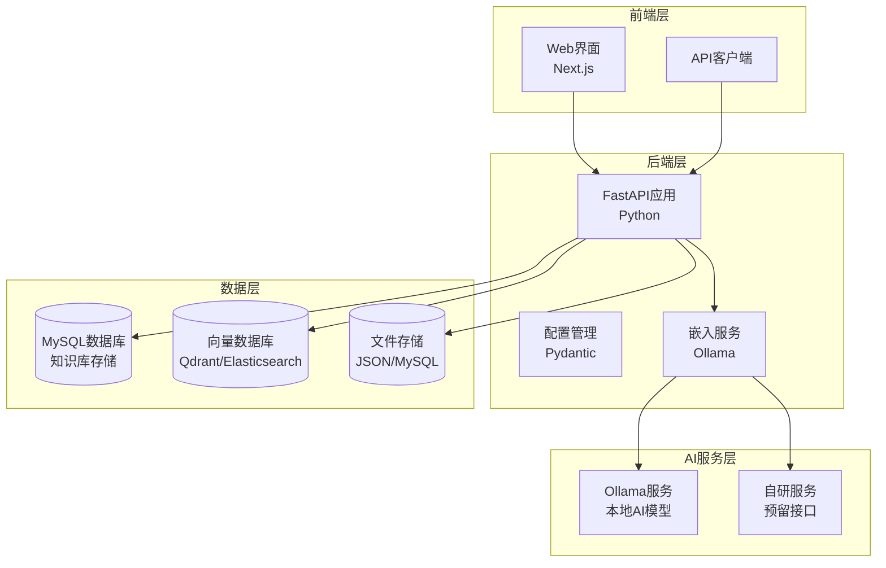
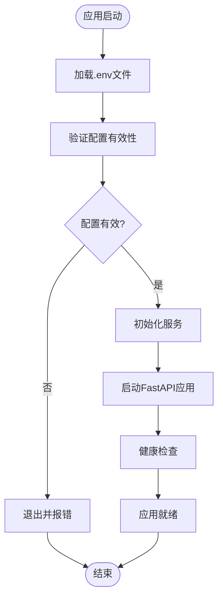
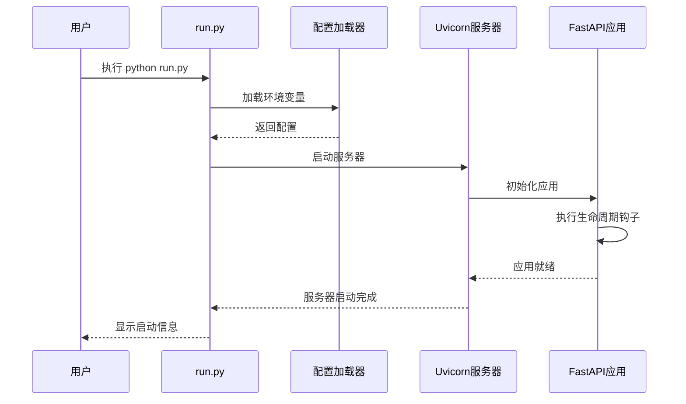
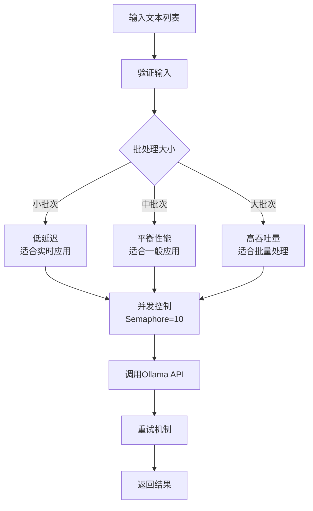
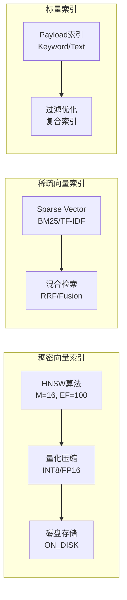
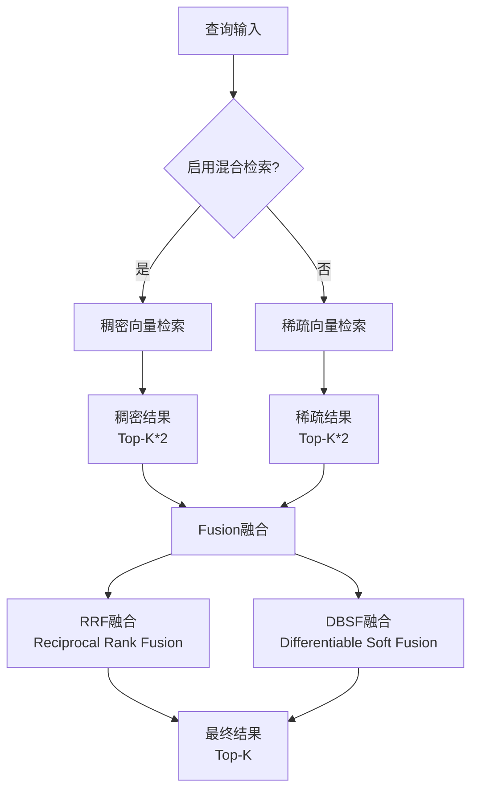
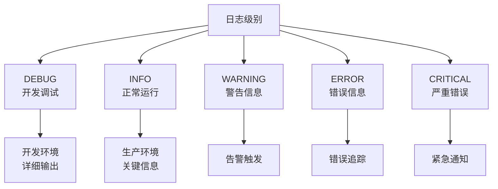
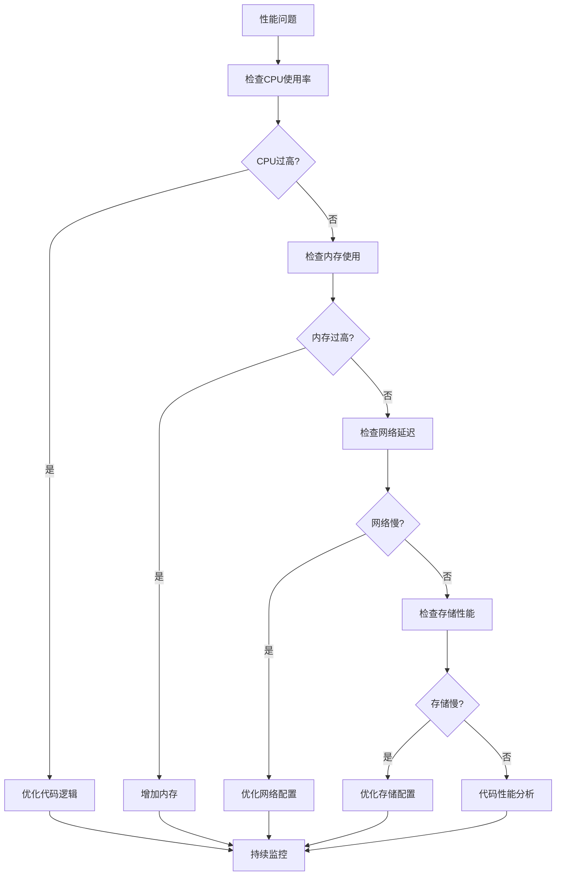

# 部署与配置

<cite>
**本文档中引用的文件**
- [backend/app/config.py](file://backend/app/config.py)
- [backend/env.example](file://backend/env.example)
- [backend/run.py](file://backend/run.py)
- [backend/app/main.py](file://backend/app/main.py)
- [backend/requirements.txt](file://backend/requirements.txt)
- [web/package.json](file://web/package.json)
- [backend/app/services/embedding_service.py](file://backend/app/services/embedding_service.py)
- [backend/app/services/vector_db_service.py](file://backend/app/services/vector_db_service.py)
- [test_sparse_vector_simple.py](file://test_sparse_vector_simple.py)
</cite>

## 目录
1. [概述](#概述)
2. [环境准备](#环境准备)
3. [配置详解](#配置详解)
4. [部署方案](#部署方案)
5. [性能调优](#性能调优)
6. [监控与维护](#监控与维护)
7. [故障排除](#故障排除)

## 概述

RAG-Studio是一个基于FastAPI的RAG（检索增强生成）管理平台，支持云边架构的知识库管理、链路排查和测试评估。本指南提供从开发环境到生产环境的完整部署方案，涵盖所有关键配置项和最佳实践。

### 系统架构概览



**图表来源**
- [backend/app/main.py](file://backend/app/main.py#L1-L112)
- [backend/app/config.py](file://backend/app/config.py#L1-L99)

## 环境准备

### 系统要求

| 组件 | 最低要求 | 推荐配置 |
|------|----------|----------|
| CPU | 2核 | 4核+ |
| 内存 | 4GB | 8GB+ |
| 存储 | 20GB | 50GB+ SSD |
| 网络 | 10Mbps | 100Mbps+ |
| 操作系统 | Linux/macOS/Windows | Linux (Ubuntu 20.04+) |

### 必需软件依赖

#### 后端环境
- Python 3.8+
- Node.js 16+
- MySQL 8.0+
- Docker (可选)

#### AI服务依赖
- Ollama (推荐)
- Elasticsearch 8.x (可选)
- Qdrant (推荐)
- Milvus (可选)

### 依赖包安装

```bash
# 后端Python依赖
cd backend
pip install -r requirements.txt

# 前端Node.js依赖
cd ../web
npm install
```

**章节来源**
- [backend/requirements.txt](file://backend/requirements.txt#L1-L45)
- [web/package.json](file://web/package.json#L1-L73)

## 配置详解

### 环境变量配置

RAG-Studio使用Pydantic设置管理环境变量，所有配置都通过`.env`文件进行管理。

#### 核心应用配置

| 配置项 | 默认值 | 说明 |
|--------|--------|------|
| `APP_NAME` | RAG Studio Backend | 应用名称 |
| `APP_VERSION` | 1.0.0 | 应用版本 |
| `DEBUG` | True | 调试模式开关 |
| `API_PREFIX` | /api/v1 | API路径前缀 |
| `HOST` | 0.0.0.0 | 服务器主机地址 |
| `PORT` | 8000 | 服务器端口号 |

#### 数据库配置

| 配置项 | 默认值 | 说明 |
|--------|--------|------|
| `DB_HOST` | localhost | MySQL主机地址 |
| `DB_PORT` | 3306 | MySQL端口号 |
| `DB_USER` | root | 数据库用户名 |
| `DB_PASSWORD` | - | 数据库密码 |
| `DB_NAME` | rag_studio | 数据库名称 |
| `STORAGE_TYPE` | json | 存储类型: json 或 mysql |
| `STORAGE_PATH` | ./storage | JSON文件存储路径 |

#### AI服务配置

| 配置项 | 默认值 | 说明 |
|--------|--------|------|
| `OLLAMA_BASE_URL` | http://localhost:11434 | Ollama服务地址 |
| `OLLAMA_EMBEDDING_MODEL` | nomic-embed-text | 嵌入模型名称 |
| `OLLAMA_CHAT_MODEL` | deepseek-r1:1.5b | 对话模型名称 |

#### 向量数据库配置

RAG-Studio支持多种向量数据库，可根据需求选择：

##### Qdrant配置
| 配置项 | 默认值 | 说明 |
|--------|--------|------|
| `VECTOR_DB_TYPE` | qdrant | 向量数据库类型 |
| `QDRANT_HOST` | localhost | Qdrant主机地址 |
| `QDRANT_PORT` | 6333 | Qdrant端口号 |
| `QDRANT_API_KEY` | - | Qdrant API密钥 |

##### Elasticsearch配置
| 配置项 | 默认值 | 说明 |
|--------|--------|------|
| `ES_HOST` | localhost | ES主机地址 |
| `ES_PORT` | 9200 | ES端口号 |
| `ES_USER` | - | ES用户名 |
| `ES_PASSWORD` | - | ES密码 |

##### Milvus配置
| 配置项 | 默认值 | 说明 |
|--------|--------|------|
| `MILVUS_HOST` | localhost | Milvus主机地址 |
| `MILVUS_PORT` | 19530 | Milvus端口号 |
| `MILVUS_USER` | - | Milvus用户名 |
| `MILVUS_PASSWORD` | - | Milvus密码 |

#### CORS配置

| 配置项 | 默认值 | 说明 |
|--------|--------|------|
| `ALLOWED_ORIGINS` | http://localhost:3000,http://localhost:3001 | 允许的跨域源 |

**章节来源**
- [backend/app/config.py](file://backend/app/config.py#L15-L99)
- [backend/env.example](file://backend/env.example#L1-L56)

### 配置加载机制



**图表来源**
- [backend/app/config.py](file://backend/app/config.py#L74-L99)
- [backend/app/main.py](file://backend/app/main.py#L15-L37)

### 环境区分策略

#### 开发环境 (Development)
```bash
# .env.development
DEBUG=True
APP_NAME="RAG Studio Dev"
HOST=0.0.0.0
PORT=8000
ALLOWED_ORIGINS=http://localhost:3000,http://localhost:3001
```

#### 测试环境 (Testing)
```bash
# .env.testing
DEBUG=False
APP_NAME="RAG Studio Test"
HOST=0.0.0.0
PORT=8001
ALLOWED_ORIGINS=http://localhost:3000
```

#### 生产环境 (Production)
```bash
# .env.production
DEBUG=False
APP_NAME="RAG Studio Prod"
HOST=0.0.0.0
PORT=8000
ALLOWED_ORIGINS=https://your-domain.com
```

## 部署方案

### 方案一：原生部署

#### 后端部署

```bash
# 1. 安装依赖
cd backend
pip install -r requirements.txt

# 2. 配置环境变量
cp env.example .env
# 编辑 .env 文件，设置生产环境配置

# 3. 启动应用
python run.py
```

#### 前端部署

```bash
# 1. 安装依赖
cd web
npm install

# 2. 构建应用
npm run build

# 3. 启动应用
npm start
```

#### 后端启动流程



**图表来源**
- [backend/run.py](file://backend/run.py#L1-L24)
- [backend/app/main.py](file://backend/app/main.py#L15-L37)

### 方案二：Docker容器化部署

#### Dockerfile示例

```dockerfile
FROM python:3.11-slim

# 设置工作目录
WORKDIR /app

# 安装系统依赖
RUN apt-get update && apt-get install -y \
    gcc \
    g++ \
    && rm -rf /var/lib/apt/lists/*

# 复制依赖文件
COPY backend/requirements.txt .
RUN pip install --no-cache-dir -r requirements.txt

# 复制应用代码
COPY backend/ .

# 创建非root用户
RUN useradd -m -u 1000 -s /bin/bash appuser
USER appuser

# 暴露端口
EXPOSE 8000

# 健康检查
HEALTHCHECK --interval=30s --timeout=10s --start-period=5s --retries=3 \
    CMD curl -f http://localhost:8000/health || exit 1

# 启动命令
CMD ["python", "run.py"]
```

#### Docker Compose配置

```yaml
version: '3.8'

services:
  backend:
    build:
      context: .
      dockerfile: Dockerfile
    ports:
      - "8000:8000"
    volumes:
      - ./storage:/app/storage
      - ./logs:/app/logs
    environment:
      - DEBUG=false
      - HOST=0.0.0.0
      - PORT=8000
    depends_on:
      - mysql
      - ollama
    restart: unless-stopped
    
  frontend:
    build:
      context: ./web
      dockerfile: Dockerfile
    ports:
      - "3000:3000"
    environment:
      - NEXT_PUBLIC_API_BASE=http://localhost:8000/api/v1
    depends_on:
      - backend
    restart: unless-stopped
    
  mysql:
    image: mysql:8.0
    ports:
      - "3306:3306"
    environment:
      MYSQL_ROOT_PASSWORD: ${DB_PASSWORD}
      MYSQL_DATABASE: ${DB_NAME}
    volumes:
      - mysql_data:/var/lib/mysql
    restart: unless-stopped
    
  ollama:
    image: ollama/ollama:latest
    ports:
      - "11434:11434"
    volumes:
      - ollama_data:/root/.ollama
    restart: unless-stopped

volumes:
  mysql_data:
  ollama_data:
```

### 方案三：进程管理工具部署

#### PM2部署配置

```javascript
// ecosystem.config.js
module.exports = {
  apps: [{
    name: 'rag-studio-backend',
    script: './backend/run.py',
    args: '',
    instances: 1,
    autorestart: true,
    watch: false,
    max_memory_restart: '1G',
    env: {
      NODE_ENV: 'production',
      PYTHONPATH: './backend'
    },
    env_production: {
      NODE_ENV: 'production',
      DEBUG: 'false',
      HOST: '0.0.0.0',
      PORT: '8000'
    }
  }]
};
```

#### 启动命令

```bash
# 安装PM2
npm install pm2 -g

# 启动应用
pm2 start ecosystem.config.js --env production

# 保存进程列表
pm2 save

# 设置开机自启
pm2 startup
```

**章节来源**
- [backend/run.py](file://backend/run.py#L1-L24)
- [web/package.json](file://web/package.json#L5-L9)

## 性能调优

### 嵌入服务优化

#### 批处理大小调优



**图表来源**
- [backend/app/services/embedding_service.py](file://backend/app/services/embedding_service.py#L152-L183)

#### 嵌入服务配置优化

| 参数 | 默认值 | 推荐值 | 说明 |
|------|--------|--------|------|
| 并发限制 | 10 | 5-20 | 避免Ollama过载 |
| 超时时间 | 60秒 | 30-120秒 | 根据网络状况调整 |
| 重试次数 | 3 | 2-5 | 平衡可靠性和性能 |
| 批处理大小 | 动态 | 1-10 | 根据内存和模型调整 |

### 向量数据库索引优化

#### Qdrant索引配置



**图表来源**
- [backend/app/services/vector_db_service.py](file://backend/app/services/vector_db_service.py#L306-L444)

#### 索引参数调优表

| 索引类型 | 参数 | 默认值 | 推荐值 | 说明 |
|----------|------|--------|--------|------|
| HNSW M值 | M | 16 | 8-32 | 连接数，影响精度和速度 |
| HNSW EF构造 | EF | 100 | 50-200 | 构建质量，影响内存使用 |
| 量化类型 | Type | None | INT8 | 减少内存占用 |
| 磁盘存储 | OnDisk | False | True | 大数据集推荐 |
| 稀疏向量 | Method | BM25 | TF-IDF/BM25 | 根据查询特点选择 |

### 混合检索优化

#### 检索策略配置



**图表来源**
- [backend/app/services/vector_db_service.py](file://backend/app/services/vector_db_service.py#L654-L761)

#### 混合检索参数

| 参数 | 默认值 | 推荐范围 | 说明 |
|------|--------|----------|------|
| Top-K倍数 | 2 | 1.5-3 | 预取更多候选结果 |
| 融合方法 | RRF | RRF/DBSF | 根据准确性需求选择 |
| 权重比例 | 1:1 | 0.6:0.4 到 0.4:0.6 | 根据向量类型重要性调整 |

**章节来源**
- [backend/app/services/embedding_service.py](file://backend/app/services/embedding_service.py#L152-L183)
- [backend/app/services/vector_db_service.py](file://backend/app/services/vector_db_service.py#L654-L761)

## 监控与维护

### 健康检查端点

RAG-Studio提供多个健康检查端点，用于监控系统状态：

#### 根健康检查
- **URL**: `GET /`
- **响应**: 应用基本信息和状态
- **用途**: 基础连通性检查

#### API健康检查
- **URL**: `GET /api/v1/health`
- **响应**: 完整的系统状态信息
- **包含**: 应用版本、存储类型、向量数据库状态

#### 健康检查响应示例

```json
{
  "status": "healthy",
  "app_name": "RAG Studio Backend",
  "version": "1.0.0",
  "storage_type": "json",
  "vector_db": "qdrant"
}
```

### 日志监控最佳实践

#### 日志级别配置



#### 日志配置建议

| 环境 | 日志级别 | 输出目标 | 保留期限 |
|------|----------|----------|----------|
| 开发 | DEBUG | 控制台 | 7天 |
| 测试 | INFO | 文件 | 30天 |
| 生产 | WARNING | 文件+集中化 | 90天 |

### 性能监控指标

#### 关键性能指标(KPI)

| 指标类别 | 指标名称 | 监控目标 | 告警阈值 |
|----------|----------|----------|----------|
| 响应时间 | API响应时间 | < 200ms | > 500ms |
| 吞吐量 | QPS | > 100 req/s | < 50 req/s |
| 错误率 | HTTP 5xx错误率 | < 1% | > 5% |
| 资源使用 | CPU使用率 | < 70% | > 85% |
| 资源使用 | 内存使用率 | < 80% | > 90% |

#### 监控工具推荐

- **应用监控**: Prometheus + Grafana
- **日志聚合**: ELK Stack (Elasticsearch, Logstash, Kibana)
- **链路追踪**: Jaeger/OpenTelemetry
- **告警通知**: AlertManager + 企业微信/钉钉

**章节来源**
- [backend/app/main.py](file://backend/app/main.py#L66-L90)

## 故障排除

### 常见问题及解决方案

#### 1. 数据库连接问题

**症状**: 应用启动时报数据库连接错误

**排查步骤**:
```bash
# 1. 检查数据库服务状态
mysql -h $DB_HOST -P $DB_PORT -u $DB_USER -p$DB_PASSWORD

# 2. 验证网络连接
telnet $DB_HOST $DB_PORT

# 3. 检查防火墙设置
iptables -L | grep $DB_PORT
```

**解决方案**:
- 确认数据库服务已启动
- 检查网络连通性
- 验证用户权限和密码
- 检查字符集设置

#### 2. Ollama服务连接问题

**症状**: 嵌入服务调用失败

**排查步骤**:
```bash
# 1. 检查Ollama服务状态
curl http://localhost:11434/api/tags

# 2. 验证模型是否存在
ollama list

# 3. 检查网络连接
telnet localhost 11434
```

**解决方案**:
- 确认Ollama服务已启动
- 下载所需的AI模型
- 检查端口占用情况
- 验证API版本兼容性

#### 3. 向量数据库连接问题

**症状**: 向量检索功能异常

**排查步骤**:
```bash
# Qdrant检查
curl http://$QDRANT_HOST:$QDRANT_PORT/health

# Elasticsearch检查
curl -u $ES_USER:$ES_PASSWORD http://$ES_HOST:$ES_PORT/_cluster/health

# Milvus检查
milvus_cli --endpoint=$MILVUS_HOST:$MILVUS_PORT --username=$MILVUS_USER --password=$MILVUS_PASSWORD
```

**解决方案**:
- 检查服务端口和网络
- 验证认证凭据
- 确认服务版本兼容性
- 检查存储空间和内存

#### 4. 性能问题诊断

**症状**: 响应时间过长或吞吐量不足

**诊断流程**:



**性能优化建议**:
- 调整批处理大小
- 优化并发控制
- 启用缓存机制
- 使用异步处理
- 监控资源使用情况

### 故障恢复流程

#### 1. 应用重启流程

```bash
# 1. 停止应用
pm2 stop rag-studio-backend

# 2. 检查配置
cat .env | grep -E "(DB_|OLLAMA_|VECTOR_)"

# 3. 清理临时文件
rm -rf backend/storage/temp/*

# 4. 重启应用
pm2 restart rag-studio-backend
```

#### 2. 数据库恢复

```bash
# 1. 备份当前数据
mysqldump -h $DB_HOST -u $DB_USER -p$DB_PASSWORD $DB_NAME > backup.sql

# 2. 恢复备份
mysql -h $DB_HOST -u $DB_USER -p$DB_PASSWORD $DB_NAME < backup.sql

# 3. 验证数据完整性
mysqlcheck -h $DB_HOST -u $DB_USER -p$DB_PASSWORD --auto-repair --check --all-databases
```

#### 3. 向量数据库重建

```bash
# 1. 删除损坏的集合
curl -X DELETE http://$QDRANT_HOST:$QDRANT_PORT/collections/my_collection

# 2. 重新创建集合
# 在应用中重新初始化知识库

# 3. 重新导入数据
python scripts/rebuild_vector_db.py
```

**章节来源**
- [backend/app/main.py](file://backend/app/main.py#L66-L90)
- [backend/app/services/embedding_service.py](file://backend/app/services/embedding_service.py#L62-L135)

## 总结

本部署与配置指南涵盖了RAG-Studio从开发到生产的完整部署流程，包括：

1. **环境准备**: 系统要求、软件依赖和硬件配置
2. **配置管理**: 详细的环境变量说明和配置加载机制
3. **部署方案**: 多种部署方式的选择和实施
4. **性能调优**: 嵌入服务、向量数据库和混合检索的优化策略
5. **监控维护**: 健康检查、日志管理和性能监控
6. **故障排除**: 常见问题解决方案和恢复流程

通过遵循本指南，您可以成功将RAG-Studio部署到生产环境，并确保系统的稳定性、性能和可维护性。建议在正式部署前，在测试环境中充分验证所有配置和部署方案。