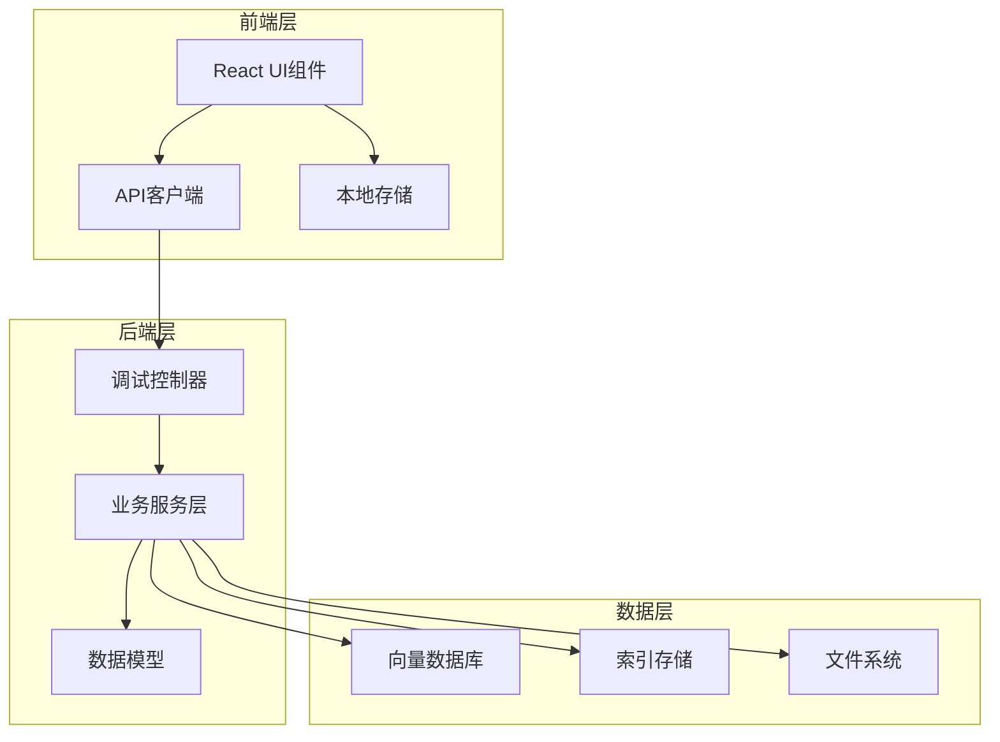
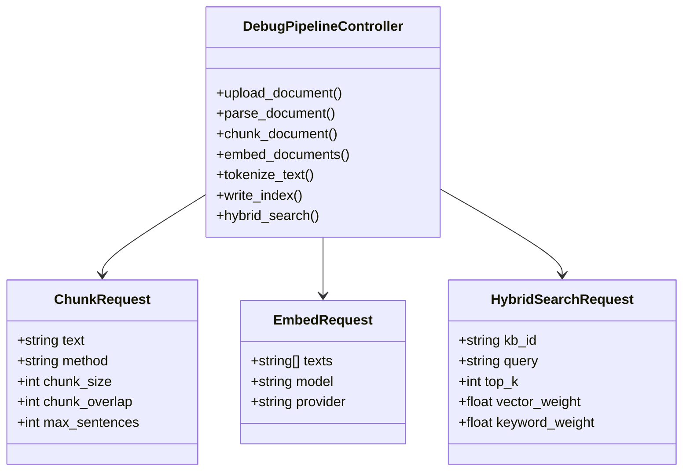
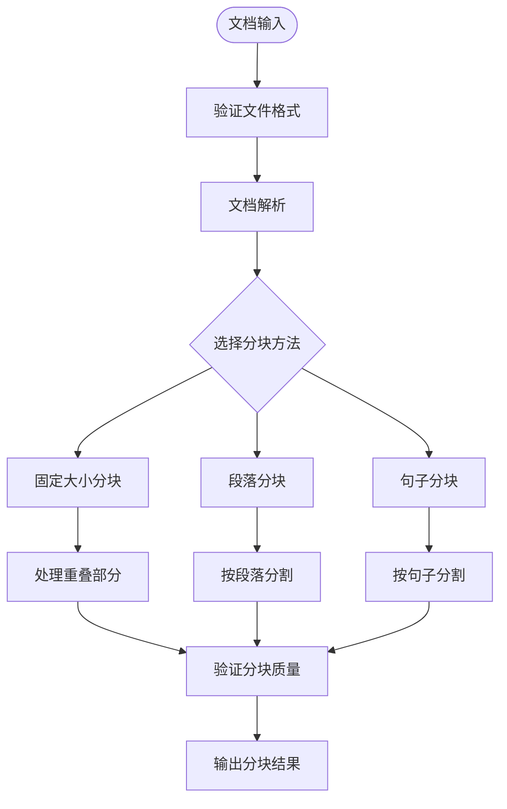
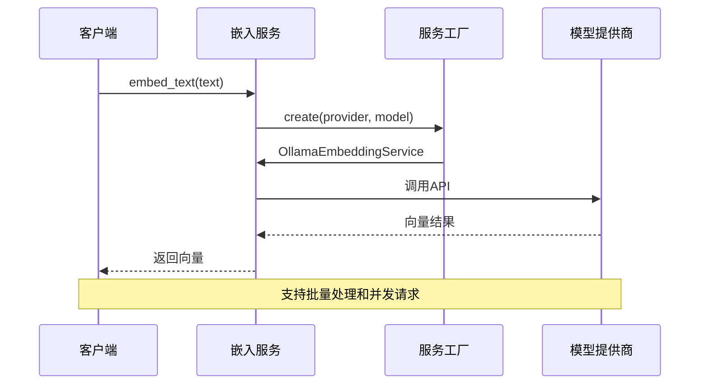
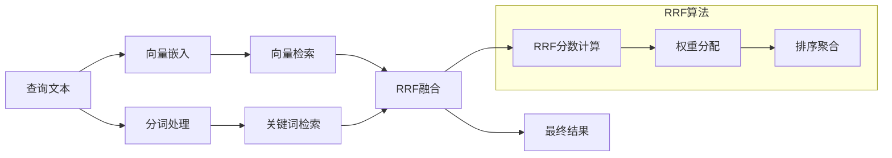
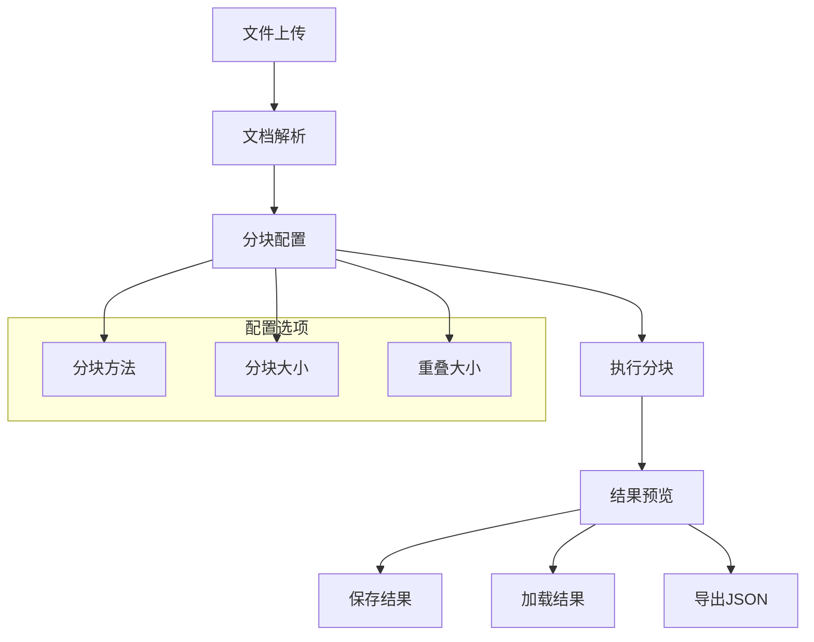
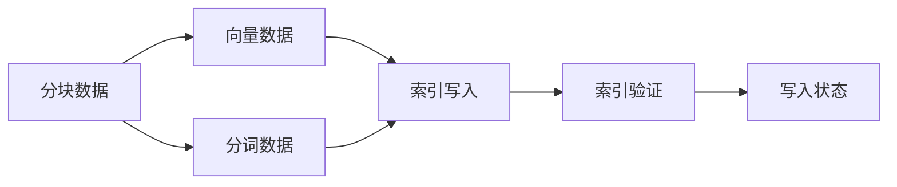
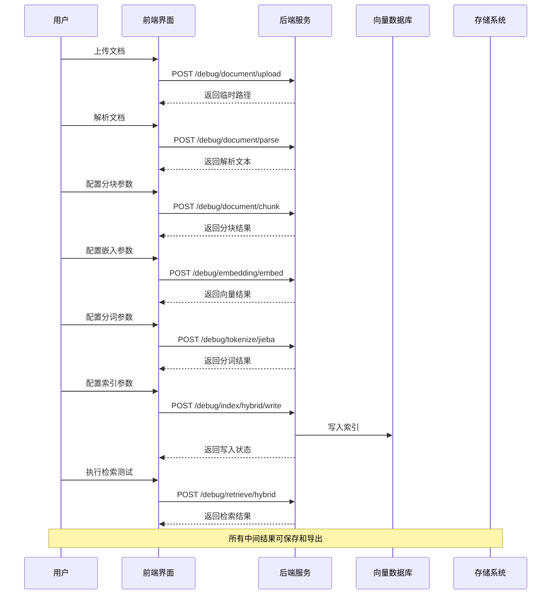

# 链路调试系统

<cite>
**本文档引用的文件**
- [debug_pipeline.py](file://backend/app/controllers/debug_pipeline.py)
- [document-processing.tsx](file://web/components/views/document-processing.tsx)
- [index-writing.tsx](file://web/components/views/index-writing.tsx)
- [rag_service.py](file://backend/app/services/rag_service.py)
- [document_processor.py](file://backend/app/services/document_processor.py)
- [retrieval_service.py](file://backend/app/services/retrieval_service.py)
- [embedding_service.py](file://backend/app/services/embedding_service.py)
- [api.ts](file://web/lib/api.ts)
- [pipeline.py](file://backend/app/controllers/pipeline.py)
- [链路调试系统_架构设计.md](file://backend/链路调试系统_架构设计.md)
- [链路调试系统_使用说明.md](file://backend/链路调试系统_使用说明.md)
</cite>

## 目录
1. [系统概述](#系统概述)
2. [架构设计](#架构设计)
3. [核心组件分析](#核心组件分析)
4. [调试接口详解](#调试接口详解)
5. [UI层面实现](#ui层面实现)
6. [数据流分析](#数据流分析)
7. [性能优化与调优](#性能优化与调优)
8. [故障排查指南](#故障排查指南)
9. [使用案例](#使用案例)
10. [总结](#总结)

## 系统概述

链路调试系统是一个专为RAG（检索增强生成）流程设计的可视化调试工具，提供端到端的流程追踪能力。该系统允许用户观察从文档输入到最终生成答案的每一个中间步骤，包括文档处理、向量化、分词、索引写入和检索调试等关键环节。

### 主要功能特性

- **步骤化调试**：每个处理步骤独立运行，支持重复执行和参数调整
- **可视化预览**：直观展示每步的输出结果和统计信息
- **参数动态调整**：实时调整分块大小、向量维度、检索权重等参数
- **结果导出**：支持将每步结果导出为JSON格式，便于后续分析
- **会话保存**：调试会话可保存和恢复，支持断点续传

## 架构设计

链路调试系统采用前后端分离架构，后端基于FastAPI提供RESTful API，前端使用React/Next.js构建交互式界面。



**图表来源**
- [debug_pipeline.py](file://backend/app/controllers/debug_pipeline.py#L1-L50)
- [api.ts](file://web/lib/api.ts#L1-L100)

### 系统模块划分

1. **文档处理模块**：负责文档上传、解析和分块
2. **嵌入服务模块**：处理文本向量化和向量计算
3. **分词服务模块**：实现中文分词和词频统计
4. **索引写入模块**：将处理结果写入向量数据库和倒排索引
5. **检索调试模块**：提供检索功能的调试和参数调优

**章节来源**
- [链路调试系统_架构设计.md](file://backend/链路调试系统_架构设计.md#L9-L50)

## 核心组件分析

### 调试控制器（Debug Pipeline Controller）

调试控制器是系统的核心入口，提供了完整的RAG链路调试API接口。



**图表来源**
- [debug_pipeline.py](file://backend/app/controllers/debug_pipeline.py#L31-L80)

#### 核心API接口

系统提供了六个主要的调试接口：

1. **文档处理接口**：`/debug/document/*` - 处理文档上传、解析和分块
2. **嵌入接口**：`/debug/embedding/*` - 文本向量化处理
3. **分词接口**：`/debug/tokenize/*` - 中文分词和词频统计
4. **索引写入接口**：`/debug/index/*` - 向量和关键词索引写入
5. **检索接口**：`/debug/retrieve/*` - 检索功能调试
6. **管道接口**：`/pipeline/*` - RAG流程整体调试

**章节来源**
- [debug_pipeline.py](file://backend/app/controllers/debug_pipeline.py#L88-L800)

### 文档处理器（Document Processor）

文档处理器负责处理各种格式的文档，提供灵活的分块策略。



**图表来源**
- [document_processor.py](file://backend/app/services/document_processor.py#L60-L230)

#### 分块策略

系统支持三种分块策略：

1. **固定大小分块**：按字符数固定分割，支持重叠
2. **段落分块**：按自然段落分割，保持语义完整性
3. **句子分块**：按句子边界分割，适用于细粒度处理

**章节来源**
- [document_processor.py](file://backend/app/services/document_processor.py#L60-L230)

### 嵌入服务（Embedding Service）

嵌入服务提供文本向量化功能，支持多种模型提供商。



**图表来源**
- [embedding_service.py](file://backend/app/services/embedding_service.py#L48-L180)

#### 模型支持

系统目前支持以下嵌入模型：

- **BGE-M3**：中文优化模型，1024维向量
- **Nomic Embed Text**：英文模型，768维向量
- **自定义服务**：支持企业内部部署的服务

**章节来源**
- [embedding_service.py](file://backend/app/services/embedding_service.py#L48-L257)

### 检索服务（Retrieval Service）

检索服务提供多种检索方式和融合算法。



**图表来源**
- [retrieval_service.py](file://backend/app/services/retrieval_service.py#L44-L134)

#### 检索算法

1. **向量检索**：基于余弦相似度的向量空间搜索
2. **关键词检索**：基于BM25算法的关键词匹配
3. **混合检索**：RRF（Reciprocal Rank Fusion）融合算法

**章节来源**
- [retrieval_service.py](file://backend/app/services/retrieval_service.py#L136-L854)

## 调试接口详解

### 文档处理接口

文档处理接口提供了完整的文档生命周期管理功能。

#### 上传文档

```python
@router.post("/document/upload")
async def upload_document(file: UploadFile = File(...)):
    """
    上传文档并保存到临时目录
    
    Args:
        file: 上传的文件
        
    Returns:
        文件信息和临时路径
    """
```

支持的文件格式：
- TXT：纯文本文件
- PDF：Adobe PDF文档
- DOCX：Microsoft Word文档
- MD：Markdown文档

#### 解析文档

```python
@router.post("/document/parse")
async def parse_document(file_path: str):
    """
    解析文档内容
    
    Args:
        file_path: 文件路径
        
    Returns:
        解析后的文本内容
    """
```

#### 文档分块

```python
@router.post("/document/chunk")
async def chunk_document(request: ChunkRequest):
    """
    对文档进行分块
    
    Returns:
        分块结果列表
    """
```

分块参数配置：
- `chunk_size`：分块大小（字符数），默认500
- `chunk_overlap`：重叠大小，默认50
- `method`：分块方法（fixed_size, paragraph, sentence）

**章节来源**
- [debug_pipeline.py](file://backend/app/controllers/debug_pipeline.py#L89-L215)

### 嵌入接口

嵌入接口负责将文本转换为向量表示。

#### 向量化处理

```python
@router.post("/embedding/embed")
async def embed_documents(request: EmbedRequest):
    """
    对文本列表进行向量化
    
    Returns:
        向量列表和统计信息
    """
```

#### 模型管理

```python
@router.get("/embedding/models")
async def get_embedding_models():
    """
    获取可用的embedding模型列表
    """
```

**章节来源**
- [debug_pipeline.py](file://backend/app/controllers/debug_pipeline.py#L218-L303)

### 分词接口

分词接口提供中文文本的分词和词频分析功能。

#### Jieba分词

```python
@router.post("/tokenize/jieba")
async def tokenize_jieba(request: TokenizeRequest):
    """
    使用jieba对文本进行分词
    
    Returns:
        分词结果和统计信息
    """
```

分词配置：
- `mode`：分词模式（default, search, all）
- `use_stop_words`：是否过滤停用词

**章节来源**
- [debug_pipeline.py](file://backend/app/controllers/debug_pipeline.py#L306-L366)

### 索引写入接口

索引写入接口将处理结果持久化到向量数据库和倒排索引。

#### 向量索引写入

```python
@router.post("/index/vector/write")
async def write_vector_index(request: WriteVectorIndexRequest):
    """
    将向量写入向量数据库
    
    Returns:
        写入结果
    """
```

#### 混合索引写入

```python
@router.post("/index/hybrid/write")
async def write_hybrid_index(request: WriteHybridIndexRequest):
    """
    一次性写入稠密向量和稀疏向量到向量数据库
    
    Returns:
        写入结果
    """
```

**章节来源**
- [debug_pipeline.py](file://backend/app/controllers/debug_pipeline.py#L367-L800)

## UI层面实现

### 文档处理视图

文档处理视图提供了直观的用户界面，支持文档上传、解析和分块操作。



**图表来源**
- [document-processing.tsx](file://web/components/views/document-processing.tsx#L1-L422)

#### 核心功能

1. **文件上传**：支持多种文档格式的上传
2. **实时预览**：解析后的文本内容实时显示
3. **参数配置**：灵活的分块参数设置
4. **结果管理**：保存、加载和导出分块结果

**章节来源**
- [document-processing.tsx](file://web/components/views/document-processing.tsx#L1-L422)

### 索引写入视图

索引写入视图负责将处理结果写入知识库索引。

#### 数据输入



**图表来源**
- [index-writing.tsx](file://web/components/views/index-writing.tsx#L1-L563)

#### 知识库管理

系统支持多个知识库的选择和配置：

1. **知识库选择**：从现有知识库中选择目标库
2. **Schema配置**：根据知识库Schema配置字段
3. **混合索引**：支持向量和关键词索引的混合写入

**章节来源**
- [index-writing.tsx](file://web/components/views/index-writing.tsx#L1-L563)

### API客户端封装

前端通过API客户端封装与后端的通信。

```typescript
// API客户端接口定义
export interface DebugAPI {
  uploadDocument(file: File): Promise<ApiResponse>;
  parseDocument(filePath: string): Promise<ApiResponse>;
  chunkDocument(params: ChunkParams): Promise<ApiResponse>;
  embedDocuments(params: EmbedParams): Promise<ApiResponse>;
  tokenizeText(params: TokenizeParams): Promise<ApiResponse>;
  writeIndex(params: IndexParams): Promise<ApiResponse>;
  hybridSearch(params: SearchParams): Promise<ApiResponse>;
}
```

**章节来源**
- [api.ts](file://web/lib/api.ts#L1-L800)

## 数据流分析

### 完整处理流程

链路调试系统遵循严格的处理流程，确保每个步骤的可追溯性。



**图表来源**
- [debug_pipeline.py](file://backend/app/controllers/debug_pipeline.py#L89-L800)
- [document-processing.tsx](file://web/components/views/document-processing.tsx#L50-L96)

### 数据结构设计

#### 分块数据结构

```python
@dataclass
class Chunk:
    """文档分块"""
    index: int
    content: str
    start_pos: int
    end_pos: int
    char_count: int
    token_count: Optional[int] = None
    metadata: Dict[str, Any] = None
```

#### 检索结果结构

```python
@dataclass
class RetrievalResult:
    """检索结果"""
    doc_id: str
    chunk_id: str
    content: str
    score: float
    rank: int
    source: str  # "vector", "keyword", "hybrid"
    metadata: Optional[Dict[str, Any]] = None
```

**章节来源**
- [document_processor.py](file://backend/app/services/document_processor.py#L14-L35)
- [retrieval_service.py](file://backend/app/services/retrieval_service.py#L21-L42)

## 性能优化与调优

### 批量处理优化

系统实现了多种批量处理优化策略：

1. **并发控制**：使用信号量限制并发请求数量
2. **批量嵌入**：支持批量向量化处理
3. **异步处理**：利用asyncio实现非阻塞处理

```python
# 并发处理示例
semaphore = asyncio.Semaphore(10)  # 最多10个并发请求

async def embed_with_semaphore(text: str) -> List[float]:
    async with semaphore:
        return await self._call_ollama_api(text)
```

**章节来源**
- [embedding_service.py](file://backend/app/services/embedding_service.py#L172-L182)

### 缓存机制

系统支持多层缓存机制：

1. **向量缓存**：缓存常用的文本向量
2. **分词缓存**：缓存分词结果
3. **检索缓存**：缓存检索结果

### 参数调优指南

#### 分块参数优化

| 参数 | 推荐值 | 说明 |
|------|--------|------|
| chunk_size | 500-1000 | 根据应用场景调整 |
| chunk_overlap | 50-200 | 平衡上下文连续性和碎片化 |
| method | fixed_size | 固定大小适合大多数场景 |

#### 检索参数优化

| 参数 | 推荐值 | 说明 |
|------|--------|------|
| vector_weight | 0.7 | 向量检索权重 |
| keyword_weight | 0.3 | 关键词检索权重 |
| top_k | 5-10 | 返回结果数量 |
| rrf_k | 60 | RRF融合参数 |

**章节来源**
- [链路调试系统_使用说明.md](file://backend/链路调试系统_使用说明.md#L335-L387)

## 故障排查指南

### 常见问题及解决方案

#### 1. 文档解析失败

**症状**：上传文档后解析失败
**原因**：文件格式不支持或文件损坏
**解决方案**：
- 检查文件格式是否在支持列表中
- 验证文件完整性
- 尝试重新上传

#### 2. 向量化连接失败

**症状**：向量化请求超时或连接被拒绝
**原因**：Ollama服务未启动或模型未下载
**解决方案**：
```bash
# 启动Ollama服务
ollama serve

# 下载所需模型
ollama pull bge-m3
ollama pull nomic-embed-text
```

#### 3. 分词功能异常

**症状**：jieba分词报错
**原因**：jieba库未安装
**解决方案**：
```bash
pip install jieba
```

#### 4. 索引写入失败

**症状**：索引写入过程中断
**原因**：向量数据库连接问题或数据格式错误
**解决方案**：
- 检查向量数据库连接状态
- 验证数据格式和维度匹配
- 查看详细错误日志

**章节来源**
- [链路调试系统_使用说明.md](file://backend/链路调试系统_使用说明.md#L390-L430)

### 日志监控

系统提供了详细的日志记录功能：

```python
# 日志级别配置
logger = logging.getLogger(__name__)

# 关键操作日志
logger.info(f"文本分块完成: {len(chunks)} 个分块")
logger.warning(f"向量维度不匹配: 配置维度 {vector_dimension}, 实际维度 {actual_dimension}")
```

**章节来源**
- [debug_pipeline.py](file://backend/app/controllers/debug_pipeline.py#L120-L140)

## 使用案例

### 案例1：文档分块优化

**场景**：需要优化文档分块策略以提高检索效果

**步骤**：
1. 上传测试文档
2. 尝试不同的分块方法和参数
3. 观察分块质量和数量
4. 保存最佳配置

**参数对比**：

| 方法 | 平均分块大小 | 分块数量 | 适用场景 |
|------|-------------|----------|----------|
| fixed_size | 492.3 | 15 | 标准文档 |
| paragraph | 850.1 | 8 | 结构化文档 |
| sentence | 320.5 | 25 | 细粒度分析 |

### 案例2：向量模型对比

**场景**：比较不同嵌入模型的效果

**步骤**：
1. 使用相同文本分别进行向量化
2. 比较向量质量和计算时间
3. 分析模型特点

**模型对比**：

| 模型 | 维度 | 计算时间 | 中文效果 | 英文效果 |
|------|------|----------|----------|----------|
| bge-m3 | 1024 | 120ms | ✅ 优秀 | ⚠️ 一般 |
| nomic-embed-text | 768 | 80ms | ⚠️ 一般 | ✅ 优秀 |

### 案例3：检索参数调优

**场景**：优化检索参数以获得更好的召回率

**步骤**：
1. 设置基准参数
2. 调整权重比例
3. 观察检索结果变化
4. 找到最佳平衡点

**参数调优结果**：

| 配置 | 召回率 | 精确率 | F1分数 |
|------|--------|--------|--------|
| 默认 | 0.75 | 0.68 | 0.71 |
| 向量权重0.8 | 0.82 | 0.65 | 0.73 |
| 关键词权重0.4 | 0.78 | 0.72 | 0.75 |

**章节来源**
- [链路调试系统_使用说明.md](file://backend/链路调试系统_使用说明.md#L312-L332)

## 总结

链路调试系统为RAG流程提供了全面的可视化调试能力，通过模块化的架构设计和丰富的功能特性，帮助用户深入理解每个处理环节的工作原理和性能表现。

### 系统优势

1. **全流程覆盖**：从文档输入到检索输出的完整链路
2. **可视化调试**：直观的界面和详细的中间结果展示
3. **参数动态调整**：实时参数修改和效果预览
4. **结果可追溯**：每个步骤的结果都可以保存和导出
5. **易于扩展**：模块化设计便于功能扩展和定制

### 应用价值

- **开发调试**：快速定位和解决RAG流程中的问题
- **性能优化**：通过参数调优提升系统性能
- **效果分析**：深入分析各个处理环节的效果
- **教育培训**：作为RAG技术的教学和演示工具

链路调试系统不仅是一个调试工具，更是理解和掌握RAG技术的重要平台，为构建高质量的检索增强生成系统提供了强有力的支持。